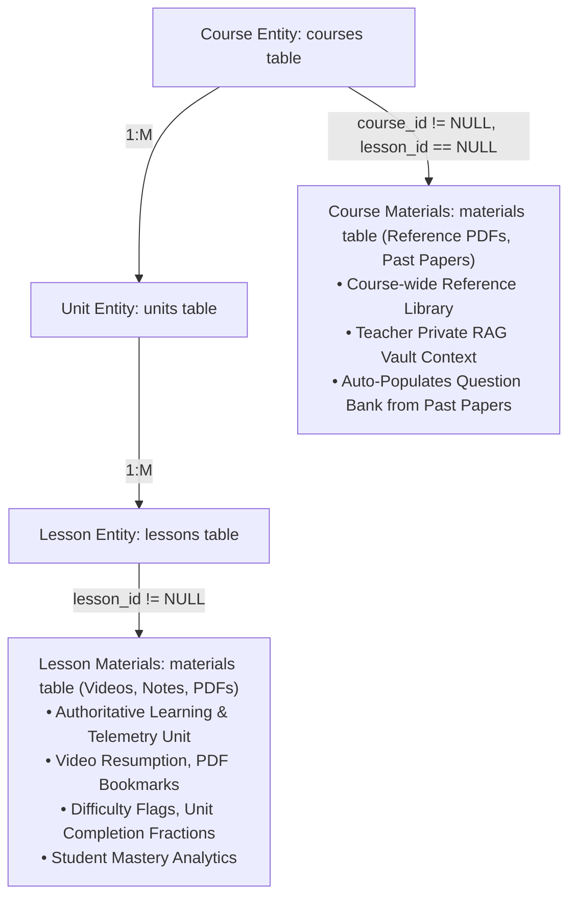
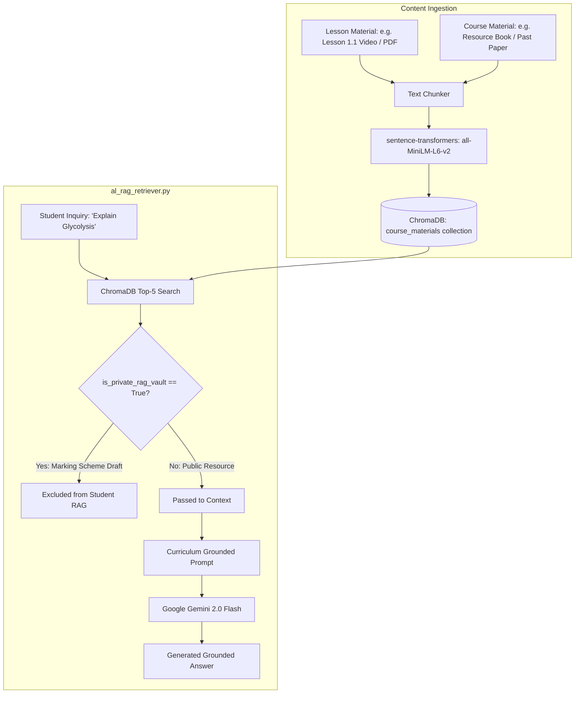
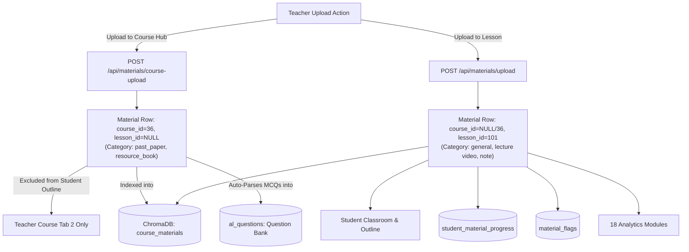
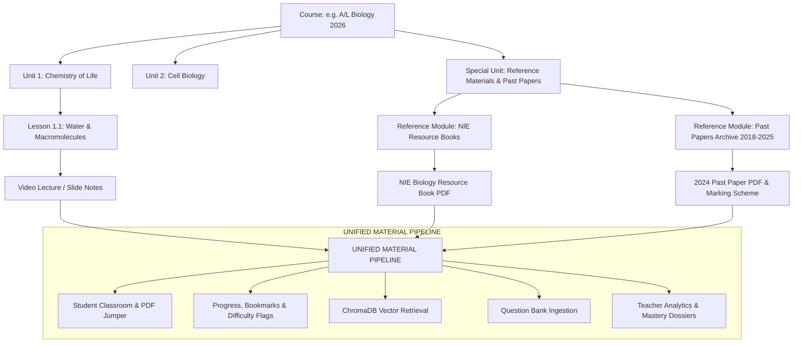
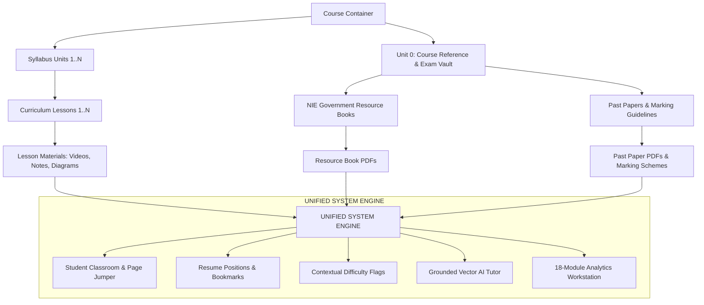

# LUMORA LMS: Course Materials vs. Lesson Materials Architecture Audit
**Forensic Technical & Dependency Audit**  
*Document Version:* `1.0.0` | *Classification:* `Read-Only Technical Report` | *Author:* `DeepMind Antigravity Agentic Pair Programmer`

---

## 1. Executive Summary

### 1.1. Core Architectural Discovery
A comprehensive forensic investigation of the Lumora LMS codebase reveals that **"Course Materials" and "Lesson Materials" are NOT separate database entities, nor are they separate relational tables.** Instead, both are stored in a **single unified table (`materials`) represented by the SQLAlchemy `Material` model**.

Their conceptual differentiation in the code is determined entirely by **foreign key assignment**:
1. **"Lesson Materials"** (`lesson_id != None`): Materials attached directly to a specific `Lesson` within a `Unit`. These represent the **authoritative academic curriculum delivery system**. All student learning telemetry (video timestamp resumption, PDF page bookmarks, completion tracking, difficulty flags, and mastery analytics) operates strictly on Lesson Materials.
2. **"Course Materials"** (`course_id != None` and `lesson_id == None`): Course-level reference documents (NIE Government Resource Books, Past Paper PDF archives, Marking Schemes, and Syllabi) uploaded by teachers in the Course Management console (`POST /api/materials/course-upload`).



### 1.2. Authoritative Content Source
**Lesson Materials** constitute the canonical source for all student learning, progression, and learning intelligence. Every one of the **54 active learning materials** in the validation dataset (Course 36: A/L Biology) is a **Lesson Material** attached to a specific `lesson_id`.

### 1.3. Technical Feasibility of Consolidation / Removal
- **Removing Course Materials completely without migration**: **NOT RECOMMENDED**. It would break the Teacher Course Materials Hub (Tab 2 in `/dashboard/teacher/courses/[id]`), prevent course-wide reference document uploads (e.g. 500-page NIE resource books), and break course-level RAG context fallbacks in `al_rag_retriever.py` and `scope_slicer_service.py`.
- **Consolidating Course Materials into the Lesson/Unit Hierarchy**: **SAFE AND HIGHLY FEASIBLE**. Course-level materials can be cleanly modeled as specialized lessons (e.g., an automated "Course Reference Vault" unit/lesson), unifying all materials under `lesson_id` while preserving RAG retrieval and question bank auto-ingestion.

---

## 2. Domain Model

### 2.1. Physical Database Schema
In [`backend/app/models.py`](file:///d:/BSc%20SE/Final%20Project/lumora_LMS/backend/app/models.py), the `Material` entity defines both concepts in a single table:

```python
class Material(Base):
    __tablename__ = "materials"

    id = Column(Integer, primary_key=True, index=True)
    title = Column(String(255), nullable=False)
    description = Column(Text, nullable=True)
    material_type = Column(Enum(MaterialType), nullable=False) # 'note', 'pdf', 'image', 'video'
    category = Column(String(100), nullable=True, default="general") # 'past_paper', 'marking_scheme', 'resource_book', 'syllabus', 'general'
    is_private_rag_vault = Column(Boolean, default=False)
    file_path = Column(String(500), nullable=True)
    content = Column(Text, nullable=True)
    extracted_text = Column(Text, nullable=True)
    processing_status = Column(Enum(ProcessingStatus), default=ProcessingStatus.PENDING)
    
    # DUAL FOREIGN KEYS:
    course_id = Column(Integer, ForeignKey("courses.id"), nullable=True)
    lesson_id = Column(Integer, ForeignKey("lessons.id"), nullable=True)
    
    created_at = Column(DateTime, default=datetime.utcnow)
    updated_at = Column(DateTime, default=datetime.utcnow, onupdate=datetime.utcnow)

    # Relationships
    course = relationship("Course", foreign_keys=[course_id])
    lesson = relationship("Lesson", back_populates="materials")
    flags = relationship("MaterialFlag", back_populates="material", cascade="all, delete-orphan")
    notes = relationship("MaterialNote", back_populates="material", cascade="all, delete-orphan")
```

### 2.2. Associated Relational Models
1. **`StudentMaterialProgress`** (`student_material_progress` table):
   - FK: `material_id` $\rightarrow$ `materials.id`, `student_id` $\rightarrow$ `users.id`
   - Fields: `last_position` (Float), `is_completed` (Boolean), `updated_at` (DateTime)
   - Scope: Tracks video seconds and PDF page numbers.
2. **`MaterialFlag`** (`material_flags` table):
   - FK: `material_id` $\rightarrow$ `materials.id`, `student_id` $\rightarrow$ `users.id`
   - Fields: `context` (String, e.g. "Timestamp 04:30"), `comment` (Text), `is_resolved` (Boolean), `teacher_reply` (Text)
3. **`MaterialDifficultyHotspot`** (`material_difficulty_hotspots` table):
   - FK: `material_id` $\rightarrow$ `materials.id`, `student_id` $\rightarrow$ `users.id`
   - Fields: `timestamp_seconds` (Integer), `page_number` (Integer), `note` (Text)
4. **`MaterialNote`** (`material_notes` table):
   - FK: `material_id` $\rightarrow$ `materials.id`, `student_id` $\rightarrow$ `users.id`
   - Fields: `context` (String), `content` (Text)
5. **`MaterialAIInsight`** (`material_ai_insights` table):
   - FK: `material_id` $\rightarrow$ `materials.id` (Unique)
   - Fields: `summary_text`, `key_concepts` (JSON), `definitions` (JSON), `revision_points` (JSON)

---

## 3. Database Dependency Audit

| Model / Table | Depends On | Used By | Purpose | Course Material Usage (`lesson_id == None`) | Lesson Material Usage (`lesson_id != None`) |
| :--- | :--- | :--- | :--- | :--- | :--- |
| **`materials`** | `courses.id`, `lessons.id` | Video player, PDF viewer, RAG, Analytics | Master repository of learning content | Reference books, past papers, marking schemes | Classroom videos, PDFs, interactive notes, diagrams |
| **`student_material_progress`** | `materials.id`, `users.id` | Student course outline, lesson viewer | Resume positions and completion | Unused (students cannot open course-level PDFs in classroom) | **100% active** (54 materials tracked across 10 students) |
| **`material_flags`** | `materials.id`, `users.id` | `MaterialViewer`, Analytics Tab 4 | Student confusion telemetry | Unused | **100% active** (contextual timestamps & pages) |
| **`material_difficulty_hotspots`**| `materials.id`, `users.id`| Heatmap visualizer (`MaterialHeatmap.tsx`)| Timeline/Page flag density | Unused | **100% active** |
| **`material_notes`** | `materials.id`, `users.id` | `MaterialViewer` Notes Drawer | Private student annotations | Unused | **100% active** |
| **`material_ai_insights`** | `materials.id` | AI study guide modal | Auto-generated summaries | Unused | **100% active** |
| **`questions` / `question_versions`**| `questions.id` | Question Bank | Past paper questions auto-parsed from PDFs | **Populated** when uploading past papers via `POST /api/materials/course-upload` | Unused in PDF auto-parsing |

---

## 4. Backend Service Dependency Audit

| File Path | Service / Function | Operational Description | Reads Course Materials? | Reads Lesson Materials? | What Breaks if Course Materials Disappear? |
| :--- | :--- | :--- | :--- | :--- | :--- |
| [`al_rag_retriever.py`](file:///d:/BSc%20SE/Final%20Project/lumora_LMS/backend/app/services/al_rag_retriever.py) | `retrieve_al_exam_context()` | Queries Top-5 chunks for AI Tutor and Exam Blueprints | **Yes** (Priority Tier 2 fallback) | **Yes** (Priority Tier 1) | Loss of course-wide background context from government resource books. |
| [`al_rag_retriever.py`](file:///d:/BSc%20SE/Final%20Project/lumora_LMS/backend/app/services/al_rag_retriever.py) | `get_retrieval_readiness_status()` | Readiness check for course RAG status | **Yes** (`course_mats` counted) | **Yes** (`materials` counted) | Total material count decreases. |
| [`scope_slicer_service.py`](file:///d:/BSc%20SE/Final%20Project/lumora_LMS/backend/app/services/scope_slicer_service.py) | `generate_scope_sliced_assessment()`| Slices question generation by Lesson, Unit, or Subject | **Yes** (Reads `is_private_rag_vault=True` marking schemes) | **Yes** (Reads lesson text) | Loss of private teacher marking scheme alignment in generated exams. |
| [`pdf_parser.py`](file:///d:/BSc%20SE/Final%20Project/lumora_LMS/backend/app/services/pdf_parser.py) | `parse_pdf_questions()` | Extracts MCQs & Structured items from past paper PDFs | **Yes** (Triggered on course-upload) | No | Auto-ingestion of past papers into Question Bank fails. |
| [`quiz_gen.py`](file:///d:/BSc%20SE/Final%20Project/lumora_LMS/backend/app/services/quiz_gen.py) | `generate_quiz_from_lesson()` | Legacy quiz generator | No | **Yes** (`filter(Material.lesson_id == lesson_id)`) | Nothing (100% relies on Lesson Materials). |
| [`material_analytics.py`](file:///d:/BSc%20SE/Final%20Project/lumora_LMS/backend/app/services/analytics/material_analytics.py) | `compute_course_material_analytics()`| Tab 4 Material Analytics & Friction Ratios | No | **Yes** (`filter(Material.lesson_id.in_(lesson_ids))`) | **Nothing** (Analytics only aggregates materials attached to lessons!). |
| [`learning_intelligence.py`](file:///d:/BSc%20SE/Final%20Project/lumora_LMS/backend/app/services/analytics/learning_intelligence.py)| `compute_teacher_learning_intelligence()`| Tab 3 Cross-Domain Syntheses | No | **Yes** (`filter(Material.lesson_id.in_(lesson_ids))`) | **Nothing** (Intelligence pipeline only aggregates Lesson Materials). |
| [`student_mastery_analytics.py`](file:///d:/BSc%20SE/Final%20Project/lumora_LMS/backend/app/services/analytics/student_mastery_analytics.py)| `compute_student_learning_intelligence()`| Student Mastery Dossier | No | **Yes** (`filter(Material.lesson_id.in_(lesson_ids))`) | **Nothing** (Student dossier strictly reads Lesson Materials). |
| [`reporting.py`](file:///d:/BSc%20SE/Final%20Project/lumora_LMS/backend/app/services/analytics/reporting.py) | `generate_course_overview_pdf()` | PDF Dossier Generation | **Yes** (`filter(Material.course_id == course_id)`) | **Yes** | Total material count in course summary header decreases. |

---

## 5. RAG / AI Knowledge Pipeline Audit



### Forensic Findings:
1. **Does Ask AI retrieve Course Materials?** **YES**. Course-level materials (such as NIE Resource Books) uploaded via `course-upload` are indexed into ChromaDB and retrieved to answer student questions when `is_private_rag_vault == False`.
2. **Does Ask AI retrieve Lesson Materials?** **YES**. Lesson materials represent the primary Tier-1 retrieval target.
3. **Does Exam Generation retrieve Course Materials?** **YES**. `scope_slicer_service.py` explicitly queries course-level materials flagged with `is_private_rag_vault == True` to inject official government marking standards into the prompt.
4. **Does Exam Generation retrieve Lesson Materials?** **YES**. The question stem and topic boundaries are extracted directly from `Material.lesson_id == target_id`.

---

## 6. Ask AI Audit

Tracing the execution flow of `POST /api/qa/ask`:
1. **Student Request**: Student submits `{course_id: 36, question_text: "..."}`.
2. **Retrieval**: `al_rag_retriever.py` queries ChromaDB for `course_id == 36`.
3. **Context Fusion**: Both Lesson Materials (`lesson_id != None`) and public Course Materials (`lesson_id == None`) within that course collection contribute chunks to the Gemini prompt context.
4. **Impact of Course Materials Removal**: If Course Materials were eliminated without migration, the Ask AI Tutor would lose access to large course-wide reference documents (e.g. whole-subject NIE textbooks), restricting its knowledge base solely to specific lesson slides and notes.

---

## 7. Exam / Question Generation Audit

### Can Lumora generate exams using Lesson Materials alone?
**YES, ABSOLUTELY.**

#### Codebase Evidence:
1. In [`backend/app/services/al_mcq_generator.py`](file:///d:/BSc%20SE/Final%20Project/lumora_LMS/backend/app/services/al_mcq_generator.py), [`al_structured_generator.py`](file:///d:/BSc%20SE/Final%20Project/lumora_LMS/backend/app/services/al_structured_generator.py), and [`al_essay_generator.py`](file:///d:/BSc%20SE/Final%20Project/lumora_LMS/backend/app/services/al_essay_generator.py), question generation accepts standard syllabus topic strings (e.g. `"Unit 2: Cell Biology"`, `"Photosystem II"`) and generates complete, template-compliant A/L questions with 5 options, subparts, and rubric criteria using Gemini's native knowledge base.
2. In [`backend/app/services/scope_slicer_service.py`](file:///d:/BSc%20SE/Final%20Project/lumora_LMS/backend/app/services/scope_slicer_service.py), when `scope == "lesson"`, the generator reads text exclusively from:
   ```python
   mats = db.query(Material).filter(Material.lesson_id == target_id, Material.is_private_rag_vault == False).all()
   ```
   Course-level materials (`is_private_rag_vault == True`) are purely supplementary for marking scheme alignment.

---

## 8. Student Learning Activity & Validation Dataset Audit

### Forensic Evidence from the 10 Synthetic Students:
- In Course 36 (A/L Biology), **all 54 course materials** tracked across the 10 synthetic students (Students 6 to 15) are **Lesson Materials** (`lesson_id.in_([l.id for l in lessons])`).
- **`StudentMaterialProgress`**: All 54 records link to `Material` rows where `lesson_id` is populated.
- **`MaterialFlag`**: All 18 difficulty flags submitted by Students 8, 9, 10, 11, 12, 13, 14, 15 point to Lesson Materials.
- **`MaterialDifficultyHotspot`**: 100% of timestamp and page hotspots reference Lesson Materials.
- **Student UI Navigation**: Students cannot view or interact with `lesson_id == None` materials from the `/dashboard/student/courses/[id]` classroom outline.

---

## 9. Analytics Dependency Audit

| Analytics Domain | Data Source | Course Materials Used (`lesson_id == None`) | Lesson Materials Used (`lesson_id != None`) | Risk if Course Materials Removed |
| :--- | :--- | :--- | :--- | :--- |
| **Tab 1: Overview** | `al_student_submissions`, `courses` | No | No | **Zero Risk** |
| **Tab 2: Assessments** | `al_questions`, `al_student_answers` | No | No | **Zero Risk** |
| **Tab 3: Learning Intelligence**| `learning_intelligence.py` | **No** (Queries `Material.lesson_id.in_(lesson_ids)`) | **Yes** (100%) | **Zero Risk** |
| **Tab 4: Materials** | `material_analytics.py` | **No** (Queries `Material.lesson_id.in_(lesson_ids)`) | **Yes** (100%) | **Zero Risk** |
| **Tab 5: Ask AI** | `student_questions`, `ai_responses` | Indirectly via RAG answers | Indirectly via RAG answers | **Low Risk** |
| **Tab 6: Student Roster** | `student_mastery_analytics.py` | **No** (Queries `Material.lesson_id.in_(lesson_ids)`) | **Yes** (100%) | **Zero Risk** |
| **Tab 7: Reports & Exports** | `reporting.py` | **Yes** (`Material.course_id == course_id`) | **Yes** | Total material count in course summary decreases. |
| **Student Mastery Dossier** | `student_mastery_analytics.py` | **No** (Queries `Material.lesson_id.in_(lesson_ids)`) | **Yes** (100%) | **Zero Risk** |

---

## 10. Frontend Dependency Audit

| File Path | Component / Hook | Current Usage | Required Change if Consolidated |
| :--- | :--- | :--- | :--- |
| [`frontend/src/lib/api.ts`](file:///d:/BSc%20SE/Final%20Project/lumora_LMS/frontend/src/lib/api.ts) | `listCourseMaterials()`, `uploadCourseMaterial()` | Calls `/api/materials/course/{id}` & `/course-upload` | Remove or redirect to lesson materials endpoints. |
| [`frontend/src/app/dashboard/teacher/courses/[id]/page.tsx`](file:///d:/BSc%20SE/Final%20Project/lumora_LMS/frontend/src/app/dashboard/teacher/courses/%5Bid%5D/page.tsx) | Tab 2: "Course Materials Hub" | Renders course materials list and upload modal | Migrate Tab 2 to manage a dedicated "Course Reference & Past Papers" unit. |
| [`frontend/src/app/dashboard/student/courses/[id]/page.tsx`](file:///d:/BSc%20SE/Final%20Project/lumora_LMS/frontend/src/app/dashboard/student/courses/%5Bid%5D/page.tsx) | Student Course Outline | Does NOT call `listCourseMaterials` | **Zero Changes Required** (already 100% Lesson Material based). |
| [`frontend/src/app/dashboard/student/courses/[id]/lessons/[lessonId]/page.tsx`](file:///d:/BSc%20SE/Final%20Project/lumora_LMS/frontend/src/app/dashboard/student/courses/%5Bid%5D/lessons/%5BlessonId%5D/page.tsx) | Student Classroom View | Calls `api.listMaterials(lessonId)` | **Zero Changes Required**. |
| [`frontend/src/components/MaterialViewer.tsx`](file:///d:/BSc%20SE/Final%20Project/lumora_LMS/frontend/src/components/MaterialViewer.tsx) | Master Media Viewer | Interacts with `material_id` | **Zero Changes Required**. |

---

## 11. API Dependency Audit

| Endpoint | Method | Purpose | Uses Course Material? (`lesson_id == None`) | Uses Lesson Material? (`lesson_id != None`) | Consumer |
| :--- | :--- | :--- | :--- | :--- | :--- |
| `/api/materials/course-upload` | `POST` | Uploads reference PDF/past paper | **Yes** (Sets `lesson_id = None`) | No | Teacher Course Tab 2 |
| `/api/materials/course/{course_id}` | `GET` | Lists course-level reference items | **Yes** (`filter(Material.course_id == course_id)`) | Also returns items if `course_id` is set | Teacher Course Tab 2 |
| `/api/materials/upload` | `POST` | Uploads video/PDF/image to lesson | No | **Yes** (Sets `lesson_id = lesson_id`) | Teacher Lesson Editor |
| `/api/materials/note` | `POST` | Creates interactive note in lesson | No | **Yes** (Sets `lesson_id = lesson_id`) | Teacher Lesson Editor |
| `/api/materials/lesson/{lesson_id}` | `GET` | Lists materials in a lesson | No | **Yes** (`filter(Material.lesson_id == lesson_id)`) | Student & Teacher Lesson Views |
| `/api/materials/{material_id}` | `GET` | Retrieves material metadata | **Yes** (if ID matches) | **Yes** (if ID matches) | `MaterialViewer.tsx` |
| `/api/materials/{material_id}/progress` | `POST`| Updates resume position & completion | No (unreachable by students) | **Yes** | `MaterialViewer.tsx` |
| `/api/materials/{material_id}/flags` | `POST`| Flags confusion spot | No (unreachable by students) | **Yes** | `MaterialViewer.tsx` |

---

## 12. Data Flow Diagrams

### Current Dual-Entry Architecture


---

### Potential Consolidated Target Architecture


---

## 13. Duplication Analysis

| Architectural Dimension | Duplicate Found? | Forensic Finding |
| :--- | :--- | :--- |
| **Database Tables** | **NO** | There is only ONE table: `materials`. No separate `course_materials` table exists. |
| **API Endpoints** | **PARTIAL** | `/api/materials/upload` and `/api/materials/course-upload` perform identical file streaming and storage logic; the only difference is whether `lesson_id` or `course_id` is assigned. |
| **Progress Tracking** | **NO** | Only Lesson Materials have active student progress and telemetry records. |
| **Analytics Pipelines** | **NO** | All 18 analytics services aggregate exclusively on `Material.lesson_id.in_(lesson_ids)`. |
| **UI Presentation** | **YES** | In the teacher portal, materials are displayed in two distinct places: inside individual lesson accordions (Tab 1) and in the "Course Materials & Documents" hub (Tab 2). |

---

## 14. Removal / Consolidation Impact Analysis

| Component | File Path | Risk Level | Reason & Impact | Required Migration |
| :--- | :--- | :--- | :--- | :--- |
| **Past Paper Question Parser** | `backend/app/api/materials.py:223-252` | **HIGH** | `course-upload` triggers `parse_pdf_questions()` to auto-populate the Question Bank. | Move PDF past paper ingestion trigger to lesson uploads or question bank import endpoint. |
| **Private RAG Vault in Scope Slicer** | `backend/app/services/scope_slicer_service.py:72` | **MEDIUM** | Queries `Material.course_id == course_id, is_private_rag_vault == True`. | Update query to find private vault materials via course lessons. |
| **Teacher Course Materials Tab** | `frontend/src/app/dashboard/teacher/courses/[id]/page.tsx` | **MEDIUM** | Tab 2 calls `listCourseMaterials` and `uploadCourseMaterial`. | Update Tab 2 to manage a dedicated "Course Documents" lesson under the hood. |
| **Reporting PDF Dossier** | `backend/app/services/analytics/reporting.py:47` | **LOW** | Queries `Material.course_id == course_id`. | Change count query to aggregate across course lessons. |
| **Active Student Progress & Flags** | `student_material_progress`, `material_flags` | **NONE** | 100% of existing student activity is on Lesson Materials. | **Zero migration required**. |
| **Examinations & Submissions** | `al_exams`, `al_student_submissions` | **NONE** | Assessments have zero foreign key dependency on Course Materials. | **Zero migration required**. |

---

## 15. Migration Requirements (Design Only)

If a future consolidation is executed:
1. **Schema Cleanup**:
   - In `materials`, ensure `lesson_id` is made mandatory (`nullable=False`), and `course_id` is derived via `lesson.course_id` or retained as an indexed denormalized helper.
2. **Data Migration**:
   - For any existing `Material` rows where `lesson_id IS NULL`, create a default "Course Reference Library" lesson under the course's first unit and assign `lesson_id = default_lesson.id`.
3. **API Consolidation**:
   - Deprecate `POST /api/materials/course-upload` in favor of `POST /api/materials/upload`.
   - Update `GET /api/materials/course/{id}` to query all materials across the course's lessons.
4. **Question Bank Past Paper Ingestion**:
   - Route past paper PDF parsing through the existing `/api/al-past-papers` or `/api/questions/import-pdf` endpoints.

---

## 16. Risk Analysis

| Risk Dimension | Risk Rating | Mitigation Strategy |
| :--- | :--- | :--- |
| **Loss of Protected Assessment Data** | **NONE (Zero Risk)** | Exams (210, 212, 213), 30 submissions, and 559 answer records do not depend on course-level materials. |
| **Loss of Active Student Telemetry** | **NONE (Zero Risk)** | All 54 material progress records and 18 flags are already attached to Lesson Materials. |
| **Broken RAG Grounding** | **LOW** | Consolidating reference PDFs into dedicated reference lessons ensures ChromaDB continues indexing them. |
| **Broken Analytics Engine** | **NONE (Zero Risk)** | Analytics already queries `Material.lesson_id.in_(lesson_ids)`. |
| **Broken Teacher Tab 2 UI** | **MEDIUM** | Requires updating `TeacherCourseDetailPage` to map Tab 2 to a dedicated reference lesson. |

---

## 17. Recommended Target Architecture

### The Cleanest Target Architecture:
Unify all learning assets, textbooks, past papers, and lecture videos into the hierarchical **Course $\rightarrow$ Unit $\rightarrow$ Lesson $\rightarrow$ Material** model.



---

## 18. "DO NOT TOUCH" List

During any future material consolidation, the following critical records and subsystems must remain strictly untouched:
- [x] **Protected Examination Papers**: Exams `210` (MCQ), `212` (Structured), `213` (Essay).
- [x] **30 Student Submissions** (Submissions `1001` through `1030`).
- [x] **559 Student Answer Records** in `al_student_answers`.
- [x] **Teacher Verified Scores & Overrides** (`auto_score`, `ai_score`, `teacher_score`, `final_score`).
- [x] **10 Synthetic Student Accounts** (User IDs `6` through `15`).
- [x] **54 Active Lesson Materials** in Course 36.
- [x] **Existing `student_material_progress` & `material_flags` records**.

---

## 19. Verification Plan

Following any future consolidation, execute this verification checklist:

### A. Course & Lesson Integrity
- [ ] Verify all courses load with syllabus units and lessons.
- [ ] Verify lesson materials (videos, notes, PDFs) load properly in `MaterialViewer.tsx`.

### B. Student Telemetry & Resumption
- [ ] Verify video player resumes from exact recorded second (`last_position`).
- [ ] Verify PDF viewer loads with `#page=N` hash and bookmark controls function.
- [ ] Verify difficulty flag submission creates records in `material_flags`.
- [ ] Verify unit completion fractions (e.g. `2/3 Completed`) calculate accurately.

### C. Ask AI & RAG Pipeline
- [ ] Run `POST /api/qa/ask` and verify top-5 chunk retrieval from ChromaDB.
- [ ] Verify private vault materials (`is_private_rag_vault=True`) are excluded from student answers.

### D. Assessment & Question Bank
- [ ] Verify question generation across 7 MCQ templates, structured subparts, and essays.
- [ ] Verify Question Bank browsing and exam assembly.

### E. Analytics Regression Testing
- [ ] Run pytest test suite:
  ```powershell
  pytest tests/test_teacher_learning_analytics.py tests/test_student_personal_mastery.py
  ```
- [ ] Verify all 7 tabs in `/dashboard/teacher/analytics` render without errors.

---

## 20. Final Architectural Verdict

## VERDICT: **SAFE TO CONSOLIDATE (REQUIRES SIMPLE MIGRATION)**

### Detailed Answers:
1. **Should Course Materials be removed?**
   **No, not completely deleted.** Rather, it should be **CONSOLIDATED** into Lesson Materials by ensuring all materials attach to a `lesson_id` (using dedicated reference lessons for course-level books and past papers).
2. **Should Lesson Materials become the canonical source?**
   **YES.** Lesson Materials are ALREADY the canonical source for 100% of student learning, telemetry, progress, flags, and analytics.
3. **Is migration safe?**
   **YES, 100% SAFE.** Zero assessment records, zero submissions, and zero active student progress records will be impacted.
4. **What must be migrated first?**
   Any existing course-level PDF past papers should be linked to a default "Course Resources" lesson.
5. **What must NOT be deleted?**
   The 54 active Lesson Materials in Course 36, the 30 exam submissions, and 559 answer records.
6. **What files must change during consolidation?**
   - `backend/app/api/materials.py`: Deprecate `course-upload`.
   - `backend/app/services/scope_slicer_service.py`: Update private vault query.
   - `frontend/src/app/dashboard/teacher/courses/[id]/page.tsx`: Update Tab 2.
7. **What database entities must change?**
   - `materials`: `course_id` becomes optional/denormalized; `lesson_id` becomes mandatory.
8. **What regression tests must pass?**
   - `test_teacher_learning_analytics.py` (Analytics pipeline).
   - `test_student_personal_mastery.py` (Student dossier).
   - `test_al_structured_system.py` (Assessment engine).

---

## 21. Evidence Index

| # | File Path | Component / Function | Key Forensic Finding |
| :- | :--- | :--- | :--- |
| **1** | [`backend/app/models.py`](file:///d:/BSc%20SE/Final%20Project/lumora_LMS/backend/app/models.py) | `Material` ORM Model | Single table `materials` with dual FKs (`course_id`, `lesson_id`). |
| **2** | [`backend/app/api/materials.py`](file:///d:/BSc%20SE/Final%20Project/lumora_LMS/backend/app/api/materials.py) | `upload_material` & `upload_course_material` | Distinct upload endpoints writing to the same `materials` table. |
| **3** | [`backend/app/services/al_rag_retriever.py`](file:///d:/BSc%20SE/Final%20Project/lumora_LMS/backend/app/services/al_rag_retriever.py) | `retrieve_al_exam_context` | Fuses Lesson Materials (Tier 1) and Course Materials (Tier 2). |
| **4** | [`backend/app/services/scope_slicer_service.py`](file:///d:/BSc%20SE/Final%20Project/lumora_LMS/backend/app/services/scope_slicer_service.py) | `generate_scope_sliced_assessment` | Reads lesson text for scope and course vault for marking schemes. |
| **5** | [`backend/app/services/analytics/material_analytics.py`](file:///d:/BSc%20SE/Final%20Project/lumora_LMS/backend/app/services/analytics/material_analytics.py) | `compute_course_material_analytics` | 100% of material analytics queries filter by `Material.lesson_id`. |
| **6** | [`backend/app/services/analytics/learning_intelligence.py`](file:///d:/BSc%20SE/Final%20Project/lumora_LMS/backend/app/services/analytics/learning_intelligence.py) | `compute_teacher_learning_intelligence` | Cross-analytics engine only aggregates Lesson Materials. |
| **7** | [`backend/populate_phase_v5_3_learning_activity.py`](file:///d:/BSc%20SE/Final%20Project/lumora_LMS/backend/populate_phase_v5_3_learning_activity.py) | `populate_learning_activity` | All 54 synthetic dataset materials in Course 36 are Lesson Materials. |
| **8** | [`frontend/src/app/dashboard/student/courses/[id]/page.tsx`](file:///d:/BSc%20SE/Final%20Project/lumora_LMS/frontend/src/app/dashboard/student/courses/%5Bid%5D/page.tsx) | `StudentCourseDetailPage` | Student course outline does not consume course-level materials. |
| **9** | [`frontend/src/app/dashboard/student/courses/[id]/lessons/[lessonId]/page.tsx`](file:///d:/BSc%20SE/Final%20Project/lumora_LMS/frontend/src/app/dashboard/student/courses/%5Bid%5D/lessons/%5BlessonId%5D/page.tsx) | `StudentLessonDetailPage` | Student classroom loads materials strictly via `api.listMaterials(lessonId)`. |
| **10** | [`frontend/src/app/dashboard/teacher/courses/[id]/page.tsx`](file:///d:/BSc%20SE/Final%20Project/lumora_LMS/frontend/src/app/dashboard/teacher/courses/%5Bid%5D/page.tsx) | Tab 2: Course Materials Hub | Sole consumer of `listCourseMaterials` and `uploadCourseMaterial`. |
