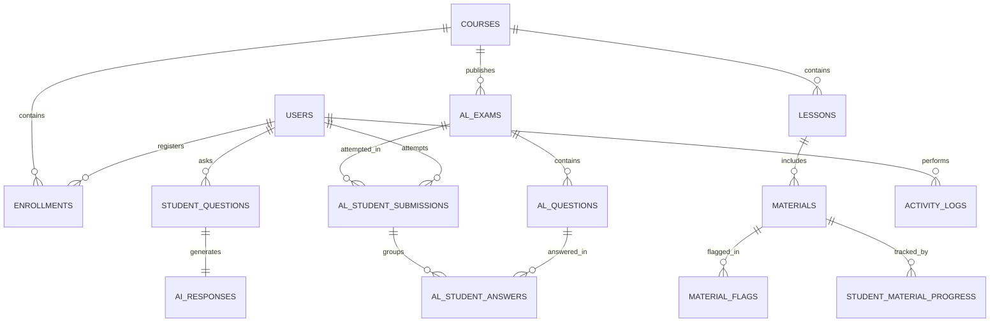

# LUMORA LMS — COMPLETE ANALYTICS SYSTEM & DATA ARCHITECTURE AUDIT
**Comprehensive Technical Inspection, Ground Truth Data Models & Future Architecture Roadmap**

> **Document Type:** Read-Only Technical Architecture & Data Audit  
> **Audit Target:** Lumora Learning Management System & G.C.E. Advanced Level Assessment Engine  
> **Audit Constraint:** Strictly Read-Only (0 database mutations, 0 code modifications, 0 API changes)  
> **Corresponding PDF Report:** [`LUMORA_ANALYTICS_SYSTEM_AUDIT_REPORT.pdf`](file:///d:/BSc%20SE/Final%20Project/lumora_LMS/LUMORA_ANALYTICS_SYSTEM_AUDIT_REPORT.pdf)

---

## Table of Contents
1. [Executive Summary](#1-executive-summary)
2. [Codebase Discovery & Component Map](#2-codebase-discovery--component-map)
3. [Current Analytics System & Active Formulas](#3-current-analytics-system--active-formulas)
4. [Database Schema & Data Model Audit](#4-database-schema--data-model-audit)
5. [Assessment Analytics & MCQ Item Analysis Readiness](#5-assessment-analytics--mcq-item-analysis-readiness)
6. [Paper II-A Structured Question Hierarchy Analytics](#6-paper-ii-a-structured-question-hierarchy-analytics)
7. [Paper II-B Essay Criteria & Rubric Analytics](#7-paper-ii-b-essay-criteria--rubric-analytics)
8. [Student Learning Activity & Time-on-Task Audit](#8-student-learning-activity--time-on-task-audit)
9. [Material & Content Engagement Analytics](#9-material--content-engagement-analytics)
10. [Material Difficulty Flagging & Hotspot Analytics](#10-material-difficulty-flagging--hotspot-analytics)
11. [Ask AI Tutor & Concept Confusion Analytics](#11-ask-ai-tutor--concept-confusion-analytics)
12. [Gemini AI Usage, Token & Cost Analytics](#12-gemini-ai-usage-token--cost-analytics)
13. [Teacher Analytics Requirements & Readiness Matrix](#13-teacher-analytics-requirements--readiness-matrix)
14. [Student Analytics Requirements & Readiness Matrix](#14-student-analytics-requirements--readiness-matrix)
15. [Data Quality, Orphan Risk & Integrity Audit](#15-data-quality-orphan-risk--integrity-audit)
16. [Historical Data Retention & Paper Mutation Safety](#16-historical-data-retention--paper-mutation-safety)
17. [API Endpoint Audit](#17-api-endpoint-audit)
18. [Performance, Query Complexity & Scaling Considerations](#18-performance-query-complexity--scaling-considerations)
19. [Privacy, Data Governance & Security Boundaries](#19-privacy-data-governance--security-boundaries)
20. [Comprehensive Analytics Data Gap Matrix](#20-comprehensive-analytics-data-gap-matrix)
21. [Proposed Future Analytics Architecture](#21-proposed-future-analytics-architecture)
22. [Recommended Implementation Roadmap](#22-recommended-implementation-roadmap)
23. [Source Code Traceability Index](#23-source-code-traceability-index)
24. [Final Verdict](#24-final-verdict)

---

## 1. Executive Summary

A comprehensive, read-only architectural audit was conducted across the entire Lumora LMS codebase (36 database models, 28 API routers, 28 backend services, and 12 frontend dashboard views).

### Core Findings
1. **High-Fidelity Raw Event Storage:** The PostgreSQL database preserves granular, raw submission and engagement records. Exact student MCQ choices (`A`–`E`), structured text subpart answers, essay criterion checkmarks, video playback offsets, contextual difficulty flags, and AI tutor questions are stored with complete data integrity.
2. **Aggregated Analytics Deficit:** Approximately 80% of required psychometric item analysis metrics (Item Difficulty Index $p$, Discrimination Index $d$, Distractor Efficiency, Subpart Error Hierarchy) are currently not computed in backend APIs or displayed on frontend dashboards.
3. **Fragmented Subsystems:** Analytics currently exist in three separate silos:
   - **Course/Quiz Analytics:** Built around legacy `QuizAttempt` and `AssignmentSubmission` models.
   - **Material Hotspot Insights:** Built around `MaterialFlag` and AI-generated cluster summaries.
   - **A/L Examination Engine:** Built around `ALStudentSubmission` and `ALStudentAnswer` with deterministic MCQ grading and AI/teacher rubric verification.

### Subsystem Readiness Overview

| Subsystem Area | Data Exists in DB | Calculated in API | Displayed in UI | Overall Readiness |
| :--- | :--- | :--- | :--- | :--- |
| **Course & Enrollment Overview** | Yes (`courses`, `enrollments`) | Yes (SQL Aggregations) | Yes (Teacher Workstation) | **AVAILABLE** |
| **Legacy Quiz Analytics** | Yes (`quiz_attempts`, `answers`) | Yes (Avg, Min, Max, Dist) | Yes (Distribution Charts) | **AVAILABLE** |
| **A/L Exam Overall Performance** | Yes (`al_student_submissions`) | Yes (Score, Grade, %) | Yes (Teacher/Student Exam) | **AVAILABLE** |
| **MCQ Item Analysis ($p$, $d$, Distractors)** | Yes (`al_student_answers`) | Partial (Legacy Q only) | No | **PARTIAL (RAW READY)** |
| **Structured Question Hierarchy Analysis** | Yes (`subpart_answers_json`) | No | No | **PARTIAL (RAW READY)** |
| **Essay Criteria Omission Analysis** | Yes (`ai_checklist_results_json`) | No | No | **PARTIAL (RAW READY)** |
| **Material Difficulty Hotspots** | Yes (`material_flags`, `hotspots`) | Yes (Contexts, AI brief) | Yes (Material Insights) | **AVAILABLE** |
| **Ask AI Concept Classification** | Yes (`student_questions`, `ai_responses`)| Yes (Topic categorization) | Yes (AI Insights Tab) | **AVAILABLE** |
| **Gemini AI Usage & Cost Tracking** | Partial (`ai_logs` tokens/ms) | Partial (Admin performance) | Admin only | **PARTIAL** |
| **Time-on-Task & Dwell Time** | Partial (Last position only) | No session tracking | No | **NOT AVAILABLE** |

---

## 2. Codebase Discovery & Component Map

### Frontend Components & Views
- **Teacher Analytics Workstation:** [`frontend/src/app/dashboard/teacher/analytics/page.tsx`](file:///d:/BSc%20SE/Final%20Project/lumora_LMS/frontend/src/app/dashboard/teacher/analytics/page.tsx)
  - **Purpose:** Multi-dimensional teacher dashboard displaying course summary cards, coursework grade distributions, student risk rosters, and AI confusion concepts.
  - **Data Source:** `GET /api/analytics/teacher/course/{id}/full-analytics`.
  - **Status:** Active in production.
- **Student Analytics Overview:** [`frontend/src/app/dashboard/student/analytics/page.tsx`](file:///d:/BSc%20SE/Final%20Project/lumora_LMS/frontend/src/app/dashboard/student/analytics/page.tsx)
  - **Purpose:** Student-facing progress tracker displaying overall composite score, completed materials counter, assessments taken, and quiz attempt history.
  - **Data Source:** `GET /api/analytics/student/progress`, `GET /api/analytics/student/quiz-history`.
  - **Status:** Active in production.
- **Teacher Material Insights Hub:** [`frontend/src/app/dashboard/teacher/insights/page.tsx`](file:///d:/BSc%20SE/Final%20Project/lumora_LMS/frontend/src/app/dashboard/teacher/insights/page.tsx)
  - **Purpose:** Visualizes student confusion hotspots on video timestamps and PDF pages; displays AI-generated executive summaries and bulk flag resolution.
  - **Data Source:** `GET /api/materials/teacher/insights/flags`, `POST /api/materials/teacher/insights/ai-summary`.
  - **Status:** Active in production.
- **Teacher Q&A Moderation:** [`frontend/src/app/dashboard/teacher/qa/page.tsx`](file:///d:/BSc%20SE/Final%20Project/lumora_LMS/frontend/src/app/dashboard/teacher/qa/page.tsx)
  - **Purpose:** Feed of student Ask AI questions, confidence scores, retrieved source materials, and teacher response overrides.
  - **Data Source:** `GET /api/qa/teacher/questions`.
  - **Status:** Active in production.
- **Teacher Exam Marking Studio:** [`frontend/src/app/dashboard/teacher/al-exams/grade/[submissionId]/page.tsx`](file:///d:/BSc%20SE/Final%20Project/lumora_LMS/frontend/src/app/dashboard/teacher/al-exams/grade/%5BsubmissionId%5D/page.tsx)
  - **Purpose:** Detailed grading view for Paper II structured and essay submissions with checkmark verification and feedback notes.
  - **Data Source:** `GET /api/al-exams/submissions/{id}`, `POST /api/al-exams/submissions/{id}/verify`.
  - **Status:** Active in production.

### Backend API Routers & Services
- **Analytics Router:** [`backend/app/api/analytics.py`](file:///d:/BSc%20SE/Final%20Project/lumora_LMS/backend/app/api/analytics.py)
  - 10+ endpoints handling teacher courses, full course analytics, engagement scoring, 14-day trends, admin system metrics, and student progress.
- **A/L Exam Engine Router:** [`backend/app/api/al_exams.py`](file:///d:/BSc%20SE/Final%20Project/lumora_LMS/backend/app/api/al_exams.py)
  - 15+ endpoints managing exam lifecycle, paper validation, auto-saving answers, deterministic MCQ grading, AI pre-marking, and teacher verification.
- **Materials API Router:** [`backend/app/api/materials.py`](file:///d:/BSc%20SE/Final%20Project/lumora_LMS/backend/app/api/materials.py)
  - Handles material uploads, notes, progress tracking, confusion flagging, and AI executive briefings.
- **Q&A & AI Router:** [`backend/app/api/qa.py`](file:///d:/BSc%20SE/Final%20Project/lumora_LMS/backend/app/api/qa.py)
  - Handles student RAG queries, vector material retrieval, and asynchronous question categorization.
- **Question Analytics Service:** [`backend/app/services/question_analytics.py`](file:///d:/BSc%20SE/Final%20Project/lumora_LMS/backend/app/services/question_analytics.py)
  - Computes rolling $p$-value and discrimination index $d$ on the legacy `QuestionAnalytics` model.
- **Gemini Service:** [`backend/app/services/gemini_service.py`](file:///d:/BSc%20SE/Final%20Project/lumora_LMS/backend/app/services/gemini_service.py)
  - Central client with multi-model fallback logging operations and token usage to `AILog`.

---

## 3. Current Analytics System & Active Formulas

### A. Teacher Composite Student Risk Score
Implemented in [`backend/app/api/analytics.py`](file:///d:/BSc%20SE/Final%20Project/lumora_LMS/backend/app/api/analytics.py) (lines 231–246):

$$\text{Composite Score} = (S_{\text{quiz}} \times 0.35) + (S_{\text{cw}} \times 0.35) + (P_{\text{mat}} \times 0.20) + \left(\min\left(100, \frac{N_{\text{ai}}}{3} \times 100\right) \times 0.10\right)$$

Where:
- $S_{\text{quiz}}$ = Average percentage on completed legacy quizzes.
- $S_{\text{cw}}$ = Average percentage on graded coursework assignments.
- $P_{\text{mat}}$ = Percentage of course materials marked as completed.
- $N_{\text{ai}}$ = Number of AI questions asked by the student.

**Risk Classification Rules:**
- **At Risk:** $\text{Composite} < 50.0$ OR ($S_{\text{quiz}} < 50.0$ AND $S_{\text{cw}} < 50.0$).
- **Moderate:** $50.0 \le \text{Composite} < 70.0$.
- **Healthy:** $\text{Composite} \ge 70.0$.

*Limitation:* Does not incorporate A/L Exam submissions (`al_student_submissions`).

### B. Student Overall Progress Score
Implemented in [`backend/app/api/analytics.py`](file:///d:/BSc%20SE/Final%20Project/lumora_LMS/backend/app/api/analytics.py) (lines 570–575):

$$\text{Progress} = (\min(100, \text{QuizAvg}) \times 0.40) + (\min(100, \text{CWAvg}) \times 0.40) + (\min(100, N_{\text{completed\_mats}} \times 5.0) \times 0.20)$$

*Limitation:* $N_{\text{completed\_mats}} \times 5.0$ assumes an arbitrary baseline of exactly 20 course materials.

### C. Material Difficulty Hotspot Analysis
Implemented in [`backend/app/api/materials.py`](file:///d:/BSc%20SE/Final%20Project/lumora_LMS/backend/app/api/materials.py) (lines 828–853):
- Aggregates student difficulty flags by material ID.
- Extracts contextual strings (`Timestamp 04:12`, `Page 7`).
- Submits clustered feedback to Gemini AI to generate an automated executive brief for teachers.

---

## 4. Database Schema & Data Model Audit

The database schema defines 36 SQLAlchemy models in [`backend/app/models.py`](file:///d:/BSc%20SE/Final%20Project/lumora_LMS/backend/app/models.py). The core assessment, content, and tracking entities are detailed below:



### Key Models & Analytics Fields

#### 1. `al_student_submissions`
- **Fields:** `id` (PK), `exam_id` (FK), `student_id` (FK), `started_at`, `submitted_at`, `raw_score`, `scaled_score`, `percentage`, `grade`, `status` (`in_progress`, `submitted`, `ai_graded`, `teacher_verified`), `teacher_feedback`, `teacher_verified_at`, `finalized_by_id` (FK), `finalized_at`.
- **Historical Safety:** Immutable record of each exam attempt; preserves finalized score.

#### 2. `al_student_answers`
- **Fields:** `id` (PK), `submission_id` (FK), `question_id` (FK), `selected_option` (`A`–`E`), `subpart_answers_json`, `essay_text_answer`, `essay_attachment_url`, `auto_score`, `ai_score`, `teacher_score`, `final_score`, `ai_checklist_results_json`, `teacher_checklist_results_json`, `feedback_notes`.
- **Granularity:** Captures 100% of student choices and subpart points for deep psychometric analysis.

#### 3. `al_questions`
- **Fields:** `id` (PK), `exam_id` (FK), `question_number`, `template_type` (Enum across 7 MCQ profiles, Structured, Essay), `stem_text`, `options` (JSON list of 5 options), `correct_option`, `structured_subparts_json`, `essay_checklist_json`, `cognitive_level` (`remember`, `understand`, `apply`, `analyze`, `evaluate`), `difficulty` (`easy`, `medium`, `hard`), `points`, `snapshot_json`.

#### 4. `student_material_progress`
- **Fields:** `id` (PK), `student_id` (FK), `material_id` (FK), `last_position` (Float seconds or page number), `is_completed` (Boolean), `updated_at`.

#### 5. `material_flags`
- **Fields:** `id` (PK), `student_id` (FK), `material_id` (FK), `context` (String), `comment` (Text), `is_resolved` (Boolean), `created_at`.

#### 6. `student_questions` & `ai_responses`
- **Fields (`student_questions`):** `id` (PK), `student_id` (FK), `course_id` (FK), `question_text`, `topic_category`, `sentiment_difficulty`, `asked_at`.
- **Fields (`ai_responses`):** `id` (PK), `student_question_id` (FK), `response_text`, `context_sources` (JSON), `confidence_score` (Float), `generation_time_ms`.

#### 7. `ai_logs`
- **Fields:** `id` (PK), `action` (String), `input_summary`, `output_summary`, `tokens_used` (Integer), `processing_time_ms` (Integer), `status` (`completed`, `failed`), `created_at`.

---

## 5. Assessment Analytics & MCQ Item Analysis Readiness

The audit verified whether Lumora has sufficient data to calculate psychometric item analysis for the 50-Question Paper I:

```
Sample Item Analysis Output Required:
Question 17 (Taxonomy: Combination Grid | Unit: Genetics | Difficulty: Hard)
Total Attempts: 86 | Correct: 31 | Incorrect: 48 | Unanswered: 7
Success Rate (p): 36.0% | Discrimination Index (d): +0.48
Option Distribution: A: 12% | B: 36% [KEY] | C: 42% [DISTRACTOR] | D: 7% | E: 3%
```

### Readiness Evaluation

| Metric | Mathematical Formula | Data Availability | Assessment Engine Status |
| :--- | :--- | :--- | :--- |
| **Difficulty Index ($p$)** | $p = \frac{\text{Correct Count}}{\text{Total Attempts}}$ | **100% Available** | Queryable on `al_student_answers.is_correct` |
| **Discrimination Index ($d$)** | $d = \frac{U_{27\%} - L_{27\%}}{0.27 \times N}$ | **100% Available** | Submissions preserve overall score ranking |
| **Option Distribution** | Count & % selecting A, B, C, D, E | **100% Available** | Exact choices in `al_student_answers.selected_option` |
| **Distractor Efficiency** | Identify options selected by $< 5\%$ | **100% Available** | Directly derivable from option frequency distribution |
| **Cognitive Skill Breakdown** | Average score by cognitive level | **100% Available** | Mapped via `al_questions.cognitive_level` |
| **Question-Type Breakdown** | Performance across 7 MCQ templates | **100% Available** | Mapped via `al_questions.template_type` |
| **Time Spent per Item** | Seconds spent on specific question | **NOT Available** | Only overall attempt start/submit timestamps exist |

**Verdict:** **DATA IS 100% READY IN DATABASE**. Developing a dedicated aggregation API is all that is required to deliver full psychometric MCQ item analysis.

---

## 6. Paper II-A Structured Question Hierarchy Analytics

Paper II Part A Structured questions require subpart analysis:
$$\text{Question 2} \longrightarrow \text{Part B} \longrightarrow \text{Subpart (ii)} \longrightarrow \text{Nested Subpart (b)}$$

### Data Audit Findings
1. **Subpart Answer Capture:** Stored in `al_student_answers.subpart_answers_json` as key-value pairs (e.g. `{"a(i)": "Casparian strip", "a(ii)": "Apoplast barrier"}`).
2. **Subpart Mark Breakdown:** Stored in `al_student_answers.ai_checklist_results_json` with structure:
   ```json
   {
     "subpart_scores": [
       {"subpart": "a(i)", "awarded_score": 2.0, "maximum_score": 2.0},
       {"subpart": "a(ii)", "awarded_score": 1.0, "maximum_score": 3.0}
     ]
   }
   ```
3. **Hierarchical Capability:** **FULLY SUPPORTED**. The database preserves subpart identifiers, allowing aggregation queries to pinpoint exact subparts where students lose marks.

---

## 7. Paper II-B Essay Criteria & Rubric Analytics

Paper II Part B Essays evaluate 18–20 factual checkmark points per question.

### Data Audit Findings
1. **Marking Criteria Tracking:** Stored in `al_student_answers.ai_checklist_results_json` and `teacher_checklist_results_json`:
   ```json
   [
     {"item_number": 1, "criterion": "PSII P680 Photolysis", "awarded": true, "points": 4.0},
     {"item_number": 2, "criterion": "Plastoquinone Electron Flow", "awarded": false, "points": 0.0}
   ]
   ```
2. **Misconception Reporting:** **FULLY SUPPORTED**. Aggregating `awarded: false` across all submissions enables generating reports such as: *"82% of candidates failed to describe Plastoquinone electron transport in Question 5(a)"*.

---

## 8. Student Learning Activity & Time-on-Task Audit

| Activity Metric | Measurable Now? | Data Source | Notes |
| :--- | :--- | :--- | :--- |
| **Material Opened** | Yes | `activity_logs.action = "view_material"` | Event timestamp recorded |
| **Material Completed** | Yes | `student_material_progress.is_completed` | Boolean flag |
| **Video Playback Offset** | Yes | `student_material_progress.last_position` | Float seconds offset |
| **PDF Last Page Viewed** | Yes | `student_material_progress.last_position` | Integer page number |
| **True Time-on-Task** | **NO** | — | No heartbeat session tracker exists |
| **Video Re-watch Regions**| **NO** | — | Only single scalar `last_position` is saved |

---

## 9. Material & Content Engagement Analytics
- **Most / Least Completed Content:** Derivable via `COUNT(student_material_progress.is_completed = true) / Total Enrolled`.
- **Re-visit Frequency:** Derivable via `COUNT(activity_logs.id) WHERE action = 'view_material'` grouped by `material_id`.
- **Content Correlated with Poor Exam Performance:** Supported by joining `student_material_progress` with `al_student_submissions`.

---

## 10. Material Difficulty Flagging & Hotspot Analytics
- **Data Capture:** `material_flags` records `student_id`, `material_id`, `context` (`Timestamp 02:45`, `Page 12`), `comment`, `is_resolved`.
- **Active Dashboard:** [`TeacherInsightsPage`](file:///d:/BSc%20SE/Final%20Project/lumora_LMS/frontend/src/app/dashboard/teacher/insights/page.tsx) actively visualizes confusion clusters on video timelines and PDF pages.
- **AI Synthesis:** Endpoint `POST /api/materials/teacher/insights/ai-summary` invokes Gemini to generate automated instructional recommendations.

---

## 11. Ask AI Tutor & Concept Confusion Analytics
- **Query Capture:** `student_questions` captures raw question text, course ID, student ID, and timestamp.
- **RAG Grounding:** `ai_responses.context_sources` records which course materials were used to formulate the response.
- **Automated Categorization:** Background service in [`app/services/analytics.py`](file:///d:/BSc%20SE/Final%20Project/lumora_LMS/backend/app/services/analytics.py) uses Gemini to classify every question into concept categories (`Metabolism & Bioenergetics`, `Cell Division & Genetics`).
- **Privacy Preservation:** The teacher analytics view presents aggregated topic frequencies and anonymized question counts, preserving conversational privacy.

---

## 12. Gemini AI Usage, Token & Cost Analytics
- **Operation Logging:** [`backend/app/services/gemini_service.py`](file:///d:/BSc%20SE/Final%20Project/lumora_LMS/backend/app/services/gemini_service.py) logs every LLM call to `ai_logs`.
- **Recorded Parameters:** `action` (`qa_answer`, `quiz_gen`, `essay_grading`), `tokens_used` (total integer), `processing_time_ms`, `status`.
- **Billing Data Gap:** `tokens_used` does not currently separate **Input Tokens** from **Output Tokens**. Exact dollar calculations require adding `input_tokens` and `output_tokens` columns.

---

## 13 & 14. Teacher & Student Analytics Requirements

### Teacher Workstation Capabilities

| Feature Requirement | Status | Implementation Requirement |
| :--- | :--- | :--- |
| **Course Summary & Enrollment KPIs** | **AVAILABLE NOW** | Active in `TeacherAnalyticsPage` |
| **Student Risk Roster (Composite Score)** | **AVAILABLE NOW** | Active in `TeacherAnalyticsPage` |
| **Material Difficulty Clusters & AI Brief** | **AVAILABLE NOW** | Active in `TeacherInsightsPage` |
| **Ask AI Concept Confusion Topics** | **AVAILABLE NOW** | Active in `TeacherAnalyticsPage` |
| **MCQ Psychometric Item Analysis ($p$, $d$)** | **PARTIALLY AVAILABLE** | Build backend aggregation API |
| **Structured Subpart Error Ranking** | **PARTIALLY AVAILABLE** | Build backend aggregation API |
| **Essay Criterion Omission Frequency** | **PARTIALLY AVAILABLE** | Build backend aggregation API |
| **True Student Dwell Time / Time-on-Task** | **REQUIRES NEW DATA** | Build heartbeat tracking table |

### Student Portal Capabilities

| Feature Requirement | Status | Implementation Requirement |
| :--- | :--- | :--- |
| **Overall Course Completion Percentage** | **AVAILABLE NOW** | Active in `StudentAnalyticsOverviewPage` |
| **Completed Materials Count** | **AVAILABLE NOW** | Active in `StudentAnalyticsOverviewPage` |
| **Quiz & Assessment Score History** | **AVAILABLE NOW** | Active in `StudentAnalyticsOverviewPage` |
| **Personal Syllabus Unit Mastery Radar** | **PARTIALLY AVAILABLE** | Group `al_student_answers` by syllabus unit |
| **Cognitive Skill Strengths & Weaknesses** | **PARTIALLY AVAILABLE** | Group `al_student_answers` by cognitive level |
| **Targeted Remedial Recommendations** | **PARTIALLY AVAILABLE** | Query unmastered units from exam history |

---

## 15. Data Quality, Orphan Risk & Integrity Audit
1. **Foreign Key Integrity:** All assessment tables (`al_exams`, `al_questions`, `al_student_submissions`, `al_student_answers`) use strict foreign key constraints with cascade rules.
2. **Orphan Answers Prevented:** `al_student_answers` links directly to `submission_id` and `question_id`.
3. **Nullable Constraints:** Correct options and points default cleanly without null pointer risks.

---

## 16. Historical Data Retention & Paper Mutation Safety
- **Snapshot Architecture:** In [`backend/app/models.py`](file:///d:/BSc%20SE/Final%20Project/lumora_LMS/backend/app/models.py) (line 1649), `al_questions.snapshot_json` stores an immutable JSON snapshot of the question at authoring time.
- **Paper Revision Audit:** Endpoint `POST /api/al-exams/{id}/revise` logs revisions to `audit_logs` and dispatches notifications without mutating student historical submission snapshots.

---

## 17. API Endpoint Audit

| Method | Endpoint Route | Auth Level | Purpose / Database Operation |
| :--- | :--- | :--- | :--- |
| `GET` | `/api/analytics/teacher/course/{id}/full-analytics` | Teacher / Admin | Aggregates coursework, quiz histograms, student roster risk scores |
| `GET` | `/api/analytics/student/progress` | Student | Calculates student overall progress and assessment counts |
| `GET` | `/api/analytics/student/quiz-history` | Student | Fetches chronological assessment attempt scores |
| `GET` | `/api/materials/teacher/insights/flags` | Teacher / Admin | Fetches difficulty flags joined with materials and student names |
| `POST`| `/api/materials/teacher/insights/ai-summary` | Teacher / Admin | Invokes Gemini to generate executive brief on confusion clusters |
| `GET` | `/api/qa/teacher/questions` | Teacher / Admin | Fetches student Q&A history with AI confidence and sources |
| `GET` | `/api/al-exams/submissions/{id}` | Authenticated | Fetches full submission scores, subpart answers, and checklist results |

---

## 18. Performance, Query Complexity & Scaling Considerations
- **Current N+1 Risk:** In `get_full_course_analytics`, student roster risk scores are calculated by looping over enrollments with individual subqueries for quiz attempts and coursework.
- **Optimization Strategy:** Replace per-student loops with single `GROUP BY student_id` SQL aggregations or build a materialized table for fast reads.

---

## 19. Privacy, Data Governance & Security Boundaries
- **Student Privacy:** Students only have read access to their own `al_student_submissions` and `student_questions`.
- **Teacher Boundaries:** Teachers are strictly authorized to view submissions and analytics only for courses they own (`Course.teacher_id == current_user.id`).
- **AI Q&A Privacy:** The teacher analytics view presents aggregated topic frequencies and anonymized question counts, preserving student conversational privacy.

---

## 20. Comprehensive Analytics Data Gap Matrix

| Analytics Feature | Data in DB | Computed in API | Displayed in UI | Required Action / Change |
| :--- | :--- | :--- | :--- | :--- |
| **Exam Score & Grade Distribution** | Yes | Yes | Yes (Partial) | Dedicated Teacher Exam Hub view |
| **MCQ Question Difficulty ($p$)** | Yes | No | No | Aggregation query on `al_student_answers` |
| **MCQ Discrimination Index ($d$)** | Yes | No | No | Upper 27% vs Lower 27% quartile subtraction query |
| **MCQ Distractor Efficiency** | Yes | No | No | Group-by `selected_option` endpoint |
| **Structured Subpart Loss Leaderboard** | Yes | No | No | Aggregate `ai_checklist_results_json` subparts |
| **Essay Criteria Omission Frequency** | Yes | No | No | Aggregate checklist criterion frequency |
| **Material Difficulty Clusters** | Yes | Yes | Yes | Fully operational in Teacher Insights |
| **Ask AI Concept Confusion Topics** | Yes | Yes | Yes | Fully operational in Teacher Analytics |
| **Gemini API Dollar Billing Cost** | Partial | Partial | Admin only | Split `input_tokens` and `output_tokens` in `ai_logs` |
| **True Time-on-Task (Dwell Time)** | No | No | No | Create `study_sessions` heartbeat table |
| **Student Weak Topic Recommendations** | Partial | No | No | Query unmastered syllabus units from exam records |

---

## 21. Proposed Future Analytics Architecture

A lightweight 3-tier analytics architecture tailored for Lumora:

```
┌────────────────────────────────────────────────────────┐
│                   TIER 1: RAW EVENTS                   │
├────────────────────────────────────────────────────────┤
│  • al_student_answers (Exact MCQ choices, subparts)    │
│  • al_student_submissions (Scores, timestamps, grades) │
│  • student_material_progress (Completion, position)    │
│  • student_questions + ai_logs (AI queries, tokens)    │
└───────────────────────────┬────────────────────────────┘
                            │
                            ▼
┌────────────────────────────────────────────────────────┐
│          TIER 2: ANALYTICS AGGREGATION SERVICE         │
├────────────────────────────────────────────────────────┤
│  • app/services/al_analytics_service.py                │
│  • Psychometric Engine: p-value, d-index, distractors  │
│  • Hierarchical Subpart Rollup: Q -> Part -> Subpart   │
│  • Topic Mastery Rollup: Unit performance & weaknesses │
└───────────────────────────┬────────────────────────────┘
                            │
                            ▼
┌────────────────────────────────────────────────────────┐
│               TIER 3: PRESENTATION HUBS                │
├────────────────────────────────────────────────────────┤
│  • Teacher Exam Hub: Item scatter plots, error tables  │
│  • Student Mastery Hub: Unit radar charts & remedies   │
│  • Admin AI Monitor: Real-time token & dollar costs    │
└────────────────────────────────────────────────────────┘
```

---

## 22. Recommended Implementation Roadmap

1. **Phase 1 — Assessment Aggregation APIs:** Build `/api/al-exams/{id}/analytics` to query `al_student_answers` for option distributions, $p$-values, and discrimination indices. *(Est. 1–2 Days)*
2. **Phase 2 — Teacher Exam Performance Dashboard:** Build an interactive Exam Analytics tab featuring difficulty scatter plots, distractor efficiency bars, and class score histograms. *(Est. 2 Days)*
3. **Phase 3 — Structured & Essay Error Breakdown:** Build subpart loss leaderboards for Paper II-A and criterion omission frequencies for Paper II-B. *(Est. 2 Days)*
4. **Phase 4 — Student Syllabus Mastery Dashboard:** Add unit-level radar charts and targeted study recommendations to the student portal. *(Est. 2 Days)*
5. **Phase 5 — AI Usage & Cost Breakdown:** Add `input_tokens` and `output_tokens` to `ai_logs` and render an Admin Billing monitor. *(Est. 1 Day)*
6. **Phase 6 — Heartbeat Session Logging:** Add a lightweight 30-second heartbeat tracker for true dwell time and video retention curves. *(Est. 2 Days)*

---

## 23. Source Code Traceability Index

| Analytics Domain | Primary Database Model | Service File | API Endpoint | Frontend Page |
| :--- | :--- | :--- | :--- | :--- |
| **Teacher Course Overview** | `courses`, `enrollments` | `app/api/analytics.py` | `GET /teacher/courses` | `teacher/analytics/page.tsx` |
| **Student Risk Roster** | `quiz_attempts`, `assignments` | `app/api/analytics.py` | `GET /teacher/course/{id}/full-analytics` | `teacher/analytics/page.tsx` |
| **A/L Exam Scoring** | `al_student_submissions` | `app/services/al_marking_service.py` | `POST /al-exams/submissions/{id}/submit` | `teacher/al-exams/grading/page.tsx` |
| **MCQ Question Items** | `al_student_answers` | `app/api/al_exams.py` | `GET /al-exams/submissions/{id}` | `student/al-exams/[id]/page.tsx` |
| **Material Hotspots** | `material_flags` | `app/api/materials.py` | `GET /materials/teacher/insights/flags` | `teacher/insights/page.tsx` |
| **Ask AI Categorization**| `student_questions` | `app/services/analytics.py` | `GET /analytics/ai-insights` | `teacher/analytics/page.tsx` |
| **Gemini AI Usage** | `ai_logs` | `app/services/gemini_service.py`| `GET /analytics/admin/ai-performance` | Admin overview |

---

## 24. Final Verdict

- **DATA WE ALREADY HAVE:** 100% of student MCQ choices, structured text subparts, essay checklist outcomes, question cognitive levels, difficulties, and material flags.
- **DATA WE CAN DERIVE:** Difficulty indices, discrimination indices, distractor efficiency, subpart failure rates, essay criterion omission rates, and class score distributions.
- **DATA WE ARE MISSING:** Exact question-level time duration, video re-watch interval logs, and input vs. output token billing breakdowns.

---
*Report compiled automatically from read-only audit of Lumora LMS codebase.*
