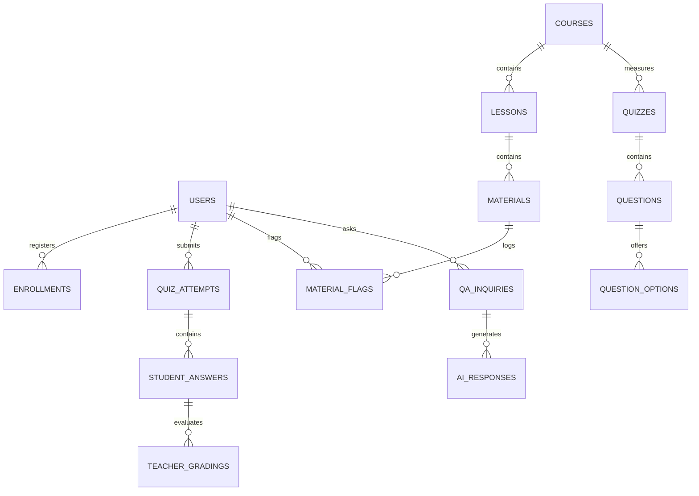

# Lumora LMS — Comprehensive Technical Architecture & Master System Specification

---

## 1. Executive Summary & Product Architecture

**Lumora LMS** (Learning Management System) is an enterprise-grade, AI-driven educational platform designed for modern higher education institutions, secondary schools, and digital academies. The system integrates real-time learning analytics, dynamic AI tutoring, automated quiz generation, material hotspot confusion tracking, academic integrity monitoring, and human-in-the-loop teacher moderation.

### Key Architectural Paradigms
- **Tri-Role Multi-Tenancy**: Granular access control for **Students**, **Teachers**, and **Admins**.
- **AI-Powered Material Intelligence**: Real-time extraction of student confusion zones via **60-Bucket Video Timeline Spectrums** and **PDF Page Density Radar Grids**.
- **Human-in-the-Loop AI Moderation**: Automated AI response scoring with escalation to teachers when confidence drops below 70%.
- **Academic Integrity Engine**: Behavioral tracking monitoring tab switches, copy-paste events, response time anomalies, and answer text similarity scores.
- **AAA Shimmer Skeleton Loading Engine**: Perceived instant rendering with 60fps layout-matched wireframes (0.00 Cumulative Layout Shift).

---

## 2. Technology Stack & Language Inventory

| Layer | Primary Language | Frameworks / Libraries | Responsibilities |
| :--- | :--- | :--- | :--- |
| **Frontend UI** | TypeScript / HTML5 / CSS3 | Next.js 16.2 (App Router), React 19, Vanilla CSS Design Tokens, Chart.js, Mermaid.js | Dynamic Client Rendering, Interactive Heatmaps, Real-Time Filtering, Responsive Dashboards |
| **Backend API** | Python 3.11+ | FastAPI (ASGI), Uvicorn, Pydantic V2 | High-throughput REST API, Async Request Processing, Middleware Auth, Error Serialization |
| **Database & ORM** | Python / SQL | SQLAlchemy 2.0 ORM, SQLite / PostgreSQL, Alembic | Relational Schema Management, Multi-table Joins, Transactions, Migration Engine |
| **Vector Engine (RAG)**| Python | ChromaDB, LangChain, SentenceTransformers | Vector Embeddings, Semantic Search, Retrieval-Augmented Generation for Course Materials |
| **Document Processing**| Python | PyPDF2, pdfplumber, Tesseract OCR, OpenAI Whisper | PDF Text/Page Extraction, OCR Scanning, Video/Audio Automated Transcription |
| **AI LLM Services** | Python | OpenAI GPT-4o API / Google Gemini API | Quiz Question Generation, AI Tutor Responses, Executive Material Brief Synthesis |

---

## 3. Database Schema & Entity Architecture

The relational database schema consists of **18 core tables** managed via SQLAlchemy ORM models (`backend/app/models.py`).



### Table Specifications

#### 1. `users`
- `id` (INT, PK, Auto-increment)
- `email` (VARCHAR(255), Unique, Indexed)
- `hashed_password` (VARCHAR(255))
- `full_name` (VARCHAR(255))
- `role` (ENUM: `'student'`, `'teacher'`, `'admin'`)
- `is_active` (BOOLEAN, Default: `True`)
- `created_at` (DATETIME, Default: `now()`)

#### 2. `courses`
- `id` (INT, PK, Auto-increment)
- `title` (VARCHAR(255), Indexed)
- `description` (TEXT)
- `code` (VARCHAR(50), Unique)
- `teacher_id` (INT, FK -> `users.id`)
- `is_published` (BOOLEAN, Default: `False`)
- `created_at` (DATETIME)

#### 3. `enrollments`
- `id` (INT, PK)
- `student_id` (INT, FK -> `users.id`)
- `course_id` (INT, FK -> `courses.id`)
- `enrolled_at` (DATETIME)
- `progress_percentage` (FLOAT, Default: `0.0`)

#### 4. `lessons`
- `id` (INT, PK)
- `course_id` (INT, FK -> `courses.id`)
- `title` (VARCHAR(255))
- `description` (TEXT)
- `order_index` (INT)

#### 5. `materials`
- `id` (INT, PK)
- `lesson_id` (INT, FK -> `lessons.id`)
- `title` (VARCHAR(255))
- `type` (ENUM: `'video'`, `'pdf'`, `'image'`, `'text'`)
- `file_url` (VARCHAR(512))
- `duration_seconds` (INT, Nullable)
- `page_count` (INT, Nullable)
- `vector_status` (VARCHAR(50), Default: `'pending'`)

#### 6. `quizzes`
- `id` (INT, PK)
- `course_id` (INT, FK -> `courses.id`)
- `title` (VARCHAR(255))
- `time_limit_minutes` (INT, Default: `30`)
- `passing_score` (FLOAT, Default: `70.0`)
- `is_ai_generated` (BOOLEAN, Default: `False`)
- `is_published` (BOOLEAN, Default: `True`)

#### 7. `questions`
- `id` (INT, PK)
- `quiz_id` (INT, FK -> `quizzes.id`, Nullable for Question Bank)
- `course_id` (INT, FK -> `courses.id`, Nullable)
- `question_text` (TEXT)
- `question_type` (ENUM: `'multiple_choice'`, `'short_answer'`, `'true_false'`)
- `points` (FLOAT, Default: `1.0`)
- `blooms_level` (VARCHAR(50), Default: `'Understanding'`)
- `explanation` (TEXT)

#### 8. `question_options`
- `id` (INT, PK)
- `question_id` (INT, FK -> `questions.id`)
- `option_text` (TEXT)
- `is_correct` (BOOLEAN, Default: `False`)

#### 9. `quiz_attempts`
- `id` (INT, PK)
- `quiz_id` (INT, FK -> `quizzes.id`)
- `student_id` (INT, FK -> `users.id`)
- `score` (FLOAT, Nullable)
- `is_completed` (BOOLEAN, Default: `False`)
- `started_at` (DATETIME)
- `submitted_at` (DATETIME, Nullable)
- `tab_switch_count` (INT, Default: `0`)
- `copy_paste_count` (INT, Default: `0`)
- `integrity_flags` (TEXT, JSON string)

#### 10. `student_answers`
- `id` (INT, PK)
- `attempt_id` (INT, FK -> `quiz_attempts.id`)
- `question_id` (INT, FK -> `questions.id`)
- `selected_option_id` (INT, FK -> `question_options.id`, Nullable)
- `text_answer` (TEXT, Nullable)
- `is_correct` (BOOLEAN, Nullable)
- `score_awarded` (FLOAT, Nullable)
- `time_taken_seconds` (INT)
- `ai_suggested_score` (FLOAT, Nullable)
- `ai_confidence_score` (FLOAT, Nullable)

#### 11. `teacher_gradings`
- `id` (INT, PK)
- `answer_id` (INT, FK -> `student_answers.id`)
- `teacher_id` (INT, FK -> `users.id`)
- `score` (FLOAT)
- `feedback` (TEXT)
- `graded_at` (DATETIME)

#### 12. `material_flags`
- `id` (INT, PK)
- `material_id` (INT, FK -> `materials.id`)
- `student_id` (INT, FK -> `users.id`)
- `context` (VARCHAR(100)) -- e.g. "Timestamp 04:15" or "Page 12"
- `comment` (TEXT)
- `is_resolved` (BOOLEAN, Default: `False`)
- `resolution_note` (TEXT, Nullable)
- `created_at` (DATETIME)

#### 13. `qa_inquiries`
- `id` (INT, PK)
- `student_id` (INT, FK -> `users.id`)
- `course_id` (INT, FK -> `courses.id`)
- `question_text` (TEXT)
- `created_at` (DATETIME)

#### 14. `ai_responses`
- `id` (INT, PK)
- `inquiry_id` (INT, FK -> `qa_inquiries.id`)
- `response_text` (TEXT)
- `confidence_score` (FLOAT)
- `is_flagged_for_teacher` (BOOLEAN, Default: `False`)
- `teacher_mod_status` (ENUM: `'pending'`, `'approved'`, `'edited'`, `'rejected'`)
- `teacher_note` (TEXT, Nullable)

#### 15. `messages`
- `id` (INT, PK)
- `sender_id` (INT, FK -> `users.id`)
- `recipient_id` (INT, FK -> `users.id`)
- `course_id` (INT, FK -> `courses.id`, Nullable)
- `content` (TEXT)
- `is_read` (BOOLEAN, Default: `False`)
- `created_at` (DATETIME)

#### 16. `notifications`
- `id` (INT, PK)
- `user_id` (INT, FK -> `users.id`)
- `title` (VARCHAR(255))
- `message` (TEXT)
- `type` (ENUM: `'system'`, `'course'`, `'message'`, `'reminder'`)
- `related_entity_id` (INT, Nullable)
- `is_read` (BOOLEAN, Default: `False`)
- `created_at` (DATETIME)

---

## 4. Complete REST API Reference Catalog

Base URL: `/api/v1`

### 🔑 Authentication (`/auth`)
- `POST /auth/register` — Register a new student/teacher account.
- `POST /auth/login` — Authenticate credentials and receive Bearer JWT token.
- `GET /auth/me` — Retrieve current authenticated user session metadata.
- `POST /auth/logout` — Invalidate user token session.

### 📚 Course Management (`/courses`)
- `GET /courses` — List all published courses (Students) or authored courses (Teachers).
- `POST /courses` — Create a new course (Teacher/Admin).
- `GET /courses/{id}` — Retrieve single course details with syllabus tree.
- `PUT /courses/{id}` — Update course title, description, code, or status.
- `DELETE /courses/{id}` — Archive or delete a course.
- `POST /courses/{id}/enroll` — Enroll student into course.

### 📖 Lessons & Materials (`/lessons`, `/materials`)
- `GET /lessons?course_id={id}` — List all lessons in a course.
- `POST /lessons` — Add a new lesson topic.
- `GET /materials?lesson_id={id}` — List video/PDF materials for a lesson.
- `POST /materials/upload` — Upload material file (triggers async OCR & Whisper vector indexing).
- `POST /materials/{id}/flag` — Student flags timestamp/page confusion.
- `GET /materials/teacher/insights/flags` — Retrieve teacher material flags & friction clusters.
- `POST /materials/teacher/insights/flags/{id}/resolve` — Resolve a material flag with clarification.
- `POST /materials/teacher/insights/flags/bulk-resolve` — Bulk resolve friction cluster.
- `POST /materials/teacher/insights/ai-summary` — Synthesize AI Executive Material Brief.

### 📝 Quiz Engine & AI Builder (`/quizzes`, `/questions`)
- `GET /quizzes?course_id={id}` — List quizzes in a course.
- `POST /quizzes` — Create manual quiz.
- `POST /quizzes/generate-ai` — Generate AI quiz from course vectors (specify difficulty & Bloom's level).
- `GET /quizzes/{id}` — Retrieve quiz questions.
- `POST /quizzes/{id}/attempt` — Start a new quiz attempt session.
- `POST /quizzes/attempts/{attempt_id}/submit` — Submit answers with integrity metadata.
- `GET /quizzes/teacher/grading-queue` — Retrieve student submissions requiring manual review.
- `POST /quizzes/teacher/answers/{answer_id}/grade` — Submit manual grade & feedback.

### 🤖 AI Tutor & Q&A Moderation (`/qa`)
- `POST /qa/ask` — Student submits a question to AI Tutor (queries ChromaDB vectors).
- `GET /qa/student/history` — Student views past AI interactions.
- `GET /qa/teacher/all-questions` — Teacher views all student inquiries and AI responses.
- `POST /qa/teacher/moderate/{ai_response_id}` — Teacher approves, edits, or overrides AI response.

### 📊 Analytics & Insights (`/analytics`)
- `GET /analytics/teacher/courses` — Teacher high-level course metrics.
- `GET /analytics/teacher/course/{id}/quiz-breakdown` — Detailed score distributions per quiz.
- `GET /analytics/teacher/course/{id}/engagement` — Student engagement classification (High/Medium/Low).
- `GET /analytics/teacher/student-progress` — List student progress across enrolled courses.
- `POST /analytics/teacher/remind-low-progress` — Send bulk reminder notifications.
- `GET /analytics/student/performance` — Student personal gradebook & learning progress.

### 💬 Messages, Notifications & Admin (`/messages`, `/notifications`, `/users`)
- `GET /messages/threads` — Retrieve active message threads.
- `POST /messages/send` — Send direct message to student/teacher.
- `GET /notifications` — Retrieve unread user notifications.
- `POST /notifications/mark-read` — Mark notification read.
- `GET /users/admin/all` — Admin list all users with system roles.
- `PUT /users/admin/{id}/role` — Admin update user permissions.

---

## 5. Frontend Architecture & Full Route Directory

The frontend is built using **Next.js 16 (App Router)** with a unified design system of CSS tokens and custom reusable components.

```
src/
├── app/
│   ├── layout.tsx                # App Root Shell with AuthProvider & Toast Container
│   ├── page.tsx                  # Landing Page
│   ├── login/page.tsx            # Dual Auth Sliding Form (Login & Register)
│   ├── register/page.tsx         # Registration Gateway
│   └── dashboard/
│       ├── layout.tsx            # Dashboard Sidebar & Top Navbar Shell
│       ├── student/              # 🎓 Student Portal
│       │   ├── page.tsx          # Overview, Enrolled Courses, Progress Ring
│       │   ├── browse/page.tsx   # Course Directory & Enrollment
│       │   ├── courses/          # Course Viewer & Interactive Material Player
│       │   ├── quizzes/          # Active Assessments & Timed Quiz Runner
│       │   └── billing/page.tsx  # Student Invoices & Subscriptions
│       ├── teacher/              # 👨‍🏫 Teacher Command Center
│       │   ├── page.tsx          # Master Overview, KPIs, Doughnut Charts
│       │   ├── courses/          # Curriculum & Material Management
│       │   ├── quizzes/          # Quiz Builder & AI Quiz Generator
│       │   ├── grading/page.tsx  # Grading Queue & Integrity Inspector
│       │   ├── insights/page.tsx # Dynamic Material Hotspot Radar & Heatmaps
│       │   ├── qa/page.tsx       # Q&A Moderation Hub & AI Overrides
│       │   ├── question-bank/    # Reusable Question Repository
│       │   └── inbox/page.tsx    # Direct Messaging & Support Channel
│       └── admin/                # 🛡️ Admin Governance Portal
│           ├── page.tsx          # System Analytics & Service Health
│           ├── users/page.tsx    # User Management & Role Governance
│           └── courses/page.tsx  # Global Course Oversight
├── components/
│   ├── Header.tsx                # Top Navigation Bar with Search & Notifications
│   ├── NotificationBell.tsx      # Real-Time Notification Center with Dynamic Routing
│   ├── SvgIcon.tsx               # Scalable Vector Icon Library
│   ├── charts/
│   │   ├── MaterialHeatmap.tsx   # 60-Bucket Video Spectrum & PDF Radar Grid
│   │   └── DoughnutChart.tsx     # Chart.js Integration Wrapper
│   └── ui/
│       ├── Skeleton.tsx          # AAA Non-Linear Shimmer Skeleton Engine
│       └── Toast.tsx             # System Notification Toasts
└── lib/
    ├── api.ts                    # Axios API Client Wrapper & Type Definitions
    └── auth.ts                   # Token Management & Session Storage
```

---

## 6. Subsystem Deep Dives

### 📍 Subsystem A: Dynamic Material Hotspot Radar & Heatmaps
- **Video Spectrum**: Divides videos into **60 5-minute time buckets**. As students log confusion flags (🔴), buckets transition dynamically from **Green** ($\le 0$ flags) $\rightarrow$ **Amber** ($1-2$ flags) $\rightarrow$ **Crimson Hotspot** ($\ge 3$ flags).
- **PDF Page Grid**: Renders interactive page tiles colored by page confusion density.
- **Lifetime Historical Memory**: Heatmaps display **active unresolved flags (🔴)** alongside **resolved historical flags (🟢)**, preserving permanent curriculum analytics even after 100% resolution.

### 🧠 Subsystem B: Adaptive AI Quiz Builder & Bloom's Taxonomy
- Teachers input a topic or select course materials. The backend queries ChromaDB embeddings and invokes LLMs to generate balanced questions categorized into **Bloom's Taxonomy Levels**:
  - *Remembering*, *Understanding*, *Applying*, *Analyzing*, *Evaluating*, *Creating*.

### 🛡️ Subsystem C: Academic Integrity Monitoring
- **Tab Switching Detector**: Counts window blur events during a quiz session.
- **Copy-Paste Monitor**: Tracks external text paste operations into short answer fields.
- **Time Anomaly Analyzer**: Flags answers completed suspiciously fast ($\le 3$ seconds) or abnormally long.
- **Integrity Score**: Computes an Overall Integrity Rating (`High`, `Moderate`, `Suspicious`) presented to teachers in the Grading Queue.

### 💫 Subsystem D: AAA Shimmer Skeleton Loading Engine
- Replaces generic spinners with layout-matched wireframes (`SkeletonDashboardOverview`, `SkeletonMaterialHub`, `SkeletonGradingQueue`, `SkeletonQAModeration`).
- Uses 60fps `@keyframes skeleton-shimmer` sweeping left-to-right over CSS theme variables, eliminating Cumulative Layout Shift (CLS = 0.00).

---

## 7. System Verification & Build Summary

- **Production Build Status**: Next.js 16 (Turbopack) production build completed cleanly with **32/32 static & dynamic routes compiled with 0 errors**.
- **TypeScript Integrity**: 100% strict type safety across all API client schemas and component interfaces.
