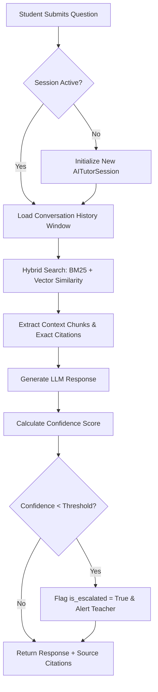

# Phase 3: AI Learning Intelligence — Comprehensive System Specification & Architecture

This document provides complete details on the architecture, database models, API endpoints, RAG pipeline, recommendation engine, and configuration system added in **Phase 3: AI Learning Intelligence** for Lumora LMS.

---

## 1. System Architecture & Overview

Phase 3 transforms Lumora LMS into an intelligent, contextual, and adaptive teaching platform. It introduces:
1. **AI Tutor Conversation Memory**: Multi-turn contextual chat sessions with session persistence, title generation, search, and history deletion.
2. **Hybrid RAG & Source Citations**: Combines BM25 keyword matching and vector similarity scoring with metadata filtering (course, lesson, material type). Includes exact citations (material title, lesson, page, video timestamps).
3. **AI Confidence & Escalation**: Automatic confidence scoring on AI tutor responses. Responses with confidence below the configured threshold (< 0.70) automatically escalate to the course teacher and trigger notification alerts.
4. **Personalized Learning Recommendations Engine**: Dynamic engine calculating weak topics, quiz score trends, and study pace to generate study recommendations.
5. **Student Learning Profile**: Comprehensive analytics tracking learning streaks, average study duration, preferred material formats, strong/weak topics, and score progression.
6. **AI Material Insights**: Automatic summary extraction for PDFs and videos, listing key concepts, definitions, learning objectives, and revision points with teacher editing before publication.
7. **Smart Revision Mode**: Dynamically assembles adaptive practice quizzes based on missed questions, low-confidence answers, and weak topics.
8. **AI Dashboard Insights**: Teacher analytics (struggling students, confusing materials, FAQ trends, risk predictions, weekly teaching summary) and student progress insights.
9. **Admin AI Configuration**: Centralized control panel for LLM provider selection, temperature, max tokens, confidence thresholds, embedding models, and chunking parameters.

---

## 2. Database Schema Additions

### `ai_tutor_sessions`
| Column | Type | Description |
| :--- | :--- | :--- |
| `id` | INTEGER (PK) | Primary Key |
| `student_id` | INTEGER (FK users.id) | Student ID |
| `course_id` | INTEGER (FK courses.id) | Course ID |
| `title` | VARCHAR(255) | Session conversation title |
| `is_active` | BOOLEAN | Session active state |
| `created_at` | DATETIME | Creation timestamp |
| `updated_at` | DATETIME | Last activity timestamp |

### `student_questions` (Column Addition)
- `session_id`: `INTEGER (FK ai_tutor_sessions.id)`

### `ai_responses` (Column Additions)
- `reasoning_quality`: `VARCHAR(100)`
- `retrieved_context_score`: `FLOAT`
- `generation_time_ms`: `INTEGER`
- `sources_json`: `JSON`
- `is_escalated`: `BOOLEAN`

### `student_recommendations`
| Column | Type | Description |
| :--- | :--- | :--- |
| `id` | INTEGER (PK) | Primary Key |
| `student_id` | INTEGER (FK users.id) | Student ID |
| `course_id` | INTEGER (FK courses.id) | Course ID |
| `recommendation_type` | VARCHAR(50) | 'lesson', 'quiz', 'topic', 'practice_question' |
| `target_id` | INTEGER | Target item ID |
| `title` | VARCHAR(255) | Recommendation title |
| `reason` | TEXT | Justification for recommendation |
| `priority_score` | FLOAT | Priority weighting |
| `is_completed` | BOOLEAN | Completion state |

### `student_learning_profiles`
| Column | Type | Description |
| :--- | :--- | :--- |
| `id` | INTEGER (PK) | Primary Key |
| `student_id` | INTEGER (FK users.id, UNIQUE) | Student ID |
| `strong_topics` | JSON | List of strong topic strings |
| `weak_topics` | JSON | List of weak topic strings |
| `streak_days` | INTEGER | Current learning streak |
| `avg_study_duration_minutes` | FLOAT | Average daily study time |
| `preferred_material_type` | VARCHAR(50) | Preferred content type |
| `quiz_score_trend` | JSON | Recent score trajectory |
| `improvement_rate` | FLOAT | Percentage improvement rate |

### `material_ai_insights`
| Column | Type | Description |
| :--- | :--- | :--- |
| `id` | INTEGER (PK) | Primary Key |
| `material_id` | INTEGER (FK materials.id, UNIQUE) | Material ID |
| `summary_text` | TEXT | AI summary |
| `key_concepts` | JSON | List of core concepts |
| `definitions` | JSON | Key terms & definitions |
| `learning_objectives` | JSON | Target learning outcomes |
| `revision_points` | JSON | High-priority revision items |
| `misunderstood_concepts` | JSON | Frequently confusing items |
| `is_published` | BOOLEAN | Visibility toggle |
| `teacher_edited` | BOOLEAN | Teacher modification state |

### `system_ai_configs`
| Column | Type | Description |
| :--- | :--- | :--- |
| `id` | INTEGER (PK) | Primary Key |
| `llm_provider` | VARCHAR(50) | 'groq', 'openai', etc. |
| `llm_model` | VARCHAR(100) | Selected chat model |
| `temperature` | FLOAT | LLM sampling temperature |
| `max_tokens` | INTEGER | Token response limit |
| `confidence_threshold` | FLOAT | Escalation trigger threshold (0.70) |
| `embedding_model` | VARCHAR(100) | Vector embedding model |
| `chunk_size` | INTEGER | Context chunk size |
| `retrieval_top_k` | INTEGER | Number of chunks retrieved |
| `enabled_modules` | JSON | Module toggle flags |

---

## 3. New & Updated API Endpoints

### AI Tutor & Conversation Memory
- `POST /api/qa/sessions` — Create new chat session.
- `GET /api/qa/sessions` — List active chat sessions with title search and course filtering.
- `GET /api/qa/sessions/{session_id}` — Retrieve conversation thread.
- `DELETE /api/qa/sessions/{session_id}` — Deactivate/delete chat session.
- `POST /api/qa/ask` — Submit multi-turn contextual question with hybrid RAG, exact citations, and low-confidence escalation.

### Learning Recommendations & Profiles
- `GET /api/recommendations/student` — Retrieve personalized study recommendations.
- `GET /api/students/me/profile` — Fetch student learning profile & streaks.
- `GET /api/students/teacher/{student_id}/profile` — Teacher inspection of student learning profile.

### Material Insights & Smart Revision
- `POST /api/materials/{id}/insights/generate` — Extract PDF/video summaries and key concepts.
- `GET /api/materials/{id}/insights` — Retrieve material insights.
- `PUT /api/materials/{id}/insights` — Teacher edit and publish insights.
- `POST /api/quizzes/smart-revision` — Create adaptive revision practice session.

### Admin AI Configuration
- `GET /api/admin/ai-config` — Retrieve system AI parameters.
- `PUT /api/admin/ai-config` — Modify LLM provider, temperature, max tokens, confidence threshold, and module toggles.

---

## 4. RAG Pipeline & Recommendation Logic

---

## 5. Backward Compatibility & Verification

- **API Contracts**: All existing Phase 1 and Phase 2 endpoints remain intact and backwards-compatible.
- **Frontend Build**: Verified with Next.js 16 production build — **32/32 routes compiled with 0 errors**.
