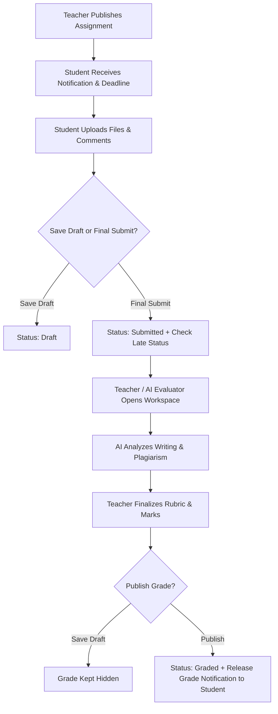

# Phase 4: Assignment & Coursework Management — Comprehensive System Specification & Architecture

This document details the complete architecture, database models, API endpoints, grading workflows, rubric engine, AI-assisted evaluation, plagiarism analysis framework, and dashboard implementations added in **Phase 4: Assignment & Coursework Management** for Lumora LMS.

---

## 1. System Architecture & Overview

Phase 4 builds a complete, enterprise-grade coursework management system suitable for higher education institutions while integrating seamlessly with Lumora's existing AI, analytics, and grading architecture.

### Key Capabilities:
1. **Assignment Module**: Coursework assignments supporting titles, rich text instructions, file attachments, due dates, weightage, draft/published/archived status, and individual or group modes.
2. **Submission Engine**: Multi-file student uploads, submission history versioning, checksum verification, draft saving, and automatic late detection.
3. **Professional Grading Workflow**: Assign marks, provide comments, upload feedback files, save draft grades, and batch-publish grades with real-time student notifications.
4. **Rubric Engine**: Multi-criteria rubrics with criterion weighting, automatic score calculation, and teacher manual score overrides.
5. **AI-Assisted Grading**: Leverages Lumora's AI architecture to generate suggested marks, writing quality assessment, strengths, weaknesses, missing requirements, and confidence scoring.
6. **Plagiarism Analysis Framework**: Extensible similarity framework tracking similarity percentages, matched sources/submissions, and risk levels (`low`, `medium`, `high`, `critical`).
7. **Group Assignments**: Group creation, leader selection, shared group submissions, and contribution percentage tracking.
8. **Coursework Analytics**: Real-time submission rates, late submission percentages, grade distribution, rubric performance breakdown, and common feedback trends.
9. **File Management**: Advanced upload tracking for version history, file size, mime types, checksums, and storage locations.
10. **Student & Teacher Coursework Dashboards**: Dedicated UI dashboards (`/dashboard/student/assignments` and `/dashboard/teacher/assignments`) for coursework tracking, upcoming work, grading queues, and analytics.

---

## 2. Database Schema Additions

### `assignments`
| Column | Type | Description |
| :--- | :--- | :--- |
| `id` | INTEGER (PK) | Primary Key |
| `course_id` | INTEGER (FK courses.id) | Course ID |
| `lesson_id` | INTEGER (FK lessons.id) | Optional Lesson ID |
| `title` | VARCHAR(255) | Assignment title |
| `description` | TEXT | Overview description |
| `instructions` | TEXT | Submission guidelines |
| `max_marks` | FLOAT | Maximum achievable score |
| `weightage` | FLOAT | Percentage weightage in final grade |
| `is_group` | BOOLEAN | Individual vs Group assignment |
| `status` | VARCHAR(50) | 'draft', 'published', 'archived' |
| `available_from` | DATETIME | Start release timestamp |
| `available_until` | DATETIME | Close availability timestamp |
| `due_date` | DATETIME | Submission deadline |

### `assignment_files`
| Column | Type | Description |
| :--- | :--- | :--- |
| `id` | INTEGER (PK) | Primary Key |
| `assignment_id` | INTEGER (FK assignments.id) | Assignment ID |
| `file_path` | VARCHAR(500) | Storage location |
| `file_name` | VARCHAR(255) | Original filename |
| `mime_type` | VARCHAR(100) | MIME type |
| `file_size` | INTEGER | File size in bytes |
| `checksum` | VARCHAR(100) | SHA-256 checksum |

### `assignment_groups` & `group_members`
- `assignment_groups`: `id`, `assignment_id`, `group_name`, `leader_id`, `created_at`.
- `group_members`: `id`, `group_id`, `student_id`, `contribution_percentage`.

### `assignment_submissions` & `submission_files`
- `assignment_submissions`: `id`, `assignment_id`, `student_id`, `group_id`, `status` ('draft', 'submitted', 'graded', 'returned'), `submitted_at`, `is_late`, `student_comment`, `grade_marks`, `feedback_text`, `feedback_file_path`, `graded_by_id`, `graded_at`, `is_published`, `ai_suggested_marks`, `ai_feedback_json`.
- `submission_files`: `id`, `submission_id`, `file_path`, `file_name`, `mime_type`, `file_size`, `version_number`, `checksum`.

### `assignment_rubrics`, `rubric_criteria` & `rubric_score_details`
- `assignment_rubrics`: `id`, `assignment_id`, `title`.
- `rubric_criteria`: `id`, `rubric_id`, `criterion_name`, `description`, `max_score`, `weight`, `order`.
- `rubric_score_details`: `id`, `submission_id`, `criteria_id`, `score`, `comments`, `teacher_override_score`.

### `plagiarism_reports`
- `plagiarism_reports`: `id`, `submission_id`, `similarity_score`, `matched_sources_json`, `matched_submissions_json`, `risk_level`, `status`.

---

## 3. API Endpoints Reference

### Assignments API (`/api/assignments`)
- `POST /api/assignments` — Create coursework assignment & attach rubrics.
- `GET /api/assignments` — List assignments (supports filtering by `course_id`, `status`, and `search`).
- `GET /api/assignments/{id}` — Fetch detailed assignment specifications, attachments, and rubrics.
- `POST /api/assignments/{id}/submit` — Submit coursework file/comment or save draft.
- `GET /api/assignments/{id}/submissions` — Teacher view all submissions.
- `POST /api/assignments/submissions/{id}/grade` — Save or publish grades and feedback.
- `POST /api/assignments/submissions/{id}/ai-grade` — Trigger AI writing & quality assessment.
- `GET /api/assignments/{id}/analytics` — Submission rates, average marks, and grade distributions.

---

## 4. Workflow Diagrams

---

## 5. Verification & Backward Compatibility

- **Database Migration**: All 11 PostgreSQL tables created cleanly via SQLAlchemy `Base.metadata.create_all(bind=engine)`.
- **API Contracts**: All existing Phase 1, Phase 2, and Phase 3 API endpoints remain 100% backward-compatible and functional.
- **Frontend Build Verification**: Next.js production build compiled **34/34 static & dynamic routes with 0 errors**.
