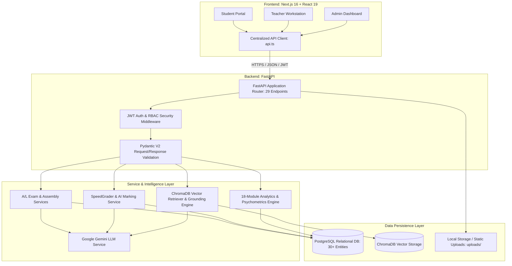

# 00. System Overview: Lumora Learning Analytics Platform

## 1. Executive Summary

**Lumora LMS** is an enterprise-grade, AI-integrated Learning Management System (LMS) and psychometric assessment platform specifically engineered to meet the demanding pedagogical and structural requirements of the **Sri Lankan General Certificate of Education (Advanced Level) examination standard** as well as large-scale university and secondary education environments.

Unlike conventional learning platforms that treat digital learning purely as video/file hosting or simple multiple-choice quizzes, Lumora introduces a multi-tiered architecture that unifies:
1. **Multi-Format Course & Content Delivery**: Structured unit-lesson-material hierarchies supporting high-definition video, multi-page PDFs with page anchoring, biological/scientific diagram image viewers, and interactive rich-text notes.
2. **National-Standard A/L Assessment Engine**: A high-fidelity examination pipeline modeling **Paper I (50-item 5-option MCQs across 7 specialized question templates)**, **Paper II-A (4-question multi-tiered Structured subpart hierarchies)**, and **Paper II-B (3-essay analytical responses with fine-grained rubric criteria checklists)**.
3. **Retrieval-Augmented Generation (RAG) & AI Tutor**: A localized, course-vault-grounded AI assistant utilizing Google Gemini LLM architectures and ChromaDB vector embeddings (`all-MiniLM-L6-v2`) to answer student inquiries with citation-grounded references while isolating sensitive assessment materials.
4. **Human-in-the-Loop SpeedGrader & Marking Studio**: AI pre-grading and semantic evaluation of complex written student scripts coupled with teacher verification, point overrides, and rubric attainment tracking.
5. **Multi-Domain Psychometric & Learning Intelligence Engine**: 18 specialized analytics services computing classical test theory metrics (Item Difficulty Index $p$, Item Discrimination Index $d$, non-functional distractor analysis), Bloom's taxonomy cognitive depth tracking, question format divergence detection, material difficulty hotspot aggregation, and multi-factor student academic risk modeling.

---

## 2. Target Users and Role-Based Capabilities

Lumora implements strict Role-Based Access Control (RBAC) across three principal user roles:

```mermaid
graph TD
    User([Authenticated User])
    User -->|Role = Student| StudentRole[Student Workspace]
    User -->|Role = Teacher| TeacherRole[Teacher Command Center]
    User -->|Role = Admin| AdminRole[Administrative Governance]

    subgraph Student Workspace
        StudentRole --> S1[Course & Lesson Learning]
        StudentRole --> S2[Exact Position Resume: Video/PDF]
        StudentRole --> S3[Difficulty Flagging & Notes]
        StudentRole --> S4[Ask AI Tutor & RAG Support]
        StudentRole --> S5[A/L Assessment Engine Workstation]
        StudentRole --> S6[Personal Mastery Dossier & Analytics]
    end

    subgraph Teacher Command Center
        TeacherRole --> T1[Curriculum & Material Authoring]
        TeacherRole --> T2[A/L Exam Designer & Blueprint Generator]
        TeacherRole --> T3[SpeedGrader & Verification Studio]
        TeacherRole --> T4[7-Tab Analytics Workstation]
        TeacherRole --> T5[Content Hotspot & Flag Moderation]
        TeacherRole --> T6[Q&A Moderation & AI Corrections]
        TeacherRole --> T7[Multi-Format Academic Reporting]
    end

    subgraph Administrative Governance
        AdminRole --> A1[Global AI Hyperparameter Configuration]
        AdminRole --> A2[User Account & Role Management]
        AdminRole --> A3[System Audit & Background Job Tracking]
    end
```

### 2.1. Student Capabilities
- **Coursework & Learning Navigation**: Seamless progression through courses, syllabus units, and lessons with real-time completion fraction tracking (e.g. `2/3 Completed`).
- **Precision Media Resumption**: Automatic timestamp retention for video playback (restoring exact second) and PDF documents (loading specific page hash `#page=N` with top control bar).
- **In-Context Learning Assistance**: Creating difficulty flags at specific video timestamps or PDF pages, writing private material notes, and consulting the Ask AI Tutor.
- **Formal A/L Assessment Execution**: Taking timed, proctored examinations with Section navigation, scientific symbol toolbars, combination grid selectors, structured answer boxes, rich text essay authoring, and diagram upload.
- **Student Performance Mastery**: Reviewing verified marks, A/L standardized letter grades (`A`, `B`, `C`, `S`, `F`), detailed teacher feedback notes, and unit mastery breakdowns.

### 2.2. Teacher Capabilities
- **Curriculum Architecture**: Constructing courses, unit hierarchies, lessons, and uploading materials (Videos, PDFs, Notes, Diagrams) categorized as general, past paper, resource book, or private RAG vault.
- **Exam Authoring & Blueprint Assembly**: Manual drafting or AI-assisted generation of full 50-item MCQ papers, structured questions with academic parent-child labels (`(a)`, `(i)`), and essay prompts with rubric checklists.
- **Marking Studio & SpeedGrader**: Reviewing student attempts with side-by-side candidate scripts and rubric checklists, adopting or overriding AI recommendations, and publishing verified final scores.
- **Teacher Analytics Workstation**: Deep-diving into 7 specialized analytic panes (Overview, Assessments, Learning Intelligence, Materials, Ask AI, Student Roster, Reports) with exportable CSVs and printable PDF dossiers.
- **Pedagogical Moderation**: Responding to student difficulty flags, resolving material confusion hotspots, and overriding/correcting AI tutor responses.

### 2.3. Administrator Capabilities
- **System AI Configuration**: Adjusting global LLM providers, model identifiers (`gemini-2.0-flash`, `gemini-1.5-pro`), generation temperature, token limits, confidence thresholds, and vector chunking parameters via `system_ai_configs`.
- **System Governance & Audit**: Monitoring asynchronous processing jobs (OCR, PDF indexing, AI generation) and reviewing audit logs.

---

## 3. High-Level System Architecture

---

## 4. Key Subsystem Breakdown

| Subsystem | Primary Technologies | Core Purpose | Implemented Status |
| :--- | :--- | :--- | :--- |
| **Authentication & RBAC** | `FastAPI`, `python-jose`, `passlib[bcrypt]` | Secure JWT token issuance, password hashing, role enforcement, and resource ownership checks. | **IMPLEMENTED** |
| **Course & Material Engine** | `FastAPI`, `SQLAlchemy`, `HTML5 Video`, `PDF.js` | Course hierarchies, video/PDF exact resume tracking, difficulty flags, and material categories. | **IMPLEMENTED** |
| **A/L Exam Engine** | `FastAPI`, `Next.js`, `SQLAlchemy` | 3 distinct examination formats (Paper I MCQ, Paper II-A Structured, Paper II-B Essay), timing, and submissions. | **IMPLEMENTED** |
| **AI Assessment Generator** | `Google Gemini API`, `Pydantic` | Template-compliant generation of MCQs, structured subparts, and essay marking blueprints. | **IMPLEMENTED** |
| **Marking Studio & SpeedGrader** | `Next.js 16`, `React 19`, `FastAPI` | Pre-grading evaluation, interactive rubric checklists, score override drawer, and Zen focus reader. | **IMPLEMENTED** |
| **RAG & Ask AI Tutor** | `ChromaDB`, `sentence-transformers`, `Gemini` | Vault-grounded student tutoring, citation extraction, grounding verification, and teacher moderation. | **IMPLEMENTED** |
| **Psychometric Analytics** | `Python`, `SQLAlchemy`, `Chart.js` | Item difficulty $p$, discrimination $d$, distractor efficiency, format divergence, and cognitive depth analysis. | **IMPLEMENTED** |
| **Student Dossier & Risk Engine**| `Python`, `Next.js` | Longitudinal progress tracking, radar mastery plots, cognitive balance, and automated academic risk flags. | **IMPLEMENTED** |
| **Reporting & Export Engine** | `FastAPI`, `Next.js`, `CSS Print` | CSV data export generation, multi-page print stylesheet, and PDF report rendering. | **IMPLEMENTED** |
| **Coursework & Assignments** | `SQLAlchemy`, `FastAPI` | Phase 4 coursework submissions, file attachments, and rubric detail models. | **PARTIALLY IMPLEMENTED** (Core backend schemas present; frontend focused on A/L Exams) |
| **Payment & Subscriptions** | `SQLAlchemy`, `FastAPI` | Subscription and payment entity models and backend routes. | **PARTIALLY IMPLEMENTED** (Mock/Database records implemented; external gateway sandbox) |

---

## 5. Security and Data Integrity Model

1. **Strict Tenant & Role Isolation**: Students can only access active courses in which they are formally enrolled. Under no circumstances can a student view or access another candidate's submissions, answer scripts, or confidential teacher marking schemes.
2. **Assessment Paper Separation**: Zero cross-assessment contamination exists between independent examination papers (e.g. MCQ submissions do not interfere with Structured or Essay marking).
3. **Deterministic Score Traceability**: Every student answer record maintains a full score provenance trail:
   - `auto_score`: Machine-calculated score (e.g., deterministic MCQ key matching).
   - `ai_score`: Gemini AI recommendation score.
   - `teacher_score`: Manual override points set by teacher.
   - `final_score`: The active verified grade committed to student records.
4. **Credential & Secret Protection**: All sensitive tokens, Gemini API keys, and database passwords are encrypted or loaded via environment variables and never logged or exposed in client responses.
