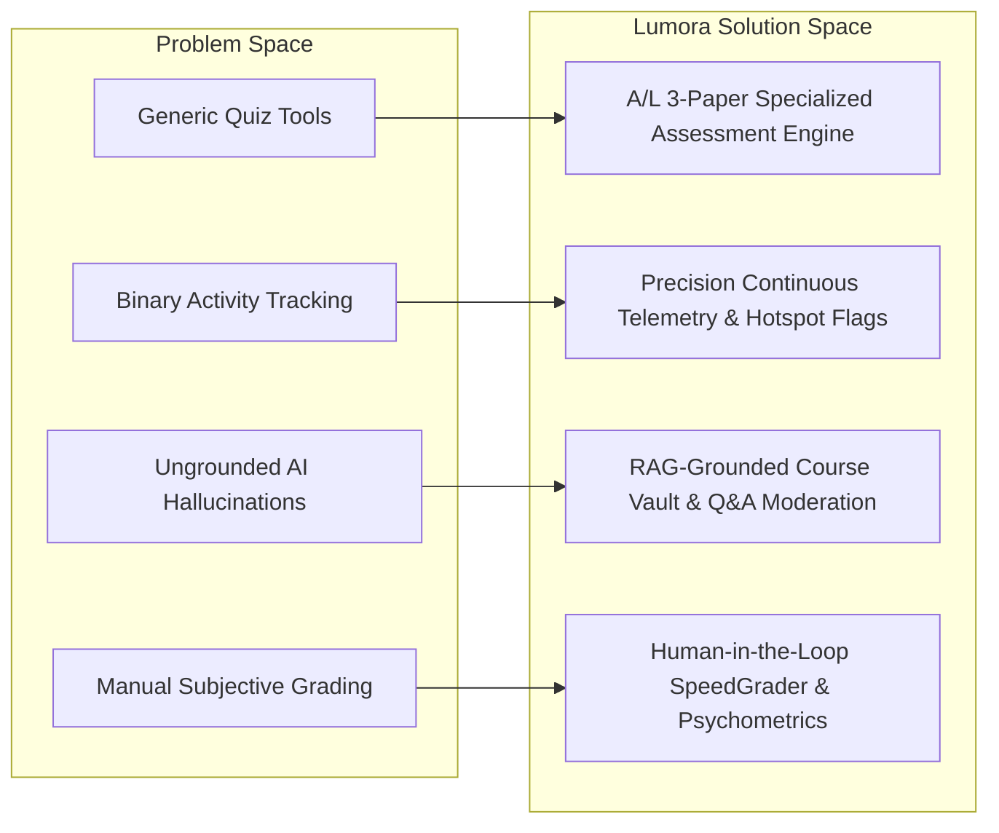

# 01. Project Scope and Objectives

## 1. Problem Statement & Background

Secondary and collegiate education platforms in South Asia—particularly for the competitive **Sri Lankan General Certificate of Education (Advanced Level)**—suffer from several critical technological and pedagogical limitations:

1. **Generic LMS Inadequacy for National Examination Standards**: Mainstream platforms (e.g., Moodle, Canvas, Google Classroom) are built around simplistic multiple-choice or monolithic essay boxes. They lack the architectural capability to represent the multi-tiered structure of A/L science and mathematics examinations:
   - **Paper I (MCQ)**: Requires 5 distinct answer choices across 7 complex formats (Multi-response 1-to-5 combination grids, 5-statement truth tables, matching column matrices, sequential diagnostics).
   - **Paper II-A (Structured Questions)**: Demands multi-tiered subpart hierarchies (`(a)`, `(i)`, `(ii)`) with allocated line spaces, prompt constraints, and discrete marks.
   - **Paper II-B (Essay Questions)**: Requires long-form analytical scientific writing evaluated against 10–15 specific rubric criteria points and accompanied by hand-drawn scientific diagrams.
2. **Disconnected Learning & Assessment Telemetry**: Conventional LMS solutions track student activity as isolated binary events (e.g., "file viewed"). They fail to capture exact resume coordinates (video timestamps, PDF page numbers), student difficulty indicators at specific content segments, or synthesize learning behavior with assessment outcomes.
3. **Unmoderated AI Hallucination in Education**: Generic AI chatbots applied to education frequently hallucinate incorrect scientific facts, provide ungrounded answers from non-curriculum sources, or leak confidential marking schemes.
4. **Absence of Real-Time Psychometric & Diagnostic Intelligence**: Teachers in large cohorts (100–1000+ students) lack automated Item Response Theory (IRT) and Classical Test Theory (CTT) tools to calculate item difficulty ($p$-value), item discrimination index ($d$), non-functional distractor frequencies, or identify systemic cognitive gaps across syllabus units.

---

## 2. Lumora's Architectural Solution

Lumora addresses these challenges by introducing an end-to-end specialized learning and assessment platform:

---

## 3. Project Scope & System Objectives

### 3.1. Primary System Objectives
- **Objective 1 (Curriculum & Material Delivery)**: Provide high-fidelity digital delivery for structured syllabi, supporting precision resume positions for video/PDF materials, unit completion fractions, and contextual confusion flagging.
- **Objective 2 (A/L Assessment Integrity)**: Deliver a comprehensive A/L exam engine capable of authoring, proctoring, taking, and scoring Paper I (MCQ), Paper II-A (Structured), and Paper II-B (Essay) papers with zero cross-contamination.
- **Objective 3 (Grounded AI Assistance)**: Implement a Retrieval-Augmented Generation (RAG) tutor grounded in verified course materials with teacher moderation, confidence thresholds, and citation tracking.
- **Objective 4 (AI Pre-Grading with Teacher Governance)**: Accelerate the evaluation of unstructured and essay responses via semantic checklist matching while preserving 100% teacher override authority.
- **Objective 5 (Multi-Dimensional Learning Intelligence)**: Equip educators with an 18-module analytics workstation calculating classical psychometrics, Bloom's cognitive taxonomy depth, format divergence, and student risk dossiers.

---

## 4. Implementation Truth Matrix (Fact vs. Design Intent)

To maintain absolute academic and forensic integrity, the following matrix contrasts what is **actually implemented and functional in the source code** versus what was planned or partially developed.

### 4.1. Core Learning & Materials System
| Capability | Status | Implementation Reality in Code |
| :--- | :--- | :--- |
| Course / Unit / Lesson Hierarchy | **IMPLEMENTED** | Fully implemented in `courses.py`, `units.py`, `lessons.py`. Rendered dynamically in student and teacher portals. |
| Material Types (Video, PDF, Note, Image) | **IMPLEMENTED** | Supported via `MaterialType` enum in `models.py`. Handled via `MaterialViewer.tsx` with dedicated rendering engines. |
| Exact Resume Tracking (Video) | **IMPLEMENTED** | Throttled `last_position` updates every 4s; resumes exact second on load in `MaterialViewer.tsx`. |
| Exact Resume Tracking (PDF) | **IMPLEMENTED** | Page anchor `#page=N` synchronisation, bookmarking, and top control bar in `MaterialViewer.tsx`. |
| Unit Progress Fractions | **IMPLEMENTED** | Backend calculates `completed_fraction` (e.g. `2/3 Completed`); displayed in student course outline. |
| Lesson Status Badges | **IMPLEMENTED** | `Reviewed`, `Engaging`, `Not Reviewed` calculated and rendered on course and lesson pages. |
| Material Difficulty Flags | **IMPLEMENTED** | Students submit timestamp/page flags; teachers view and reply in `MaterialViewer` and Analytics. |

### 4.2. A/L Examination & Question Bank Engine
| Capability | Status | Implementation Reality in Code |
| :--- | :--- | :--- |
| Paper I MCQ Engine (50 Items, 7 Formats) | **IMPLEMENTED** | 7 template types supported in `ALQuestionTemplate`. Answering, autosaving, deterministic auto-scoring functional. |
| Paper II-A Structured Engine (4 Questions) | **IMPLEMENTED** | Subparts tree with prompt labels (`(a)`, `(i)`), line counts, student text inputs, and score overrides. |
| Paper II-B Essay Engine (3 Questions) | **IMPLEMENTED** | Word-count monitored rich textarea, diagram image attachment, and 10–15 item rubric checklists. |
| AI Exam Generation (Gemini) | **IMPLEMENTED** | `al_mcq_generator.py`, `al_structured_generator.py`, `al_essay_generator.py` generate template-valid papers. |
| Question Bank & Pool Management | **IMPLEMENTED** | Question bank repository, search, filter, and selective exam deletion prompt (keep banked questions). |
| Marking Studio / SpeedGrader | **IMPLEMENTED** | Side-by-side script and rubric checklist, Accept All AI recommendations, Zen focus reader, and zoom lightbox. |

### 4.3. Analytics & Learning Intelligence
| Capability | Status | Implementation Reality in Code |
| :--- | :--- | :--- |
| Psychometric Difficulty ($p$-value) | **IMPLEMENTED** | Computed per question as $p = \frac{\text{Correct}}{\text{Total}}$ in `mcq_analytics.py`. |
| Psychometric Discrimination ($d$) | **IMPLEMENTED** | Upper 27% vs Lower 27% cohort formula with sample validation ($\ge 10$ attempts) in `discrimination.py`. |
| Distractor Analysis | **IMPLEMENTED** | Tracks frequency of choices A–E; flags non-functional distractors ($<5\%$). |
| Question Format Divergence | **IMPLEMENTED** | Detects variance between student MCQ vs Structured vs Essay performance in `learning_intelligence.py`. |
| Bloom's Cognitive Depth Tracking | **IMPLEMENTED** | Maps performance across Remember, Understand, Apply, Analyze, Evaluate levels. |
| Material Confusion Hotspots | **IMPLEMENTED** | Aggregates difficulty flags by timestamp/page; calculates view-to-flag friction ratios. |
| Student Academic Risk Modeling | **IMPLEMENTED** | Multi-factor classification into `High Risk`, `Medium Risk`, `On Track`, `High Performer`. |
| Export & Reporting Engine | **IMPLEMENTED** | CSV streaming export and print-optimized PDF dossier generation in `reporting.py`. |

### 4.4. Secondary / Partially Implemented Features
| Capability | Status | Implementation Reality in Code |
| :--- | :--- | :--- |
| Coursework & Assignments (Phase 4) | **PARTIALLY IMPLEMENTED** | Complete DB schemas and FastAPI routes in `assignments.py`; UI partially integrated in teacher views. |
| OCR Background Ingestion | **PARTIALLY IMPLEMENTED** | `ocr.py` using `pytesseract` is functional; requires local Tesseract binary configured in environment. |
| Whisper Audio Transcription | **PARTIALLY IMPLEMENTED** | Backend service `audio.py` exists; requires local ffmpeg/model binaries for production streaming. |
| Payment Gateway Integration | **PLACEHOLDER** | `payments.py` and `subscriptions.py` maintain DB records; external gateway (e.g. Stripe) operates in sandbox mode. |
| Native Mobile Application | **PLANNED** | Web application is fully responsive on mobile viewports; native iOS/Android shell not implemented. |
