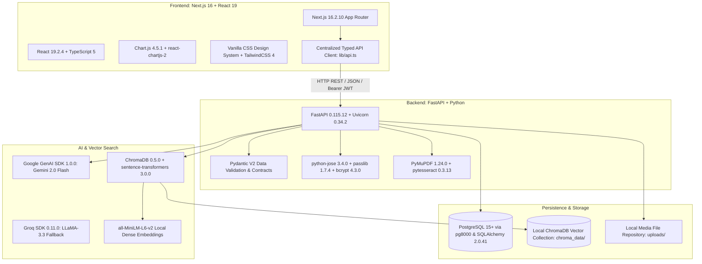

# 02. Technology Stack

This document details the actual technology stack, frameworks, libraries, database engines, AI providers, and infrastructure configurations utilized throughout the Lumora LMS codebase, verified directly against [`backend/requirements.txt`](file:///d:/BSc%20SE/Final%20Project/lumora_LMS/backend/requirements.txt), [`frontend/package.json`](file:///d:/BSc%20SE/Final%20Project/lumora_LMS/frontend/package.json), and runtime configuration files.

---

## 1. Complete Technology Matrix

---

## 2. Frontend Technology Stack

| Category | Technology | Version | Purpose & Implementation Details |
| :--- | :--- | :--- | :--- |
| **Framework** | **Next.js** | `16.2.10` | App Router paradigm, Server-Side Rendering (SSR), Static Site Generation (SSG), dynamic route segments (`[submissionId]`, `[id]`, `[studentId]`), and Turbopack build engine. |
| **UI Library** | **React** | `19.2.4` | Component lifecycle, modern hooks (`useState`, `useEffect`, `useCallback`, `useMemo`, `useRef`), and concurrent rendering. |
| **Language** | **TypeScript** | `^5.0.0` | Strict type definitions across all UI components, data structures, and API response contracts. |
| **Data Visualization** | **Chart.js** & **react-chartjs-2** | `^4.5.1` / `^5.3.1` | Renders radar charts (mastery), bar charts (grade/question distribution), doughnut charts (pass rates), and line charts (longitudinal score trends). |
| **Styling & Design** | **Vanilla CSS** & **TailwindCSS** | `@tailwindcss/postcss ^4` | Design system built on CSS variables in `globals.css` (e.g., `--bg-card`, `--accent-primary`, `--border-subtle`), ensuring responsive dark/light theme support. |
| **Icons & Media** | **Lucide React** & **SvgIcon** | `^1.26.0` | Centralized inline SVG icon rendering with Lucide styling (24×24 viewBox, 1.75 stroke). |
| **Markdown Rendering**| **react-markdown** & **remark-gfm**| `^10.1.0` / `^4.0.1` | Rich rendering of AI feedback notes, question instructions, and student markdown formatting. |
| **State & API Layer** | **Native React + Fetch API** | N/A | Centralized, strongly-typed asynchronous HTTP client in `frontend/src/lib/api.ts` handling token injection and error parsing. |

---

## 3. Backend Technology Stack

| Category | Technology | Version | Purpose & Implementation Details |
| :--- | :--- | :--- | :--- |
| **Web Framework** | **FastAPI** | `0.115.12` | High-performance asynchronous Python web framework providing automatic OpenAPI/Swagger documentation (`/docs`, `/redoc`), dependency injection, and router modularization. |
| **ASGI Server** | **Uvicorn** | `0.34.2` | Production-ready ASGI server with standard worker loops. |
| **Language** | **Python** | `3.11+ / 3.13` | Backend execution runtime. |
| **ORM & Database** | **SQLAlchemy** & **pg8000** | `2.0.41` / `1.31.2` | Object-Relational Mapping (ORM) connecting to PostgreSQL via pure-Python `pg8000` driver (`postgresql+pg8000://`). Schema migration management assisted by Alembic (`1.16.1`). |
| **Data Validation** | **Pydantic** | `V2 (FastAPI core)` | Comprehensive request validation, response serialization, and analytics data contract enforcement. |
| **Authentication** | **python-jose** & **passlib** | `3.4.0` / `1.7.4` | JWT access token creation/verification (HS256 algorithm) and secure salted bcrypt password hashing (`bcrypt 4.3.0`). |
| **Multipart & Uploads** | **python-multipart** & **aiofiles** | `0.0.20` / `24.1.0` | Asynchronous file streaming for PDF past papers, video lessons, and candidate scientific diagram attachments. |
| **Document Processing**| **PyMuPDF (fitz)** & **pytesseract** | `^1.24.0` / `^0.3.13` | PDF parsing, syllabus text extraction, and OCR image text processing. |

---

## 4. Artificial Intelligence & Vector Search Stack

| Category | Technology | Model / Version | Operational Role in Codebase |
| :--- | :--- | :--- | :--- |
| **Primary LLM** | **Google Gemini** (`google-genai`) | `gemini-2.0-flash` / `gemini-1.5-pro` (v1.0.0+) | Generates A/L MCQ items, Structured questions with academic labels, Essay marking blueprints, student Q&A answers, and SpeedGrader pre-grading evaluations. |
| **Secondary LLM** | **Groq SDK** (`groq`) | `llama-3.3-70b-versatile` (v0.11.0+) | High-speed fallback inference engine for real-time validation and classification. |
| **Vector Database** | **ChromaDB** | `^0.5.0` | Local persistent vector storage (`backend/chroma_data/`) organizing chunks into course collections (`course_materials`). |
| **Dense Embeddings**| **Sentence Transformers** | `all-MiniLM-L6-v2` (`^3.0.0`) | 384-dimensional dense semantic text embeddings for material chunk retrieval in the RAG pipeline. |
| **Computer Vision** | **OpenCV** & **pytesseract** | `opencv-python-headless 4.10.0` | Pre-processing student uploaded diagram images for automated orientation, noise removal, and layout parsing. |

---

## 5. Persistence & Infrastructure Stack

| Category | Technology | Configuration / Version | Operational Description |
| :--- | :--- | :--- | :--- |
| **Primary Database** | **PostgreSQL** | `15+` / Database `fdp_db` | Relational storage for 30+ tables containing courses, curriculum, questions, submissions, answers, scores, and analytics. |
| **Vector Storage** | **ChromaDB SQLite** | Local Directory `chroma_data` | Persistent disk-backed vector collection. |
| **Containerization** | **Docker & Compose** | `docker-compose.yml` | Multi-container setup orchestrating backend FastAPI service, PostgreSQL database, and frontend Next.js container. |
| **Static File Mount** | **FastAPI StaticFiles** | Mounted at `/uploads` | Serves uploaded past papers, course videos, PDF notes, and student essay diagrams directly with MIME-type resolution. |
