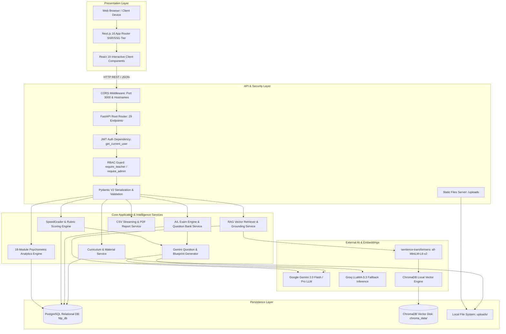
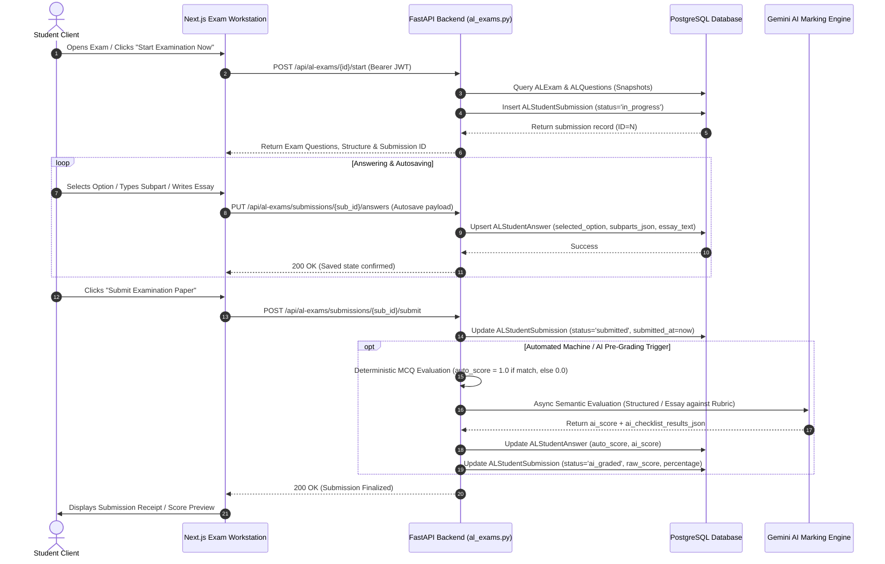
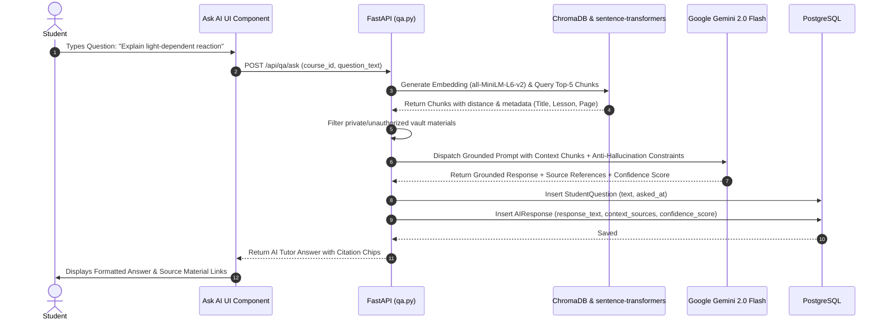

# 03. System Architecture

## 1. Architectural Overview

Lumora LMS adopts a modern, decoupled **Multi-Tier Layered Architecture** emphasizing high modularity, strict role separation, data isolation, and low coupling between the presentation layer, business services, psychometric analytics pipeline, and external AI providers.

---

## 2. Layer Responsibilities & Interactions

### 2.1. Presentation Layer (Frontend)
- **Framework**: Next.js 16 (App Router) with React 19.
- **Responsibilities**:
  - Route navigation and layout hierarchy (`/dashboard/student/*`, `/dashboard/teacher/*`, `/login`, `/register`).
  - Client-side state orchestration using React hooks (`useState`, `useEffect`, `useCallback`, `useMemo`, `useRef`).
  - Real-time media position tracking (Video timestamp throttling, PDF page hash navigation).
  - Assessment workstations (50-item MCQ grid, Structured subparts, Rich-text essay workspace, Diagram lightbox).
  - Interactive data visualization (Chart.js radar, bar, doughnut, and line charts).
- **Communication**: Interacts with the backend exclusively via `frontend/src/lib/api.ts`, which sends standard `fetch` HTTP requests with `Authorization: Bearer <JWT_TOKEN>` headers.

### 2.2. API Gateway & Security Layer (Backend)
- **Framework**: FastAPI (0.115.12) running under Uvicorn ASGI.
- **Responsibilities**:
  - Global CORS handling allowing frontend origins (`http://localhost:3000`, `http://127.0.0.1:3000`).
  - Route authentication via `get_current_user` in [`backend/app/auth.py`](file:///d:/BSc%20SE/Final%20Project/lumora_LMS/backend/app/auth.py).
  - RBAC verification ensuring students cannot access teacher authoring endpoints or marking studio.
  - Pydantic V2 schema validation preventing malformed or unverified payloads from executing business logic.

### 2.3. Service Tier (Business Logic)
- **Modular Services**:
  - `al_generator_service.py` & `al_mcq_generator.py`: Generates template-accurate questions conforming to national curriculum constraints.
  - `al_marking_service.py`: Computes preliminary AI scores and checklist matches for unstructured student answers.
  - `al_rag_retriever.py` & `vector.py`: Extracts top-$k$ relevant chunks from ChromaDB for student inquiries.
  - `analytics/`: 18 specialized services computing Item Difficulty Index $p$, Item Discrimination $d$, Distractor efficiency, Bloom's cognitive taxonomy, and student risk scores.
  - `reporting.py`: Assembles multi-page printable student/course dossiers and streaming CSV data tables.

### 2.4. Persistence Layer (Data Tier)
- **Relational Storage**: PostgreSQL (database `fdp_db`) managing 30+ tables with ACID guarantees, foreign key cascades, and unique constraints.
- **Vector Storage**: Disk-persisted ChromaDB database (`backend/chroma_data/`) storing 384-dimensional text embeddings of course materials.
- **File System**: `uploads/` folder housing original PDF past papers, lecture videos, diagram attachments, and student essay images.

---

## 3. End-to-End Request Lifecycle & Workflows

### 3.1. Student Examination Execution & Submission Sequence

---

### 3.2. RAG-Grounded Ask AI Tutor Pipeline

