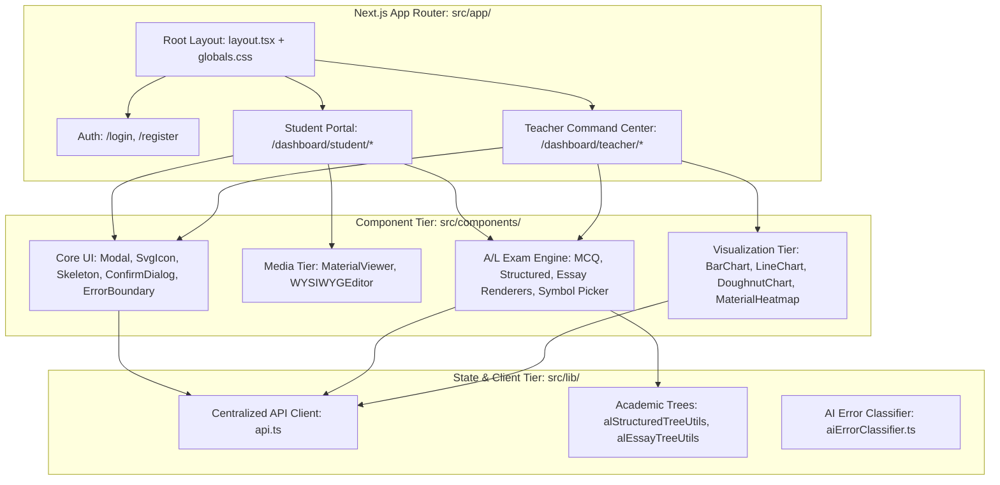

# 04. Frontend Architecture

## 1. Frontend Architectural Overview

The Lumora LMS frontend is built on **Next.js 16.2.10 (App Router)** utilizing **React 19.2.4** and **TypeScript 5**. It adopts a modular, component-driven client architecture designed for sub-second page transitions, rich typography, interactive assessment workstations, and responsive data visualizations.

---

## 2. Complete Route Map & Page Inventory

### 2.1. Authentication Routes
| Route | Access Role | Primary Purpose & Features |
| :--- | :--- | :--- |
| `/login` | Public | Dual-tab sliding login card for Students, Teachers, and Admins; JWT session storage in `localStorage`. |
| `/register` | Public | Student account registration with role assignment and immediate onboarding modal trigger. |

### 2.2. Student Portal Routes (`/dashboard/student/*`)
| Route | Page File Path | Key Features & Implemented Capabilities |
| :--- | :--- | :--- |
| `/dashboard/student` | `src/app/dashboard/student/page.tsx` | Student home dashboard displaying enrolled courses, overall progress KPI, upcoming exams, and quick action cards. |
| `/dashboard/student/courses` | `src/app/dashboard/student/courses/page.tsx` | Renders grid of all enrolled and available courses with progress percentage bars. |
| `/dashboard/student/courses/[id]` | `src/app/dashboard/student/courses/[id]/page.tsx` | Course outline with syllabus unit accordions, unit completion fractions (e.g. `2/3 Completed`), and lesson status badges (`Reviewed`, `Engaging`, `Not Reviewed`). |
| `/dashboard/student/courses/[id]/lessons/[lessonId]` | `src/app/dashboard/student/courses/[id]/lessons/[lessonId]/page.tsx` | Interactive lesson classroom hosting `MaterialViewer` (Video, PDF, Notes) with exact resume position, note-taking, and difficulty flagging. |
| `/dashboard/student/al-exams` | `src/app/dashboard/student/al-exams/page.tsx` | A/L Examination hub categorized into Paper I (MCQ), Paper II-A (Structured), and Paper II-B (Essay) with start/continue actions. |
| `/dashboard/student/al-exams/[id]` | `src/app/dashboard/student/al-exams/[id]/page.tsx` | Full-screen proctored A/L examination engine with timer countdown, autosave, section navigators, symbol picker, and submission receipt. |
| `/dashboard/student/analytics` | `src/app/dashboard/student/analytics/page.tsx` | Student Personal Mastery Dossier featuring radar mastery plots, cognitive balance chart, unit breakdowns, and AI recommendations. |
| `/dashboard/student/ask` | `src/app/dashboard/student/ask/page.tsx` | RAG-grounded AI Tutor interface with course selection, real-time question answering, and citation references. |
| `/dashboard/student/ask-teacher`| `src/app/dashboard/student/ask-teacher/page.tsx` | Direct messaging and question escalation channel to enrolled course instructors. |
| `/dashboard/student/guide` | `src/app/dashboard/student/guide/page.tsx` | Platform documentation and student user manual. |
| `/dashboard/student/browse` | `src/app/dashboard/student/browse/page.tsx` | Course catalog exploration for new course enrollment. |

### 2.3. Teacher Command Center Routes (`/dashboard/teacher/*`)
| Route | Page File Path | Key Features & Implemented Capabilities |
| :--- | :--- | :--- |
| `/dashboard/teacher` | `src/app/dashboard/teacher/page.tsx` | Teacher overview cockpit with active course KPIs, pending grading queue, and student activity trends. |
| `/dashboard/teacher/courses` | `src/app/dashboard/teacher/courses/page.tsx` | Course management console for creating courses, editing metadata, and managing syllabus units. |
| `/dashboard/teacher/courses/[id]` | `src/app/dashboard/teacher/courses/[id]/page.tsx` | Detailed course builder for adding units, ordering lessons, and configuring pricing/visibility. |
| `/dashboard/teacher/courses/[id]/lessons/[lessonId]` | `src/app/dashboard/teacher/courses/[id]/lessons/[lessonId]/page.tsx` | Lesson curriculum editor for uploading videos, PDFs, and publishing notes. |
| `/dashboard/teacher/al-exams` | `src/app/dashboard/teacher/al-exams/page.tsx` | A/L Exam repository with paper status filtering, question bank integration, and safe exam deletion modals. |
| `/dashboard/teacher/al-exams/create` | `src/app/dashboard/teacher/al-exams/create/page.tsx` | A/L Exam Designer for drafting 50-item MCQs, Structured subpart trees, and Essay blueprints with Gemini AI assistance. |
| `/dashboard/teacher/al-exams/grading` | `src/app/dashboard/teacher/al-exams/grading/page.tsx` | Submissions queue filtering student attempts by exam, status (`submitted`, `ai_graded`, `teacher_verified`), and score. |
| `/dashboard/teacher/al-exams/grade/[submissionId]` | `src/app/dashboard/teacher/al-exams/grade/[submissionId]/page.tsx` | Marking Studio & SpeedGrader with Wide Studio mode (1560px), Accept All AI recommendations, per-question overrides, and Zen reader. |
| `/dashboard/teacher/al-exams/analytics` | `src/app/dashboard/teacher/al-exams/analytics/page.tsx` | Dedicated A/L Assessment psychometrics overview (difficulty $p$, discrimination $d$, distractor counts). |
| `/dashboard/teacher/analytics` | `src/app/dashboard/teacher/analytics/page.tsx` | Master 7-Tab Teacher Analytics Workstation (Overview, Assessments, Learning Intelligence, Materials, Ask AI, Roster, Reports). |
| `/dashboard/teacher/analytics/student/[studentId]` | `src/app/dashboard/teacher/analytics/student/[studentId]/page.tsx` | Comprehensive individual student forensic dossier with longitudinal charts, risk analysis, and teacher intervention notes. |
| `/dashboard/teacher/qa` | `src/app/dashboard/teacher/qa/page.tsx` | Q&A Moderation Hub for reviewing AI tutor responses, correcting low-confidence answers, and managing student flags. |
| `/dashboard/teacher/question-bank` | `src/app/dashboard/teacher/question-bank/page.tsx` | Centralized repository of banked questions with topic filtering, cognitive level tags, and reuse actions. |
| `/dashboard/teacher/inbox` | `src/app/dashboard/teacher/inbox/page.tsx` | Teacher direct messaging console for communicating with enrolled students. |
| `/dashboard/teacher/insights/hotspots` | `src/app/dashboard/teacher/insights/hotspots/page.tsx` | Material confusion hotspot heatmaps aggregating timestamp and page-level difficulty flags. |

---

## 3. Core Reusable Component Architecture

### 3.1. `MaterialViewer.tsx` (`src/components/MaterialViewer.tsx`)
- **Supported Formats**: Video (`<video>` with HTML5 custom overlay), PDF (`<iframe>` with `#page=N` hash integration), Notes (Rich HTML/Markdown), Diagram Images (Pan-and-zoom).
- **Exact Resume Synchronization**:
  - `hasResumedRef` prevents async metadata race conditions.
  - Automatically seeks `video.currentTime = progress.last_position` upon mount.
  - Throttled position saves every 4 seconds during active playback.
  - Immediate position sync on `onPause`, `onSeeked`, `onEnded`, and component unmount.
- **Interactive Top Toolbar**: PDF page jumper (`Page [ 13 ]` + `Go`), `Prev Page`, `Next Page`, `Bookmark Page N`, and manual `Mark as Completed` toggle.
- **Contextual Difficulty Flagging**: Modal allowing students to submit confusion flags pinned to the active video second or PDF page.

### 3.2. Marking Studio & SpeedGrader (`src/app/dashboard/teacher/al-exams/grade/[submissionId]/page.tsx`)
- **Layout Architecture**:
  - Dynamic container width: Standard (1280px) vs Wide Focus Studio (1560px).
  - Paper I (MCQ): Item cards showing student choice, correct key, AI auto-mark, and override input.
  - Paper II-A (Structured): Academic subparts tree (`(a)`, `(i)`) with candidate written answers rendered in high-legibility cards.
  - Paper II-B (Essay): 2-column split (58% student script / 42% rubric criteria checklist) with word count, font size toggle (`A-` / `A+`), and diagram lightbox.
- **AI Recommendation Workflow**:
  - One-click `Accept All AI Recommendations` button adopting pre-graded marks across all questions.
  - Per-question `Accept AI Score (X pts)` quick buttons.
  - Visual `AI: ✓ Detected` badges on rubric criteria recognized by Gemini.
- **Zen Focus Mode Modal**: Distraction-free full-screen reader for long essay scripts with floating score override inputs.

### 3.3. Centralized SvgIcon Component (`src/components/SvgIcon.tsx`)
- Single source of truth for 100+ inline SVG icons styled consistently with 24×24 viewBox and 1.75 stroke width.
- Eliminates icon library fragmentation and bundle bloat.
