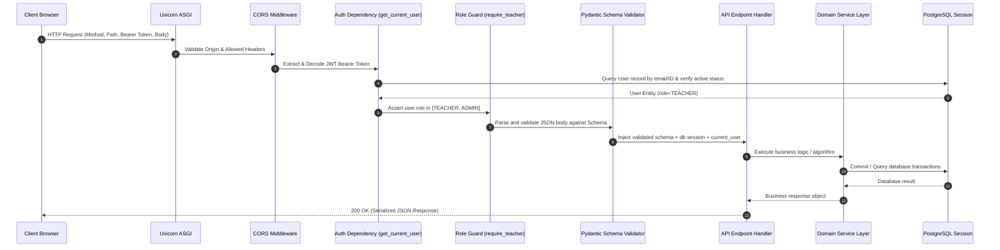

# 05. Backend Architecture

## 1. Backend Architecture Overview

The Lumora backend is an asynchronous, high-throughput REST API constructed on **FastAPI 0.115.12** and **Python 3.11+**, with **SQLAlchemy 2.0.41** managing relational persistence against PostgreSQL, and **ChromaDB 0.5.0** providing vector similarity retrieval.

```mermaid
graph TD
    Client[Client Request: HTTPS / Bearer JWT]
    Client --> Uvicorn[Uvicorn ASGI Server: Port 8000]
    
    subgraph FastAPI Core Engine [backend/main.py]
        Uvicorn --> CORS[CORS Middleware: Origin & Headers]
        CORS --> Static[StaticFiles Router: /uploads]
        CORS --> RootRouter[FastAPI Application Instance]
        
        subgraph Security & Dependency Tier
            RootRouter --> AuthDep[get_current_user: JWT Validation]
            AuthDep --> RoleDep[Role Guard: require_teacher / require_admin]
            RoleDep --> DBDriver[get_db: SQLAlchemy SessionLocal]
        end
        
        subgraph Router Dispatch [29 Modular API Routers]
            DBDriver --> R_Auth[/api/auth]
            DBDriver --> R_Courses[/api/courses & /api/units & /api/lessons]
            DBDriver --> R_Materials[/api/materials & /api/materials/ai]
            DBDriver --> R_Exams[/api/al-exams & /api/al-authoring & /api/al-mcq]
            DBDriver --> R_Analytics[/api/analytics & /api/al-analytics]
            DBDriver --> R_QA[/api/qa]
            DBDriver --> R_Users[/api/users & /api/students]
        end
    end

    subgraph Service & Persistence Layer
        R_Exams --> Svc_Exams[al_generator_service & al_marking_service]
        R_Analytics --> Svc_Analytics[18 Analytics Modules]
        R_QA --> Svc_RAG[al_rag_retriever & vector.py]
        
        Svc_Exams --> DB[(PostgreSQL: fdp_db)]
        Svc_Analytics --> DB
        Svc_RAG --> VectorDB[(ChromaDB: chroma_data/)]
        Svc_RAG --> DB
        Svc_Exams --> AI[Google Gemini 2.0 Flash / Pro]
        Svc_RAG --> AI
    end
```

---

## 2. Application Entry Point & Router Registration

The root application entry point is [`backend/main.py`](file:///d:/BSc%20SE/Final%20Project/lumora_LMS/backend/main.py). It initializes database schema extensions via `init_db_schema()`, mounts static uploads, and registers **29 modular API routers**:

```python
# Router registration in backend/main.py
app.include_router(auth.router, prefix="/api/auth", tags=["Authentication"])
app.include_router(users.router, prefix="/api/users", tags=["Users"])
app.include_router(courses.router, prefix="/api/courses", tags=["Courses"])
app.include_router(units.router, prefix="/api/units", tags=["Units"])
app.include_router(lessons.router, prefix="/api/lessons", tags=["Lessons"])
app.include_router(materials.router, prefix="/api/materials", tags=["Materials"])
app.include_router(materials_ai.router, prefix="/api/materials", tags=["Material AI Insights"])
app.include_router(quizzes.router, prefix="/api/quizzes", tags=["Quizzes"])
app.include_router(assignments.router, prefix="/api/assignments", tags=["Assignments"])
app.include_router(analytics.router, prefix="/api/analytics", tags=["Analytics"])
app.include_router(qa.router, prefix="/api/qa", tags=["Q&A"])
app.include_router(recommendations.router, prefix="/api/recommendations", tags=["Recommendations"])
app.include_router(students.router, prefix="/api/students", tags=["Student Profile"])
app.include_router(admin_ai.router, prefix="/api/admin", tags=["Admin AI Config"])
app.include_router(notifications.router, prefix="/api/notifications", tags=["Notifications"])
app.include_router(messages.router, prefix="/api/messages", tags=["Messages"])
app.include_router(payments.router, prefix="/api/payments", tags=["Payments"])
app.include_router(questions.router, prefix="/api/questions", tags=["Questions"])
app.include_router(jobs.router, prefix="/api/jobs", tags=["Jobs"])
app.include_router(audit.router, prefix="/api/audit", tags=["Audit"])
app.include_router(pools.router, prefix="/api/pools", tags=["Pools"])
app.include_router(rubrics.router, prefix="/api/rubrics", tags=["Rubrics"])
app.include_router(al_exams.router, prefix="/api/al-exams", tags=["A/L Exam Engine"])
app.include_router(al_past_papers.router, prefix="/api/al-past-papers", tags=["A/L Past Papers"])
app.include_router(al_authoring.router, prefix="/api/al-authoring", tags=["A/L Authoring"])
app.include_router(al_curriculum.router, prefix="/api/al-curriculum", tags=["A/L Curriculum & Scope Slicer"])
app.include_router(al_mcq.router, prefix="/api/al-mcq", tags=["A/L Paper I MCQ Engine"])
app.include_router(al_analytics.router, prefix="/api/analytics", tags=["A/L Assessment Analytics Foundation"])
```

---

## 3. Request Lifecycle & Execution Pipeline

Every HTTP request dispatched to the Lumora backend undergoes an explicit 7-stage lifecycle:



---

## 4. Service Layer Architecture

The backend isolates database querying and third-party AI orchestration into modular domain services located in `backend/app/services/`:

### 4.1. A/L Examination & Assessment Services
- **`al_generator_service.py`**: High-level orchestration for AI-assisted paper creation, topic blueprint sampling, and validation.
- **`al_mcq_generator.py`**: Specialized multi-prompt generator for 7 distinct Paper I MCQ formats with 5 options and distractor rationales.
- **`al_structured_generator.py`**: Generates multi-part structured trees with prompt labels (`(a)`, `(i)`), expected keywords, and line constraints.
- **`al_essay_generator.py`**: Generates long-form essay prompts with comprehensive 10–15 item criteria marking rubrics.
- **`al_marking_service.py`**: Automated SpeedGrader evaluator comparing student essay submissions against rubric criteria and returning per-criterion attainment and point suggestions.

### 4.2. Analytics & Psychometrics Pipeline (`app/services/analytics/`)
Comprises 18 specialized modules ensuring separation of statistical concerns:
- **`data_contracts.py`**: Canonical Pydantic schemas enforcing unified field naming across analytics endpoints.
- **`mcq_analytics.py`**: Item difficulty ($p$-value), option frequency distribution, and non-functional distractor flags.
- **`structured_analytics.py`**: Subpart hierarchy achievement and point loss rate calculations.
- **`essay_analytics.py`**: Rubric criteria achievement rates and analytical depth scoring.
- **`discrimination.py`**: Upper 27% vs Lower 27% psychometric discrimination index ($d$) with sample-size validation.
- **`learning_intelligence.py`**: Cross-domain analytics correlating material usage, difficulty flags, Ask AI questions, and assessment performance.
- **`student_mastery_analytics.py`**: Individual student radar mastery dimensions, cognitive depth, and risk classification.
- **`reporting.py`**: Assembles multi-page printable student/course dossiers and streaming CSV data tables.

### 4.3. Retrieval-Augmented Generation & AI Services
- **`gemini_service.py`**: Core Google GenAI SDK interface with automatic prompt structuring, retry handling, and fallback management.
- **`al_rag_retriever.py`** & **`vector.py`**: Manages ChromaDB collections, dense text embedding generation (`all-MiniLM-L6-v2`), top-$k$ similarity queries, and material privacy vault filtering.

---

## 5. Database Session & Error Handling Protocols

1. **Per-Request Session Isolation**: The `get_db()` dependency generates a discrete SQLAlchemy `SessionLocal()` per request, ensuring automatic session termination and connection pooling cleanup in `finally: db.close()`.
2. **Transaction Rollback Protection**: Write operations wrap multi-entity modifications in try-except blocks with explicit `db.rollback()` on failure to prevent database corruption.
3. **Structured HTTP Exception Codes**:
   - `401 Unauthorized`: Missing, expired, or invalid JWT signature.
   - `403 Forbidden`: Insufficient role privileges or cross-tenant access violation.
   - `404 Not Found`: Target entity (course, material, exam, submission) does not exist.
   - `422 Unprocessable Entity`: Schema validation or type mismatch error.
   - `500 Internal Server Error`: Unhandled execution fault (logged with stack trace).
