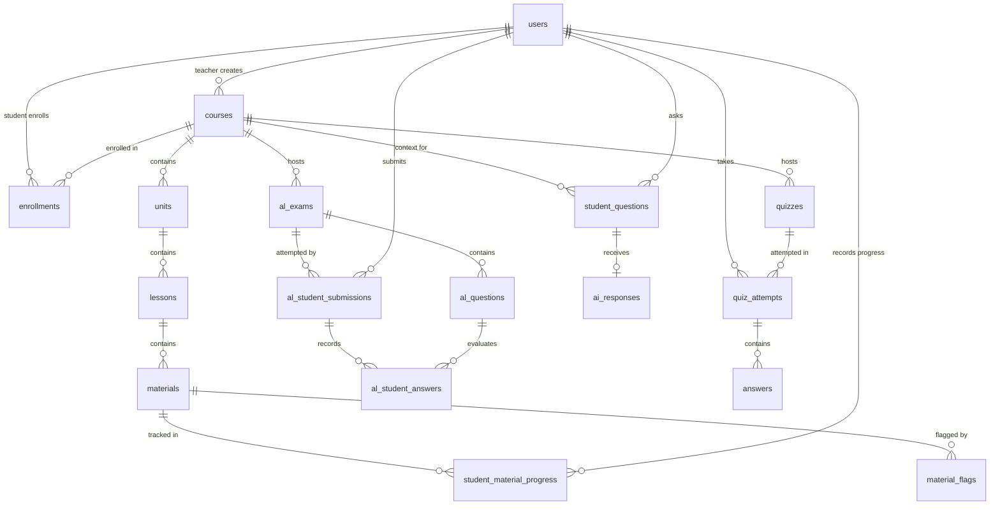

# 06. Database Architecture

## 1. Relational Database Overview

Lumora utilizes a normalized PostgreSQL relational database (database name: `fdp_db`) mapped via **SQLAlchemy 2.0.41**. The database contains **30+ core entity models** structured into discrete functional domains.

---

## 2. Core Entity Specifications

### 2.1. Domain 1: Users & Authentication

#### `users`
Represents student, teacher, and administrator accounts.
- **`id`** (`INTEGER`, Primary Key, Autoincrement)
- **`email`** (`VARCHAR(255)`, Unique, Not Null, Indexed)
- **`hashed_password`** (`VARCHAR(255)`, Not Null)
- **`full_name`** (`VARCHAR(255)`, Not Null)
- **`role`** (`ENUM(UserRole: 'admin', 'teacher', 'student')`, Not Null, Default: `'student'`)
- **`is_active`** (`BOOLEAN`, Default: `TRUE`)
- **`must_change_password`** (`BOOLEAN`, Default: `FALSE`)
- **`profile_image`** (`VARCHAR(500)`, Nullable)
- **`last_active_at`** (`TIMESTAMP`, Nullable)
- **`created_at`** (`TIMESTAMP`, Default: `NOW()`)
- **`updated_at`** (`TIMESTAMP`, Default: `NOW()`)
- **Relationships**: `taught_courses` (1:M Course), `enrollments` (1:M Enrollment), `quiz_attempts` (1:M QuizAttempt), `student_questions` (1:M StudentQuestion), `activity_logs` (1:M ActivityLog).

#### `password_reset_requests`
Tracks password recovery requests and temporary password issuances.
- **`id`** (`INTEGER`, Primary Key, Autoincrement)
- **`user_id`** (`INTEGER`, Foreign Key `users.id`, Not Null)
- **`email`** (`VARCHAR(255)`, Not Null)
- **`reason`** (`TEXT`, Nullable)
- **`status`** (`ENUM(PasswordResetStatus: 'pending', 'resolved')`, Default: `'pending'`)
- **`temp_password`** (`VARCHAR(255)`, Nullable)
- **`created_at`** (`TIMESTAMP`, Default: `NOW()`)
- **`resolved_at`** (`TIMESTAMP`, Nullable)

---

### 2.2. Domain 2: Curriculum & Course Delivery

#### `courses`
Top-level academic course container.
- **`id`** (`INTEGER`, Primary Key, Autoincrement)
- **`title`** (`VARCHAR(255)`, Not Null)
- **`description`** (`TEXT`, Nullable)
- **`subject`** (`VARCHAR(100)`, Nullable)
- **`cover_image`** (`VARCHAR(500)`, Nullable)
- **`is_active`** (`BOOLEAN`, Default: `TRUE`)
- **`is_paid_course`** (`BOOLEAN`, Default: `FALSE`)
- **`monthly_price`** (`FLOAT`, Nullable)
- **`full_price`** (`FLOAT`, Nullable)
- **`teacher_id`** (`INTEGER`, Foreign Key `users.id`, Not Null)
- **`created_at`** / **`updated_at`** (`TIMESTAMP`)
- **Relationships**: `teacher` (M:1 User), `units` (1:M Unit), `lessons` (1:M Lesson), `enrollments` (1:M Enrollment).

#### `enrollments`
Junction table linking students to courses.
- **`id`** (`INTEGER`, Primary Key, Autoincrement)
- **`student_id`** (`INTEGER`, Foreign Key `users.id`, Not Null, Index)
- **`course_id`** (`INTEGER`, Foreign Key `courses.id`, Not Null, Index)
- **`enrolled_at`** (`TIMESTAMP`, Default: `NOW()`)
- **`is_active`** (`BOOLEAN`, Default: `TRUE`)

#### `units`
Curriculum syllabus unit organizing lessons.
- **`id`** (`INTEGER`, Primary Key, Autoincrement)
- **`title`** (`VARCHAR(255)`, Not Null)
- **`description`** (`TEXT`, Nullable)
- **`order`** (`INTEGER`, Default: `0`)
- **`course_id`** (`INTEGER`, Foreign Key `courses.id`, Not Null)
- **Relationships**: `course` (M:1 Course), `lessons` (1:M Lesson).

#### `lessons`
Individual classroom module within a unit.
- **`id`** (`INTEGER`, Primary Key, Autoincrement)
- **`title`** (`VARCHAR(255)`, Not Null)
- **`description`** (`TEXT`, Nullable)
- **`order`** (`INTEGER`, Default: `0`)
- **`is_published`** (`BOOLEAN`, Default: `FALSE`)
- **`course_id`** (`INTEGER`, Foreign Key `courses.id`, Not Null)
- **`unit_id`** (`INTEGER`, Foreign Key `units.id`, Nullable)
- **Relationships**: `materials` (1:M Material), `quizzes` (1:M Quiz).

#### `materials`
Learning content assets attached to lessons.
- **`id`** (`INTEGER`, Primary Key, Autoincrement)
- **`title`** (`VARCHAR(255)`, Not Null)
- **`description`** (`TEXT`, Nullable)
- **`material_type`** (`ENUM(MaterialType: 'note', 'pdf', 'image', 'video')`, Not Null)
- **`category`** (`VARCHAR(100)`, Default: `'general'`)  # past_paper, marking_scheme, resource_book, syllabus, general
- **`is_private_rag_vault`** (`BOOLEAN`, Default: `FALSE`)  # Excludes material from student RAG queries
- **`file_path`** (`VARCHAR(500)`, Nullable)
- **`content`** (`TEXT`, Nullable)
- **`extracted_text`** (`TEXT`, Nullable)  # OCR or Whisper transcription
- **`processing_status`** (`ENUM(ProcessingStatus: 'pending', 'processing', 'completed', 'failed')`)
- **`course_id`** (`INTEGER`, Foreign Key `courses.id`, Nullable)
- **`lesson_id`** (`INTEGER`, Foreign Key `lessons.id`, Nullable)
- **Relationships**: `flags` (1:M MaterialFlag), `notes` (1:M MaterialNote).

#### `student_material_progress`
Real-time material resumption and completion tracker.
- **`id`** (`INTEGER`, Primary Key, Autoincrement)
- **`student_id`** (`INTEGER`, Foreign Key `users.id`, Not Null, Index)
- **`material_id`** (`INTEGER`, Foreign Key `materials.id`, Not Null, Index)
- **`last_position`** (`FLOAT`, Default: `0.0`)  # Video second or PDF page number
- **`is_completed`** (`BOOLEAN`, Default: `FALSE`)
- **`updated_at`** (`TIMESTAMP`, Default: `NOW()`)

#### `material_flags`
Student confusion markers on specific content timestamps or pages.
- **`id`** (`INTEGER`, Primary Key, Autoincrement)
- **`student_id`** (`INTEGER`, Foreign Key `users.id`, Not Null, Index)
- **`material_id`** (`INTEGER`, Foreign Key `materials.id`, Not Null, Index)
- **`context`** (`VARCHAR(255)`, Not Null)  # e.g., "Timestamp 04:30" or "Page 13"
- **`comment`** (`TEXT`, Not Null)
- **`is_resolved`** (`BOOLEAN`, Default: `FALSE`)
- **`teacher_reply`** (`TEXT`, Nullable)
- **`resolved_at`** (`TIMESTAMP`, Nullable)
- **`created_at`** (`TIMESTAMP`, Default: `NOW()`)

---

### 2.3. Domain 3: A/L Examination Engine

#### `al_exams`
National-standard examination paper.
- **`id`** (`INTEGER`, Primary Key, Autoincrement)
- **`title`** (`VARCHAR(255)`, Not Null)
- **`description`** (`TEXT`, Nullable)
- **`exam_type`** (`ENUM(ALExamType: 'paper_1_mcq', 'paper_2_structured', 'paper_2_essay', 'paper_2', 'full_paper')`, Not Null)
- **`time_limit_minutes`** (`INTEGER`, Default: `120`)
- **`total_questions`** (`INTEGER`, Default: `50`)
- **`raw_mark_cap`** (`FLOAT`, Nullable)
- **`score_multiplier`** (`FLOAT`, Default: `1.0`)
- **`max_attempts`** (`INTEGER`, Default: `1`)
- **`is_published`** (`BOOLEAN`, Default: `FALSE`)
- **`instructions`** (`TEXT`, Nullable)
- **`difficulty_policy`** (`VARCHAR(50)`, Default: `'mixed'`)
- **`available_from`** / **`available_until`** (`TIMESTAMP`, Nullable)
- **`show_result_immediately`** (`BOOLEAN`, Default: `TRUE`)
- **`course_id`** (`INTEGER`, Foreign Key `courses.id`, Not Null)
- **`lesson_id`** (`INTEGER`, Foreign Key `lessons.id`, Nullable)
- **Relationships**: `questions` (1:M ALQuestion), `submissions` (1:M ALStudentSubmission).

#### `al_questions`
Multi-format assessment items conforming to A/L templates.
- **`id`** (`INTEGER`, Primary Key, Autoincrement)
- **`exam_id`** (`INTEGER`, Foreign Key `al_exams.id`, Not Null)
- **`question_number`** (`INTEGER`, Not Null)
- **`template_type`** (`ENUM(ALQuestionTemplate: 'generic_mcq', 'multi_response_grid', 'five_statement_truth', 'matching_column', 'combination_grid', 'sequential_diagnostic', 'incomplete_stem', 'structured_subparts', 'essay_rubric')`)
- **`stem_text`** (`TEXT`, Not Null)
- **`diagram_url`** (`VARCHAR(500)`, Nullable)
- **`requires_image`** (`BOOLEAN`, Default: `FALSE`)
- **`image_description`** (`TEXT`, Nullable)
- **`explanation`** (`TEXT`, Nullable)
- **`points`** (`FLOAT`, Default: `1.0`)
- **`cognitive_level`** (`VARCHAR(50)`, Default: `'understand'`)
- **`difficulty`** (`VARCHAR(20)`, Default: `'medium'`)
- **`options`** (`JSON`, Nullable)  # 5 options for MCQ: ["A...", "B...", "C...", "D...", "E..."]
- **`correct_option`** (`VARCHAR(10)`, Nullable)  # "A", "B", "C", "D", "E"
- **`assertion_text`** / **`reason_text`** (`TEXT`, Nullable)
- **`statements_json`** (`JSON`, Nullable)
- **`grid_key_json`** (`JSON`, Nullable)
- **`structured_subparts_json`** (`JSON`, Nullable)
- **`essay_checklist_json`** (`JSON`, Nullable)
- **`snapshot_json`** (`JSON`, Nullable)  # Immutable snapshot at publish time

#### `al_student_submissions`
Student candidate exam attempt records.
- **`id`** (`INTEGER`, Primary Key, Autoincrement)
- **`exam_id`** (`INTEGER`, Foreign Key `al_exams.id`, Not Null, Index)
- **`student_id`** (`INTEGER`, Foreign Key `users.id`, Not Null, Index)
- **`started_at`** (`TIMESTAMP`, Default: `NOW()`)
- **`submitted_at`** (`TIMESTAMP`, Nullable)
- **`raw_score`** (`FLOAT`, Default: `0.0`)
- **`scaled_score`** (`FLOAT`, Default: `0.0`)
- **`percentage`** (`FLOAT`, Default: `0.0`)
- **`grade`** (`VARCHAR(5)`, Nullable)  # A, B, C, S, F
- **`status`** (`VARCHAR(30)`, Default: `'in_progress'`)  # 'in_progress', 'submitted', 'ai_graded', 'teacher_verified'
- **`ai_feedback_summary`** (`TEXT`, Nullable)
- **`teacher_feedback`** (`TEXT`, Nullable)
- **`teacher_verified_at`** (`TIMESTAMP`, Nullable)
- **`finalized_by_id`** (`INTEGER`, Foreign Key `users.id`, Nullable)
- **`finalized_at`** (`TIMESTAMP`, Nullable)
- **Relationships**: `answers` (1:M ALStudentAnswer).

#### `al_student_answers`
Individual question responses and provenance scores.
- **`id`** (`INTEGER`, Primary Key, Autoincrement)
- **`submission_id`** (`INTEGER`, Foreign Key `al_student_submissions.id`, Not Null, Index)
- **`question_id`** (`INTEGER`, Foreign Key `al_questions.id`, Not Null, Index)
- **`selected_option`** (`VARCHAR(10)`, Nullable)
- **`subpart_answers_json`** (`JSON`, Nullable)
- **`essay_text_answer`** (`TEXT`, Nullable)
- **`essay_attachment_url`** (`VARCHAR(500)`, Nullable)
- **`raw_points_earned`** (`FLOAT`, Default: `0.0`)
- **`scaled_points_earned`** (`FLOAT`, Default: `0.0`)
- **`is_correct`** (`BOOLEAN`, Nullable)
- **`auto_score`** (`FLOAT`, Default: `0.0`)  # Machine deterministic score
- **`ai_score`** (`FLOAT`, Default: `0.0`)    # AI suggested score
- **`teacher_score`** (`FLOAT`, Nullable)    # Teacher override score
- **`final_score`** (`FLOAT`, Default: `0.0`)# Active score
- **`ai_checklist_results_json`** (`JSON`, Nullable)
- **`teacher_checklist_results_json`** (`JSON`, Nullable)
- **`teacher_override_points`** (`FLOAT`, Nullable)
- **`feedback_notes`** (`TEXT`, Nullable)

---

### 2.4. Domain 4: Ask AI & Q&A Moderation

#### `student_questions` & `ai_responses`
Tracks student RAG inquiries and AI responses.
- **`student_questions`**: `id`, `session_id`, `student_id`, `course_id`, `question_text`, `is_answered`, `asked_at`, `topic_category`, `course_material_id`.
- **`ai_responses`**: `id`, `student_question_id` (FK `student_questions.id`), `response_text`, `context_sources` (`JSON`), `confidence_score` (`FLOAT`), `is_flagged` (`BOOLEAN`), `teacher_correction` (`TEXT`).

#### `system_ai_configs`
Administrative AI hyperparameter repository.
- **`id`** (`INTEGER`, Primary Key)
- **`llm_provider`** (`VARCHAR(50)`, Default: `'gemini'`)
- **`llm_model`** (`VARCHAR(100)`, Default: `'gemini-2.0-flash'`)
- **`temperature`** (`FLOAT`, Default: `0.3`)
- **`max_tokens`** (`INTEGER`, Default: `1500`)
- **`confidence_threshold`** (`FLOAT`, Default: `0.70`)
- **`embedding_model`** (`VARCHAR(100)`, Default: `'all-MiniLM-L6-v2'`)
- **`chunk_size`** (`INTEGER`, Default: `500`)
- **`retrieval_top_k`** (`INTEGER`, Default: `5`)
- **`enabled_modules`** (`JSON`, Default: `{}`)
