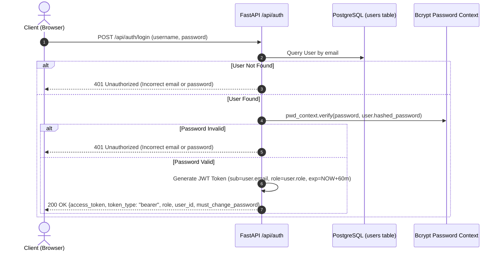

# 08. Authentication and Authorization

## 1. Authentication Architecture

Lumora LMS implements stateless **JSON Web Token (JWT)** authentication using `python-jose` with the `HS256` signing algorithm, combined with salted password hashing powered by `passlib[bcrypt]` and `bcrypt 4.3.0`.



---

## 2. Password Security & Hashing Protocols

- **Algorithm**: `bcrypt` with automatic salting managed by `passlib.context.CryptContext(schemes=["bcrypt"], deprecated="auto")`.
- **Bcrypt 4.x Compatibility**: In [`backend/main.py`](file:///d:/BSc%20SE/Final%20Project/lumora_LMS/backend/main.py), a compatibility shim dynamically resolves attribute definitions:
  ```python
  if not hasattr(bcrypt, "__about__"):
      bcrypt.__about__ = type("about", (), {"__version__": getattr(bcrypt, "__version__", "4.0.0")})()
  ```
- **Forced Password Reset Protocol**:
  - The `users` table maintains a `must_change_password` boolean flag.
  - When an administrator generates a temporary password or a user's password is reset via `PasswordResetRequest`, `must_change_password` is set to `TRUE`.
  - The frontend checks this flag upon login and immediately presents the `ForcePasswordChange.tsx` modal, blocking navigation until a new password is confirmed via `POST /api/auth/change-password`.

---

## 3. Role-Based Access Control (RBAC) & Route Protection

Lumora enforces strict hierarchical role segregation across three predefined roles in `UserRole`:

| Role | Scope of Access & Authority |
| :--- | :--- |
| **`STUDENT`** | Access to enrolled courses, video/PDF learning, difficulty flagging, taking examinations, and viewing personal mastery analytics. |
| **`TEACHER`** | Full authoring rights for courses, units, lessons, materials, exam papers, SpeedGrader marking studio, Q&A moderation, and 7-tab teacher analytics. |
| **`ADMIN`** | System-wide governance, global AI hyperparameter configuration (`/api/admin/ai-config`), user account management, and audit log inspection. |

### 3.1. FastAPI Dependency Injection Guards
In [`backend/app/auth.py`](file:///d:/BSc%20SE/Final%20Project/lumora_LMS/backend/app/auth.py), routes declare dependency constraints that execute before request handlers:

```python
async def get_current_user(token: str = Depends(oauth2_scheme), db: Session = Depends(get_db)) -> User:
    """Decodes JWT, validates signature and expiration, and retrieves active User entity."""
    credentials_exception = HTTPException(status_code=401, detail="Could not validate credentials")
    try:
        payload = jwt.decode(token, SECRET_KEY, algorithms=[ALGORITHM])
        email: str = payload.get("sub")
        if email is None:
            raise credentials_exception
    except JWTError:
        raise credentials_exception
    user = db.query(User).filter(User.email == email).first()
    if user is None or not user.is_active:
        raise credentials_exception
    return user

def require_teacher(current_user: User = Depends(get_current_user)) -> User:
    """Enforces Teacher or Admin privilege level."""
    if current_user.role not in [UserRole.TEACHER, UserRole.ADMIN]:
        raise HTTPException(status_code=403, detail="Teacher or Admin privileges required")
    return current_user

def require_admin(current_user: User = Depends(get_current_user)) -> User:
    """Enforces Admin privilege level."""
    if current_user.role != UserRole.ADMIN:
        raise HTTPException(status_code=403, detail="Administrator privileges required")
    return current_user
```

---

## 4. Tenant & Resource Ownership Validation

To prevent unauthorized horizontal privilege escalation (IDOR attacks), Lumora enforces strict ownership validation checks:

### 4.1. Course & Material Modification Checks
When a teacher attempts to update a course, unit, lesson, material, or examination paper, the endpoint explicitly verifies:
$$\text{course.teacher\_id} == \text{current\_user.id} \quad \lor \quad \text{current\_user.role} == \text{UserRole.ADMIN}$$
If this assertion fails, the API immediately halts execution with `HTTP 403 Forbidden: Not authorized to modify this course`.

### 4.2. Student Examination Submission Isolation
- When taking an exam, submissions are tied to `current_user.id`.
- When querying `/api/al-exams/submissions/{sub_id}`, the endpoint verifies:
  1. If `current_user.role == UserRole.STUDENT`: Asserts `submission.student_id == current_user.id`. Students can never inspect other candidates' submissions.
  2. If `current_user.role in [UserRole.TEACHER, UserRole.ADMIN]`: Asserts that the teacher owns the parent course of the examination.

### 4.3. Private Material Vault Isolation
Materials marked with `is_private_rag_vault = True` (e.g. unpublished marking schemes or future exam drafts) are strictly filtered out of student RAG queries in `al_rag_retriever.py`, preventing students from extracting confidential answers through the Ask AI Tutor.
