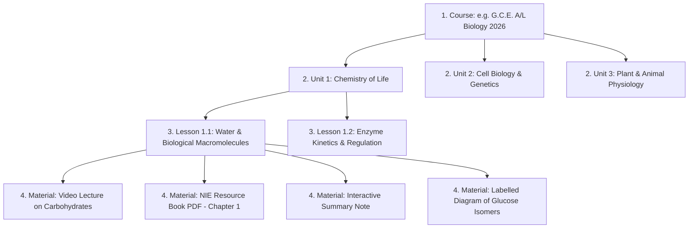

# 09. Course and Material System

## 1. Curriculum Architecture & Content Hierarchy

Lumora organizes academic content into a 4-tier structural hierarchy:

---

## 2. Supported Material Types & Dedicated Viewing Engines

All learning materials inherit from the `Material` entity and are typed via the `MaterialType` enum in [`backend/app/models.py`](file:///d:/BSc%20SE/Final%20Project/lumora_LMS/backend/app/models.py). The frontend utilizes a unified viewer component, [`MaterialViewer.tsx`](file:///d:/BSc%20SE/Final%20Project/lumora_LMS/frontend/src/components/MaterialViewer.tsx), which dynamically mounts format-specific viewing engines:

### 2.1. Video Materials (`MaterialType.VIDEO`)
- **Format Support**: MP4, WebM, H.264 video streams served statically via `/uploads/` with HTTP byte-range support.
- **Precision Resume Position**:
  - `hasResumedRef` prevents async metadata race conditions.
  - Video player automatically seeks to `progress.last_position` (in seconds) on mount.
  - Real-time visual pill displays `Resumed from MM:SS`.
  - Throttled position synchronization saves playback coordinates every 4 seconds during active watching.
  - Immediate sync executed on `onPause`, `onSeeked`, `onEnded`, and component unmount.
- **Automatic Completion Rule**: Video is automatically flagged as completed (`is_completed = True`) when the student watches $\ge 85\%$ of total video duration or upon triggering the `onEnded` event.

### 2.2. PDF Document Materials (`MaterialType.PDF`)
- **Format Support**: Multi-page PDF documents (NIE Resource Books, Past Paper Archives, Marking Schemes).
- **Exact Page Resumption & Hash Anchoring**:
  - Embedded `<iframe>` loads with direct page hash: `${fileUrl}#page=${currentPage}`.
  - Displays notification badge: `Resumed at Page N`.
- **Interactive Top Navigation Bar**:
  - `Prev Page` & `Next Page` controls.
  - Direct page input jumper (`Page [ 13 ]` + `Go`).
  - `Bookmark Page N` action immediately persisting current page coordinate to `student_material_progress.last_position`.
- **Background Text Extraction**: Handled asynchronously via PyMuPDF (`fitz`), populating `extracted_text` for downstream RAG vector search.

### 2.3. Note Materials (`MaterialType.NOTE`)
- **Format Support**: Rich HTML and Markdown notes created in the teacher WYSIWYG editor.
- **Completion Rule**: Automatically flagged completed upon initial student review or manually toggled via header toolbar.

### 2.4. Image & Scientific Diagram Materials (`MaterialType.IMAGE`)
- **Format Support**: High-resolution PNG, JPG, SVG scientific diagrams and anatomical illustrations.
- **Features**: Pan-and-zoom inspection, full-screen lightbox modal, and difficulty flagging.

---

## 3. Progress Tracking & Completion Calculation

### 3.1. Persistence Model (`student_material_progress`)
Every interaction with a learning asset is recorded in `student_material_progress`:
- `student_id`: Target candidate.
- `material_id`: Target learning asset.
- `last_position`: Exact playback second (Video) or active page number (PDF).
- `is_completed`: Boolean completion attainment status.
- `updated_at`: Timestamp of latest interaction.

### 3.2. Unit Progress Fractions
In [`backend/app/api/analytics.py`](file:///d:/BSc%20SE/Final%20Project/lumora_LMS/backend/app/api/analytics.py), unit completion is aggregated per student:
$$\text{Unit Completion Fraction} = \frac{\sum \text{Completed Materials in Unit}}{\text{Total Materials in Unit}}$$
- Rendered in the Student Course Outline ([`/dashboard/student/courses/[id]`](file:///d:/BSc%20SE/Final%20Project/lumora_LMS/frontend/src/app/dashboard/student/courses/%5Bid%5D/page.tsx)) as color-coded badges:
  - `badge-success` (Green): `3/3 Completed` ($100\%$)
  - `badge-info` (Blue): `2/3 Completed` ($>0\%$)
  - `badge-secondary` (Gray): `0/3 Completed` ($0\%$)

### 3.3. Lesson Status Lifecycle
1. **`Reviewed`** (Green `check-circle`): All materials inside the lesson are marked `is_completed = True`.
2. **`Engaging`** (Blue `book-open`): Student has started watching/reading (`last_position > 0` or partial materials completed).
3. **`Not Reviewed`** (Gray `clock`): Student has not initiated any materials in the lesson.

---

## 4. Contextual Difficulty Flagging & Hotspots

Students can flag specific difficulty points directly within `MaterialViewer.tsx`:
1. **Student Context Capture**: Student clicks "Flag Difficult Spot"; the modal automatically captures the active video timestamp (e.g. `12:45`) or PDF page (e.g. `Page 7`) into `material_flags.context`.
2. **Teacher Notification & Moderation**: Teachers view all flags on the material and analytics hotspot heatmaps.
3. **Teacher Resolution**: The instructor provides a clarifying explanation (`teacher_reply`), setting `is_resolved = True`, which notifies the student.
