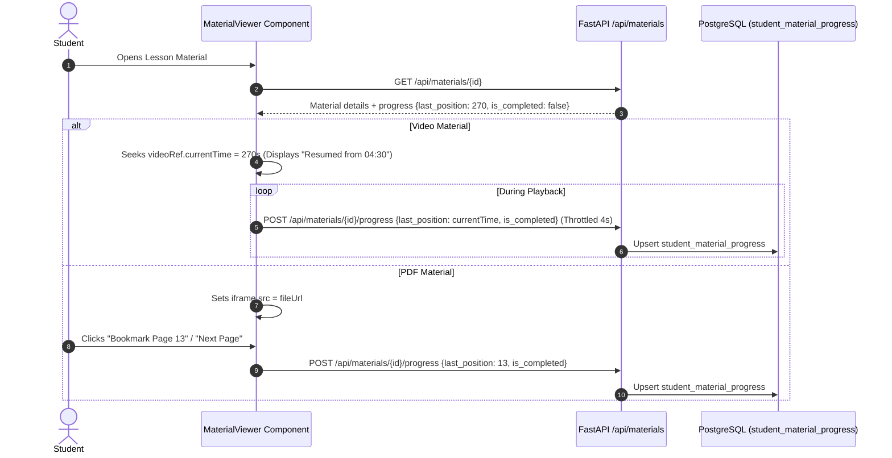

# 10. Student Learning System

## 1. Student Experience Overview

The Lumora Student Learning System provides an integrated, distraction-free digital classroom environment designed to support continuous study, precision content resumption, contextual confusion flagging, and AI-assisted tutoring.

```mermaid
graph TD
    Student[Authenticated Student] --> Dashboard[/dashboard/student]
    Dashboard --> CourseCatalog[/dashboard/student/browse]
    Dashboard --> EnrolledCourse[/dashboard/student/courses/id]
    Dashboard --> ExamHub[/dashboard/student/al-exams]
    Dashboard --> AskAITutor[/dashboard/student/ask]
    Dashboard --> PersonalMastery[/dashboard/student/analytics]

    subgraph Classroom Learning Flow
        EnrolledCourse --> UnitOutline[Unit Accordion with Completion Fractions: 2/3 Completed]
        UnitOutline --> LessonView[/dashboard/student/courses/id/lessons/lessonId]
        LessonView --> MaterialViewer[MaterialViewer: Video / PDF / Note / Image]
        
        MaterialViewer -->|Play Video| ResumeSync[Auto-Resume exact second + 4s periodic save]
        MaterialViewer -->|Read PDF| PageSync[Auto-Navigate #page=N + Bookmark Page]
        MaterialViewer -->|Flag Difficulty| FlagModal[Contextual Difficulty Flag: Timestamp/Page + Note]
        MaterialViewer -->|Take Private Notes| NoteModal[Material Note Persistence]
        MaterialViewer -->|Toggle Status| CompleteAction[Mark Completed / 85% Auto-Complete]
    end
```

---

## 2. Learning Classroom & Telemetry Flow

### 2.1. Navigating Course & Unit Structure
- **Outline View**: On [`/dashboard/student/courses/[id]`](file:///d:/BSc%20SE/Final%20Project/lumora_LMS/frontend/src/app/dashboard/student/courses/%5Bid%5D/page.tsx), students see all units with completion fraction badges (e.g. `3/3 Completed`).
- **Lesson Indicators**: Each lesson displays its real-time engagement status:
  - `Reviewed` (Green badge): All materials completed.
  - `Engaging` (Blue badge): In progress.
  - `Not Reviewed` (Gray badge): Untouched.

### 2.2. Interacting with Learning Assets
When opening a lesson ([`/dashboard/student/courses/[id]/lessons/[lessonId]`](file:///d:/BSc%20SE/Final%20Project/lumora_LMS/frontend/src/app/dashboard/student/courses/%5Bid%5D/lessons/%5BlessonId%5D/page.tsx)), the page loads the [`MaterialViewer.tsx`](file:///d:/BSc%20SE/Final%20Project/lumora_LMS/frontend/src/components/MaterialViewer.tsx) workspace:



---

## 3. In-Context Learning Support Systems

### 3.1. Material Difficulty Flagging
- **Trigger**: Student clicks the "Flag Difficulty" button in the material viewer toolbar.
- **Context Pinned**: The modal automatically records the exact playback second (e.g., `Timestamp 12:45`) or PDF page (`Page 7`).
- **Submission**: Persisted to `material_flags` via `POST /api/materials/{id}/flag`.
- **Feedback Loop**: When the instructor responds, the resolved flag displays the teacher's guidance note in the student's material view.

### 3.2. Private Note-Taking
- Students can write private rich-text notes attached to specific materials via `POST /api/materials/{id}/notes`, stored in `material_notes`. Notes persist across sessions and are accessible on subsequent visits.

### 3.3. RAG-Grounded Ask AI Tutor (`/dashboard/student/ask`)
- Students can ask questions regarding syllabus concepts. The system queries ChromaDB embeddings of course materials and provides verified answers with source citations.

### 3.4. Personal Mastery Dossier (`/dashboard/student/analytics`)
- Displays an individual mastery report featuring:
  - **Radar Mastery Chart**: Visualizes proficiency across all syllabus units.
  - **Cognitive Balance Chart**: Compares performance across Remember, Understand, Apply, Analyze, and Evaluate items.
  - **Recent Exam Results**: Displays verified marks and letter grades (`A`, `B`, `C`, `S`, `F`).
  - **AI Study Recommendations**: Suggests specific lessons or materials requiring revision based on low assessment scores.
