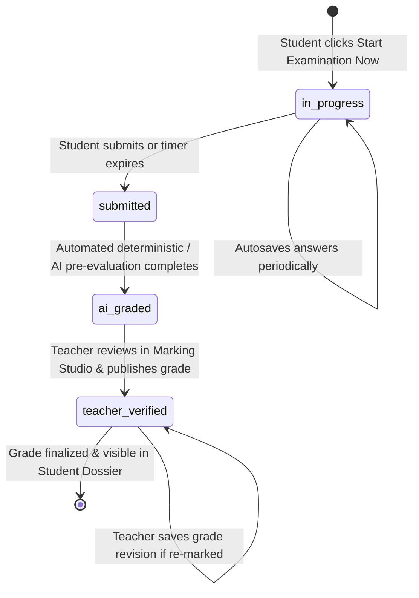

# 11. Examination System: National A/L Assessment Architecture

## 1. National Examination Standards & Paper Archetypes

Lumora is specifically engineered to support the exact assessment structures defined by the **Sri Lankan Department of Examinations** for the **G.C.E. Advanced Level Examination**. The system natively models four distinct paper archetypes:

```mermaid
graph TD
    Exam[G.C.E. Advanced Level Examination]
    Exam --> FullPaper[Full Examination Paper: Composite Paper I + Paper II]
    Exam --> Paper1[Paper I: Multiple Choice Questions - MCQ]
    Exam --> Paper2A[Paper II-A: Structured Essay Questions]
    Exam --> Paper2B[Paper II-B: Extended Analytical Essay Questions]

    subgraph Full Paper Specifications
        FullPaper --> FP_Stages[Multi-Stage: Paper I -> Breather Transition -> Paper II]
        FullPaper --> FP_Time[300 Minutes Combined: 120m P1 + 180m P2]
        FullPaper --> FP_Scoring[Standard Weighted Composite: 100% Scale]
    end

    subgraph Paper I Specifications
        Paper1 --> P1_Count[50 Questions • 5 Options A-E]
        Paper1 --> P1_Time[120 Minutes Duration]
        Paper1 --> P1_Score[Raw: 50 pts • Standard: 100% • Auto-Scored]
        Paper1 --> P1_Templates[7 Specialized Question Templates]
    end

    subgraph Paper II-A Specifications
        Paper2A --> P2A_Count[4 Compulsory Structured Questions]
        Paper2A --> P2A_Time[180 Minutes Combined with Part B]
        Paper2A --> P2A_Score[Raw: 160 pts • Scaled: 100 pts Multiplier 2.5]
        Paper2A --> P2A_Hierarchy[Multi-Tiered Subparts a, i, ii + Dotted Line Constraints]
    end

    subgraph Paper II-B Specifications
        Paper2B --> P2B_Count[3 Extended Analytical Essays]
        Paper2B --> P2B_Score[Raw: 120 pts • Scaled: 100 pts Multiplier 4.0]
        Paper2B --> P2B_Rubric[10-15 Item Criteria Rubric + Diagram Attachments]
    end
```

---

## 2. Detailed Paper Archetype Specifications

### 2.1. Full Examination Paper (`full_paper` / `full_exam`)
- **Structure**: Complete composite evaluation incorporating Paper I (MCQ items 1–50) and Paper II (Structured questions 1–4 and Essay questions 5–8).
- **Execution Flow**:
  1. **Phase 1 (Paper I)**: Candidate attempts the 50 MCQs.
  2. **Phase 2 (Breather / Transition)**: Candidate submits Paper I and views the section transition screen preparing for written evaluation.
  3. **Phase 3 (Paper II)**: Candidate attempts structured subpart questions and rich-text essay responses.
- **Teacher Marking Studio Integration**: In the Marking Studio, full papers present interactive section tabs (`All Sections`, `Paper I — MCQ`, `Paper II-A — Structured`, `Paper II-B — Essay`) for grading ease.
- **Attempt & Retake Controls**: Governed by `max_attempts` policy (default: 1, configurable up to unlimited retakes). Active in-progress retry attempts remain private to the student until submitted.

### 2.1. Paper I: Multiple Choice Questions (50 Items)
- **Question Structure**: 50 items, each presenting 5 distinct alternatives (A, B, C, D, E).
- **Template Diversity** (`ALQuestionTemplate`):
  1. `generic_mcq`: Direct factual recall and concept application.
  2. `multi_response_grid`: Combination grid format for Q41–Q50 (e.g. `(1) a,b correct`, `(2) a,c,d correct`, `(3) c,d correct`, etc.).
  3. `five_statement_truth`: Five discrete assertions evaluated for True/False combinations.
  4. `matching_column`: Two-column matrix matching concepts to functions/definitions.
  5. `combination_grid`: Multi-variable selection tables.
  6. `sequential_diagnostic`: Biological pathways and deduction sequences.
  7. `incomplete_stem`: Sentence completion with numerical/chemical parameters.
- **Evaluation**: 100% deterministic auto-grading matching `selected_option` against `correct_option`.

### 2.2. Paper II-A: Structured Questions (4 Questions • 160 Maximum Marks)
- **Question Structure**: 4 multi-part questions covering major syllabus modules.
- **Academic Hierarchy**:
  - Main question stem with optional experimental diagram or apparatus.
  - Subpart nodes labeled hierarchically: Part `(a)` $\rightarrow$ Subpart `(i)` $\rightarrow$ Nested `(A)`.
  - Allocated line count constraint and maximum point cap per leaf subpart (typically 2–6 points).
- **Evaluation**: Student submits text for each subpart. Evaluated via SpeedGrader with AI point recommendations and teacher overrides.

### 2.3. Paper II-B: Analytical Essay Questions (3 Questions • 120 Maximum Marks)
- **Question Structure**: 3 comprehensive essay prompts requiring deep scientific exposition and labelled anatomical/physiological drawings.
- **Marking Scheme Rubric**:
  - Each essay is defined with 10–15 discrete marking criteria items (e.g., `Criterion #1: Accurate definition of chemiosmosis (+4.0 pts)`).
  - Students submit rich text scripts and optional image uploads for hand-drawn biological diagrams.
- **Evaluation**: AI pre-grader scans text against rubric criteria, outputting checklist attainment flags (`AI: ✓ Detected`). The teacher confirms or modifies checks in the Marking Studio.

---

## 3. Examination Lifecycle & States

Every assessment paper progresses through an audited lifecycle in `al_student_submissions.status`:

---

## 4. Standardized Grading Scale & Score Calculation

The final examination mark is calculated and assigned a G.C.E. A/L standard letter grade:

$$\text{Final Percentage } P = \left( \frac{\text{Scaled Points Earned}}{\text{Maximum Possible Points}} \right) \times 100$$

### Official A/L Grade Boundaries
| Grade | Descriptor | Percentage Boundary ($P$) | Visual Indicator |
| :--- | :--- | :--- | :--- |
| **`A`** | **Distinction** | $P \ge 75.0\%$ | Green (`#10B981`) |
| **`B`** | **Very Good Pass** | $65.0\% \le P < 75.0\%$ | Blue (`#2563EB`) |
| **`C`** | **Credit Pass** | $55.0\% \le P < 65.0\%$ | Purple (`#8B5CF6`) |
| **`S`** | **Ordinary Pass** | $35.0\% \le P < 55.0\%$ | Amber (`#F59E0B`) |
| **`F`** | **Failure** | $P < 35.0\%$ | Red (`#EF4444`) |
