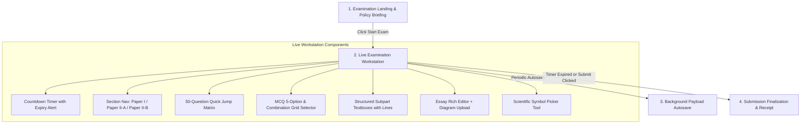

# 13. Student Exam Execution

## 1. Examination Workstation Lifecycle

The student examination experience in [`frontend/src/app/dashboard/student/al-exams/[id]/page.tsx`](file:///d:/BSc%20SE/Final%20Project/lumora_LMS/frontend/src/app/dashboard/student/al-exams/%5Bid%5D/page.tsx) is structured into a proctored 4-phase lifecycle:

---

## 2. Live Answering Workspaces by Paper Type

### 2.1. Paper I (MCQ) Answering Workspace
- **Layout**: Clean item stem rendering with diagram support.
- **5-Option Selector**: Five radio buttons labeled `(A)`, `(B)`, `(C)`, `(D)`, `(E)`.
- **Combination Grid Selector** (`CombinationGridSelector.tsx`): For Q41–Q50 multi-response items, an interactive visual key mapping statements $a, b, c, d$ directly to the canonical 1–5 response options.

### 2.2. Paper II-A (Structured) Answering Workspace
- Handled by [`StudentStructuredQuestionRenderer.tsx`](file:///d:/BSc%20SE/Final%20Project/lumora_LMS/frontend/src/components/al-exams/StudentStructuredQuestionRenderer.tsx).
- **Academic Tree Representation**: Displays hierarchical subpart labels (`(a)`, `(i)`, `(ii)`).
- **Input Constraints**: Provides discrete multi-line answer textboxes matching the physical paper's allocated line space.
- **Symbol Insertion**: Injects Greek letters and scientific notations directly into the active cursor position.

### 2.3. Paper II-B (Essay) Answering Workspace
- Handled by [`StudentEssayRichAnswerArea.tsx`](file:///d:/BSc%20SE/Final%20Project/lumora_LMS/frontend/src/components/al-exams/StudentEssayRichAnswerArea.tsx).
- **Rich Text Area**: Expansive text container with real-time word counter (`N words`), line spacing (`1.8`), and autosave indicator.
- **Scientific Diagram Upload**: Allows students to photograph/scan hand-drawn biological diagrams and attach the image directly to their essay submission (`essay_attachment_url`).

---

## 3. Continuous Autosave & Submission Finalization

