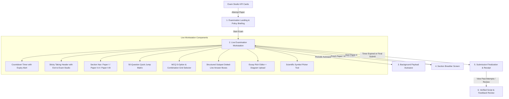
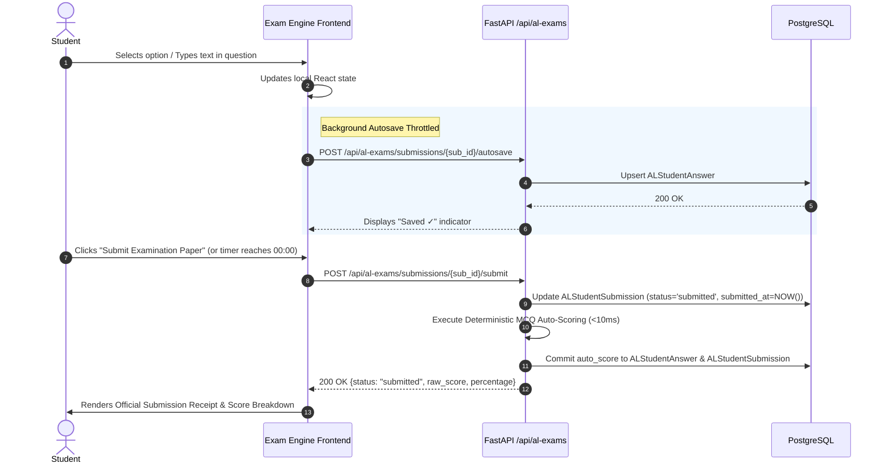

# 13. Student Exam Execution & Attempt Lifecycle

## 1. Examination Workstation Lifecycle

The student examination experience in [`frontend/src/app/dashboard/student/al-exams/[id]/page.tsx`](file:///d:/BSc%20SE/Final%20Project/lumora_LMS/frontend/src/app/dashboard/student/al-exams/%5Bid%5D/page.tsx) is structured into a proctored multi-phase lifecycle:

---

## 2. Exam Studio KPI Cards & Attempt State Machine

In [`frontend/src/app/dashboard/student/al-exams/page.tsx`](file:///d:/BSc%20SE/Final%20Project/lumora_LMS/frontend/src/app/dashboard/student/al-exams/page.tsx), each examination card dynamically adapts its action buttons based on candidate progress and paper retake policies:

| Candidate State | Visual Indicator | Primary Action | Secondary Action |
| :--- | :--- | :--- | :--- |
| **Not Yet Attempted** | Standard Card | **`Attempt Paper →`** | — |
| **In-Progress Active Draft** | Amber box: `Active In-Progress Session` | **`Continue Paper`** (resumes saved draft) | `Past (N)` (if past completed attempts exist) |
| **Completed (Retakes Available)** | Last attempt score & grade badge | **`Retake Exam`** (passes `?retake=true`) | **`View Past Attempts`** (opens History Modal) |
| **Completed (Max Attempts Reached)** | Last attempt score & grade badge | `Max Attempts Reached` badge | **`View Past Attempts`** (opens History Modal) |

---

## 3. Past Attempts History Modal & Script Review Routing

When a candidate clicks **`View Past Attempts`**:
1. A modal dialog opens displaying all recorded attempts sorted chronologically (Attempt #1, Attempt #2, etc.).
2. Each entry displays:
   - Submission date and timestamp.
   - Status badge (`Teacher Verified`, `AI Evaluated`, `Awaiting Review`, `In Progress`).
   - Earned score, percentage, and letter grade badge (`Grade A`, `Grade B`, etc.).
   - Action button:
     - For completed attempts: **`View Results`** linking directly to `/dashboard/student/al-exams/[id]?submissionId={sub.id}`.
     - For active drafts: **`Resume Paper`** linking to `/dashboard/student/al-exams/[id]`.
3. In [`[id]/page.tsx`](file:///d:/BSc%20SE/Final%20Project/lumora_LMS/frontend/src/app/dashboard/student/al-exams/%5Bid%5D/page.tsx), the page reads `useSearchParams().get("submissionId")` to load and render the exact historical attempt in full review mode without forcing the student back into an active exam session.

---

## 4. Live Answering Workspaces by Paper Type

### 4.1. Full Examination Paper (`full_paper`)
- Candidate starts with Paper I (MCQ items 1–50).
- Upon completing Paper I, the workstation transitions to the **Section Breather Screen**:
  - Displays Paper I completion receipt.
  - Briefs student on Paper II instructions, duration, and question allocation.
  - Launches Paper II (Structured subparts & Essay questions) upon candidate confirmation.

### 4.2. Paper I (MCQ) Answering Workspace
- **Layout**: Clean item stem rendering with diagram support.
- **5-Option Selector**: Five radio buttons labeled `(A)`, `(B)`, `(C)`, `(D)`, `(E)`.
- **Combination Grid Selector** (`CombinationGridSelector.tsx`): For Q41–Q50 multi-response items, an interactive visual key mapping statements $a, b, c, d$ directly to the canonical 1–5 response options.

### 4.3. Paper II-A (Structured) Answering Workspace
- Handled by [`StudentStructuredQuestionRenderer.tsx`](file:///d:/BSc%20SE/Final%20Project/lumora_LMS/frontend/src/components/assessments/StudentStructuredQuestionRenderer.tsx).
- **Academic Tree Representation**: Displays hierarchical subpart labels (`(a)`, `(i)`, `(ii)`).
- **Input Constraints**: Provides discrete dotted-line answer textboxes matching physical exam paper conventions.
- **Symbol Insertion**: Injects Greek letters and scientific notations directly into the active cursor position.

### 4.4. Paper II-B (Essay) Answering Workspace
- Handled by [`StudentEssayRichAnswerArea.tsx`](file:///d:/BSc%20SE/Final%20Project/lumora_LMS/frontend/src/components/assessments/StudentEssayRichAnswerArea.tsx).
- **Rich Text Area**: Expansive text container with real-time word counter (`N words`), line spacing (`1.8`), and autosave indicator.
- **Scientific Diagram Upload**: Allows students to photograph/scan hand-drawn biological diagrams and attach the image directly to their essay submission (`essay_attachment_url`).

---

## 5. Continuous Autosave & Submission Finalization

