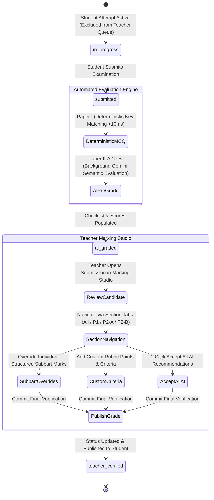

# 14. Grading and Marking Studio

## 1. Grading Lifecycle & Human-in-the-Loop Architecture

Lumora implements a **Human-in-the-Loop SpeedGrader & Verification Studio** where automated algorithms and Gemini LLMs perform preliminary scoring, while educators retain 100% authority to review, override, and officially certify student marks.

---

## 2. Multi-Tiered Score Traceability Architecture

Every question answer in `al_student_answers` maintains an immutable 4-stage audit trail:

| Field | Description | Calculation / Generation Origin |
| :--- | :--- | :--- |
| **`auto_score`** | Deterministic Machine Score | Computed instantly for MCQs ($1.0$ if `selected_option == correct_option`, else $0.0$). |
| **`ai_score`** | AI Pre-Grading Recommendation | Computed by `al_marking_service.py` via Gemini semantic evaluation of structured subparts or essay rubrics. |
| **`teacher_score`** | Teacher Manual Override | Explicit points entered by the teacher in the Marking Studio drawer. Overrides `ai_score`. |
| **`final_score`** | Active Certified Score | Set to `teacher_score` if present; otherwise defaults to `ai_score` (for written) or `auto_score` (for MCQ). |

---

## 3. Teacher Marking Studio & SpeedGrader Features

Located at [`frontend/src/app/dashboard/teacher/al-exams/grade/[submissionId]/page.tsx`](file:///d:/BSc%20SE/Final%20Project/lumora_LMS/frontend/src/app/dashboard/teacher/al-exams/grade/%5BsubmissionId%5D/page.tsx), the Marking Studio provides advanced grading workstations:

### 3.1. Full Examination Paper Section Navigation
- For composite full exams (`full_paper` / `full_exam`), the workstation provides interactive section pills:
  - **All Sections**: Continuous vertical review of the complete candidate script.
  - **Paper I — MCQ (N questions)**: Evaluates multiple choice answers, highlighting candidate choice vs correct key.
  - **Paper II-A — Structured (N questions)**: Dotted-line written subpart answers with individual subpart mark inputs.
  - **Paper II-B — Essay (N questions)**: Two-column rich text essay review with criteria rubric checklists.

### 3.2. Structured Subpart Granular Scoring
- Renders hierarchical subpart tree labels (`(a)`, `(i)`, `(ii)`).
- Each subpart presents an independent numerical mark input (`handleUpdateSubpartMark`) bounded by that subpart's maximum point cap.
- Modifying subpart marks instantly recalculates the question-level total and updates the live examination score bar.

### 3.3. Two-Column Essay Rubric Workstation & Custom Criteria
- **Left Column (58%)**: Candidate's written essay text, formatted cleanly with pre-wrap spacing, accompanied by attached scientific diagrams.
- **Right Column (42%)**: Marking scheme checklist with interactive attainment checkboxes:
  - Displays **`AI: ✓ Detected`** purple badges on criteria recognized by Gemini.
  - Interactive checkboxes automatically update candidate points in real-time.
  - Quick **"Check All"** and **"Clear"** helper buttons.
  - **Add Custom Criterion**: Allows teachers to add ad-hoc criteria (e.g. `+2.0 pts for exceptional clarity of thermodynamic cycle explanation`) directly into the candidate's marking scheme.

### 3.4. Wide Focus Studio & Typography
- **Layout Switcher**: Toggle between **Wide Reading Studio (1560px max-width)** and **Standard Layout (1280px)** for high-resolution grading monitors.
- **Enhanced Typography**: `1.8` line spacing, word count badge (`N words`), and dynamic font size toggles (`A-` / `A+`).

### 3.5. Rapid AI Recommendation Adoption
- **"Accept All AI Recommendations"**: Header action adopting all AI suggested scores and rubric checklist selections across the entire exam in a single click.
- **Per-Question "Accept AI Score (X pts)"**: Quick button on individual question cards to adopt suggested points instantly.

### 3.6. Zen Focus Mode & Diagram Lightbox
- **Zen Focus Reader**: Full-screen modal presenting student responses in high-legibility typography with floating score override inputs.
- **Diagram Lightbox**: Clicking any student diagram opens a high-resolution zoom viewer with pan controls.

### 3.7. Unsubmitted Retry Draft Protection
- The teacher submission review queue (`/api/al-exams/teacher/submissions`) strictly filters out in-progress retry drafts (`status == 'in_progress'`), ensuring that incomplete student attempts do not pollute the marking queue until the candidate officially submits.

### 3.8. Final Verification & Grade Publication
The teacher provides overall summary feedback notes and clicks **"Approve & Publish Final Grade"**, which commits `teacher_verified` status, records `teacher_verified_at`, and makes the verified mark and A/L grade (`A`, `B`, `C`, `S`, `F`) visible to the student.
