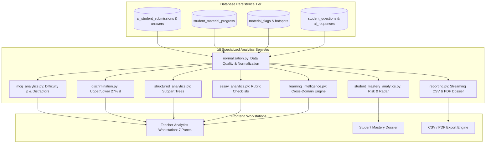

# 15. Analytics and Learning Intelligence Engine

## 1. Analytics Architecture Overview

The Lumora Analytics and Learning Intelligence Engine comprises **18 specialized service modules** in [`backend/app/services/analytics/`](file:///d:/BSc%20SE/Final%20Project/lumora_LMS/backend/app/services/analytics/) enforcing strict separation of statistical concerns, canonical Pydantic data contracts, and classical psychometric algorithms.

---

## 2. Core Psychometric & Learning Analytics Metrics

### 2.1. Item Difficulty Index ($p$-value)
- **Concept**: Measures the proportion of candidate attempts that successfully answered an assessment item correctly.
- **Mathematical Formula**:
  $$p = \frac{N_{\text{correct}}}{N_{\text{total attempts}}}$$
- **Interpretation**:
  - $p < 0.30$: **Hard Item** (High cognitive demand / potential ambiguity).
  - $0.30 \le p \le 0.70$: **Ideal Difficulty** (Optimal psychometric discrimination).
  - $p > 0.70$: **Easy Item** (Basic factual recall / mastery).
- **Backend Service**: `mcq_analytics.py` $\rightarrow$ Exposed via `GET /api/analytics/exam/{id}/mcq`.

---

### 2.2. Item Discrimination Index ($d$)
- **Concept**: Evaluates an item's ability to differentiate between high-performing and low-performing student cohorts using Classical Test Theory (Kelly's 27% Rule).
- **Mathematical Formula**:
  $$d = \frac{R_{\text{upper 27\%}} - R_{\text{lower 27\%}}}{0.27 \times N}$$
  *(where $R_{\text{upper}}$ is the number of correct responses in the top 27% total score cohort, and $R_{\text{lower}}$ is the correct count in the bottom 27% cohort).*
- **Confidence & Sample Thresholds**:
  - Requires $N \ge 10$ submissions with non-zero variance. If $N < 10$, flags `confidence: "insufficient_sample"` to prevent statistical misinterpretation.
- **Interpretation**:
  - $d \ge 0.40$: **Excellent Discrimination** (Strongly separates top from bottom students).
  - $0.20 \le d < 0.40$: **Acceptable Discrimination**.
  - $d < 0.20$: **Poor Discrimination** (Review or revise question distractors).
  - $d < 0.0$: **Defective Item** (Lower-scoring students answered correctly more frequently than top students).
- **Backend Service**: `discrimination.py` $\rightarrow$ Integrated in `MCQItemMetric`.

---

### 2.3. Non-Functional Distractor Analysis
- **Concept**: Identifies multiple-choice distractors that fail to attract candidate attention.
- **Criterion**: Any distractor option (A–E) selected by $< 5.0\%$ of candidates is flagged as `is_non_functional_distractor = True`.
- **Actionable Insight**: Recommends teachers redesign plausible misconceptions into non-functioning distractors.

---

### 2.4. Question Format Divergence
- **Concept**: Measures the performance disparity for a student or cohort across distinct assessment modalities (MCQ vs Structured vs Essay).
- **Mathematical Formula**:
  $$\Delta_{\text{format}} = |\text{Score}_{\text{MCQ}}\% - \text{Score}_{\text{Written}}\%|$$
- **Pedagogical Diagnostic**:
  - **High MCQ / Low Essay**: Student understands concepts in recognition tasks but struggles with biological terminology, analytical composition, and diagramming.
  - **Low MCQ / High Essay**: Student understands holistic narrative themes but struggles with precise detail, calculation, or combination logic.
- **Backend Service**: `learning_intelligence.py`.

---

### 2.5. Bloom's Taxonomy Cognitive Depth Index
- **Concept**: Categorizes question items across Bloom's Revised Taxonomy: Remember, Understand, Apply, Analyze, Evaluate.
- **Metric**: Evaluates mean percentage achievement per cognitive level:
  $$\text{Cognitive Achievement}_L = \frac{\sum \text{Points Earned in Level } L}{\sum \text{Max Points in Level } L} \times 100$$
- **Frontend Display**: Rendered as a multi-tier horizontal bar comparison in the Teacher Analytics Workstation.

---

### 2.6. Multi-Factor Student Academic Risk Classification
- **Concept**: Automated classification of individual students into risk categories based on composite assessment scores, lesson engagement fractions, and difficulty flags.
- **Classification Rules**:
  - **`High Risk`** (Red): Mean Assessment $< 45\%$ OR (Mean Assessment $< 55\%$ AND $> 3$ unresolved difficulty flags).
  - **`Medium Risk`** (Amber): Mean Assessment between $45\%$ and $60\%$.
  - **`On Track`** (Blue): Mean Assessment between $60\%$ and $75\%$.
  - **`High Performer`** (Green): Mean Assessment $\ge 75\%$.
- **Backend Service**: `student_mastery_analytics.py` $\rightarrow$ Displayed in Student Roster and Student Dossier.
