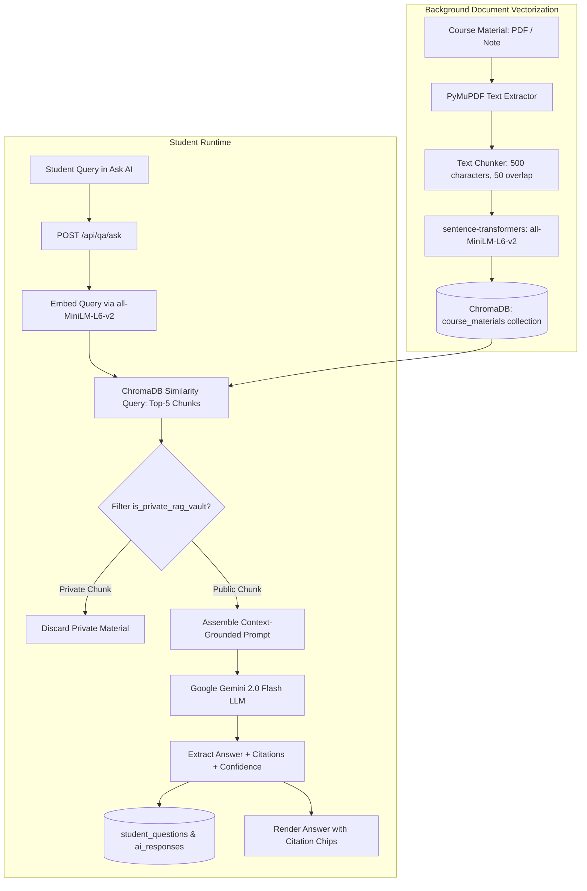

# 17. Ask AI and Retrieval-Augmented Generation (RAG) System

## 1. RAG Architecture & Grounding Pipeline

Lumora implements a localized, course-vault-grounded **Retrieval-Augmented Generation (RAG)** tutoring system using **ChromaDB 0.5.0**, **sentence-transformers (`all-MiniLM-L6-v2`)**, and **Google Gemini 2.0 Flash**.



---

## 2. Document Vectorization & Vault Privacy Isolation

### 2.1. Vector Ingestion Architecture
In [`backend/app/services/vector.py`](file:///d:/BSc%20SE/Final%20Project/lumora_LMS/backend/app/services/vector.py):
- Materials attached to a course are split into sliding text windows (default: `chunk_size = 500` characters with `overlap = 50`).
- Embeddings are generated using the dense 384-dimensional `all-MiniLM-L6-v2` transformer model running locally on the CPU/GPU.
- Chunks are stored in ChromaDB collections partitioned by `course_id`.

### 2.2. Vault Privacy Isolation (`is_private_rag_vault`)
Materials flagged with `is_private_rag_vault = True` (such as upcoming exam drafts or confidential marking guidelines) are tagged with `private: true` metadata. During student similarity retrieval in `al_rag_retriever.py`, private chunks are strictly omitted, guaranteeing that confidential assessment keys cannot be leaked through prompt extraction attacks.

---

## 3. Grounded Prompt Engineering & Anti-Hallucination Controls

The prompt assembly engine in [`backend/app/services/gemini_service.py`](file:///d:/BSc%20SE/Final%20Project/lumora_LMS/backend/app/services/gemini_service.py) enforces strict educational grounding:

```text
You are an expert AI Tutor for the G.C.E. Advanced Level Biology curriculum.
You must answer the student's inquiry strictly and solely based on the verified curriculum excerpts provided below.

VERIFIED CURRICULUM CONTEXT:
---
[Source: NIE Resource Book - Chapter 3 | Page 45]
"The light-dependent reaction occurs in the thylakoid membranes of chloroplasts..."
---

INSTRUCTIONS:
1. Provide a scientifically precise explanation adhering to Sri Lankan A/L curriculum conventions.
2. If the answer cannot be established from the provided context, state: "This concept is not explicitly detailed in your course materials. Please consult your instructor."
3. Return source citations and a self-evaluated confidence score between 0.0 and 1.0.
```

---

## 4. Moderation & Confidence Escalation

- **Confidence Threshold**: Configured globally in `system_ai_configs.confidence_threshold` (default: `0.70`).
- **Low-Confidence Escalation**: If Gemini generates an answer with `confidence_score < 0.70` or if a student clicks "Flag AI Response", the record is marked `is_flagged = True` and escalated directly to the **Teacher Q&A Moderation Hub** ([`/dashboard/teacher/qa`](file:///d:/BSc%20SE/Final%20Project/lumora_LMS/frontend/src/app/dashboard/teacher/qa/page.tsx)) for human review and correction.
