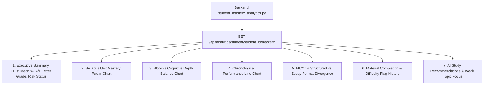

# 19. Student Analytics and Profile (Student Mastery Dossier)

## 1. Student Dossier Architecture

The **Student Mastery Dossier** operates in two symmetrical views:
1. **Student Personal Analytics** ([`/dashboard/student/analytics`](file:///d:/BSc%20SE/Final%20Project/lumora_LMS/frontend/src/app/dashboard/student/analytics/page.tsx)): Private self-diagnostic portal for candidates.
2. **Teacher Student Forensic View** ([`/dashboard/teacher/analytics/student/[studentId]`](file:///d:/BSc%20SE/Final%20Project/lumora_LMS/frontend/src/app/dashboard/teacher/analytics/student/%5BstudentId%5D/page.tsx)): Deep-dive diagnostic tool for instructors to evaluate individual candidates and design targeted interventions.

---

## 2. Forensic Diagnostic Dimensions

### 2.1. Syllabus Unit Mastery Radar Chart
- **Visualization**: Multi-axis radar chart powered by `Chart.js` (`BarChart.tsx` / `DoughnutChart.tsx`).
- **Data Source**: Aggregates points earned across all exam questions mapped to specific syllabus units (e.g. Unit 1: Chemistry of Life, Unit 2: Cell Biology, Unit 3: Genetics).
- **Diagnostic Utility**: Instantly highlights asymmetrical competency (e.g., student achieves $85\%$ in Genetics but only $42\%$ in Plant Physiology).

### 2.2. Bloom's Cognitive Depth Balance
- **Visualization**: Horizontal comparative bar graph tracking mastery across 5 cognitive levels:
  $$\text{Remember} \quad \leftrightarrow \quad \text{Understand} \quad \leftrightarrow \quad \text{Apply} \quad \leftrightarrow \quad \text{Analyze} \quad \leftrightarrow \quad \text{Evaluate}$$
- **Diagnostic Utility**: Separates students who excel at rote memory from those capable of multi-step analytical problem solving.

### 2.3. Assessment Format Divergence
- Compares percentage scores across Paper I (MCQ), Paper II-A (Structured), and Paper II-B (Essay).
- Identifies candidates with strong theoretical comprehension who suffer from examination time pressure or written exposition weaknesses.

### 2.4. Material Engagement & Friction Telemetry
- Correlates material completion percentage (e.g., `85% Materials Reviewed`) with assessment outcomes.
- Displays all unresolved difficulty flags submitted by the student, allowing teachers to address specific misconceptions during 1-on-1 tutoring.

---

## 3. Student Data Isolation & Security

- **Student Role**: The backend verifies `current_user.id == requested_student_id`. Attempting to access another student's dossier yields `HTTP 403 Forbidden`.
- **Teacher Role**: Verifies that the requested student is actively enrolled in at least one course taught by the authenticated teacher.
