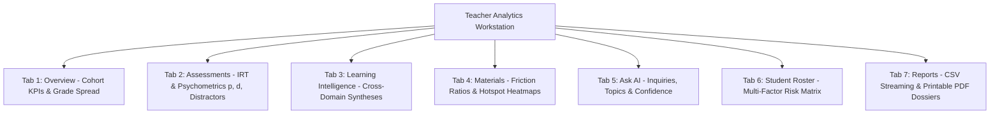

# 20. Teacher Analytics Workstation

## 1. Workstation Architecture & The 7 Dedicated Panes

The **Teacher Analytics Workstation** ([`/dashboard/teacher/analytics`](file:///d:/BSc%20SE/Final%20Project/lumora_LMS/frontend/src/app/dashboard/teacher/analytics/page.tsx)) provides educators with a 7-pane diagnostic dashboard covering cohort performance, psychometric item analysis, cross-domain intelligence, learning materials, AI interactions, student risk rosters, and academic reporting.

---

## 2. Comprehensive Pane Breakdown

### 2.1. Tab 1: Overview
- **Executive KPIs**: Total enrolled students, active submissions count, cohort mean score, pass rate percentage.
- **Grade Distribution Chart**: Standard A/L letter grade bar breakdown (`A`, `B`, `C`, `S`, `F`).
- **Score Distribution Curve**: Histogram binning student percentages into deciles ($0-10\%, 10-20\%, \dots, 90-100\%$).

### 2.2. Tab 2: Assessments (Psychometrics & Item Analysis)
- **Paper I (MCQ)**: Item table displaying difficulty index ($p$), discrimination index ($d$), distractor selection percentages (A–E), and non-functional distractor warnings.
- **Paper II-A (Structured)**: Subpart tree visualization highlighting average points earned and point loss rates across subparts (`(a)`, `(i)`, `(ii)`).
- **Paper II-B (Essay)**: Rubric criteria achievement rates ($10-15$ items) identifying specific biological concepts omitted by the cohort.

### 2.3. Tab 3: Learning Intelligence (Cross-Domain Correlations)
- **Format Divergence Matrix**: Correlates student MCQ performance with Essay writing ability.
- **Cognitive Depth Plot**: Compares cohort mastery across Bloom's levels (Remember, Understand, Apply, Analyze, Evaluate).
- **Longitudinal Unit Trends**: Tracks cohort performance evolution across successive assessments for each syllabus unit.

### 2.4. Tab 4: Materials & Confusion Hotspots
- **Material Performance Table**: Total views, unique viewers, completed count, and friction ratio ($F_{\text{material}}$).
- **Interactive Heatmap (`MaterialHeatmap.tsx`)**: Visualizes video timestamp flag density (30s bins) and PDF page flag clusters.

### 2.5. Tab 5: Ask AI Intelligence
- **Inquiry Volume by Syllabus Unit**: Identifies which modules generate the highest volume of student confusion queries.
- **Confidence & Grounding Distribution**: Categorizes AI tutor responses into High Confidence ($\ge 85\%$), Moderate ($70-84\%$), and Low Confidence ($< 70\%$).

### 2.6. Tab 6: Student Roster & Risk Matrix
- **Cohort Table**: Lists all enrolled candidates with individual mean percentages, completion rates, and **Multi-Factor Risk Badges** (`High Risk`, `Medium Risk`, `On Track`, `High Performer`).
- **Direct Navigation**: Clicking any student row opens their dedicated **Student Forensic Dossier** ([`/dashboard/teacher/analytics/student/[studentId]`](file:///d:/BSc%20SE/Final%20Project/lumora_LMS/frontend/src/app/dashboard/teacher/analytics/student/%5BstudentId%5D/page.tsx)).

### 2.7. Tab 7: Reports & Academic Exports
- Provides one-click CSV downloads for gradebooks and item analysis, as well as print-optimized multi-page PDF dossier generation.
