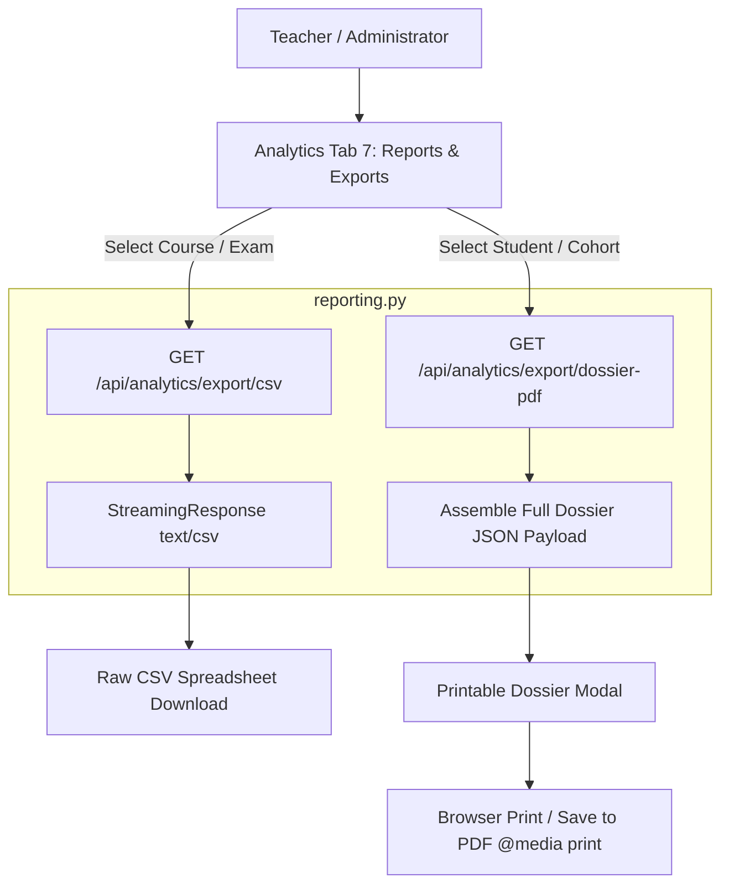

# 21. Reporting and Exports

## 1. Reporting Architecture Overview

Lumora provides a dual-format academic export and reporting engine located in [`backend/app/services/analytics/reporting.py`](file:///d:/BSc%20SE/Final%20Project/lumora_LMS/backend/app/services/analytics/reporting.py):
1. **Streaming CSV Data Exports**: Raw structured datasets formatted for external statistical software (SPSS, R, Excel).
2. **Printable Academic PDF Dossiers**: Formatted multi-page reports generated with `@media print` CSS stylesheet optimizations.



---

## 2. Supported Export Formats & Data Schemas

### 2.1. CSV Gradebook & Assessment Performance Export
- **Endpoint**: `GET /api/analytics/export/csv?course_id=N&type=gradebook`
- **Output Columns**:
  ```csv
  Student ID,Full Name,Email,Enrolled Date,Completed Materials %,Exam Title,Paper Type,Raw Score,Scaled Score,Percentage,Grade,Verification Status
  101,Kasun Perera,kasun@lumora.lk,2026-01-15,85.5%,2025 A/L Biology Model Paper I,paper_1_mcq,42.0,84.0,84.0%,A,teacher_verified
  ```

### 2.2. CSV Psychometric Item Analysis Export
- **Endpoint**: `GET /api/analytics/export/csv?exam_id=N&type=item_analysis`
- **Output Columns**:
  ```csv
  Question ID,Question Number,Template Type,Cognitive Level,Difficulty,Total Attempts,Correct Count,Difficulty Index (p),Discrimination Index (d),Discrimination Confidence,Option A %,Option B %,Option C %,Option D %,Option E %,Non-Functional Distractors
  501,1,generic_mcq,remember,easy,30,26,0.87,0.35,sufficient_sample,86.7%,6.7%,3.3%,3.3%,0.0%,C;D;E
  ```

### 2.3. Multi-Page Printable PDF Dossier
- **Endpoint**: `GET /api/analytics/export/dossier-pdf?student_id=N&course_id=M`
- **Print Optimization (`globals.css` `@media print`)**:
  - Automatically switches dark mode themes to clean high-contrast white backgrounds.
  - Inserts explicit CSS page breaks (`page-break-before: always`) between report sections.
  - Hides non-printable interactive navigation bars, buttons, and sidebars.
  - Renders official Lumora institutional header with timestamp and verified teacher signature blocks.
