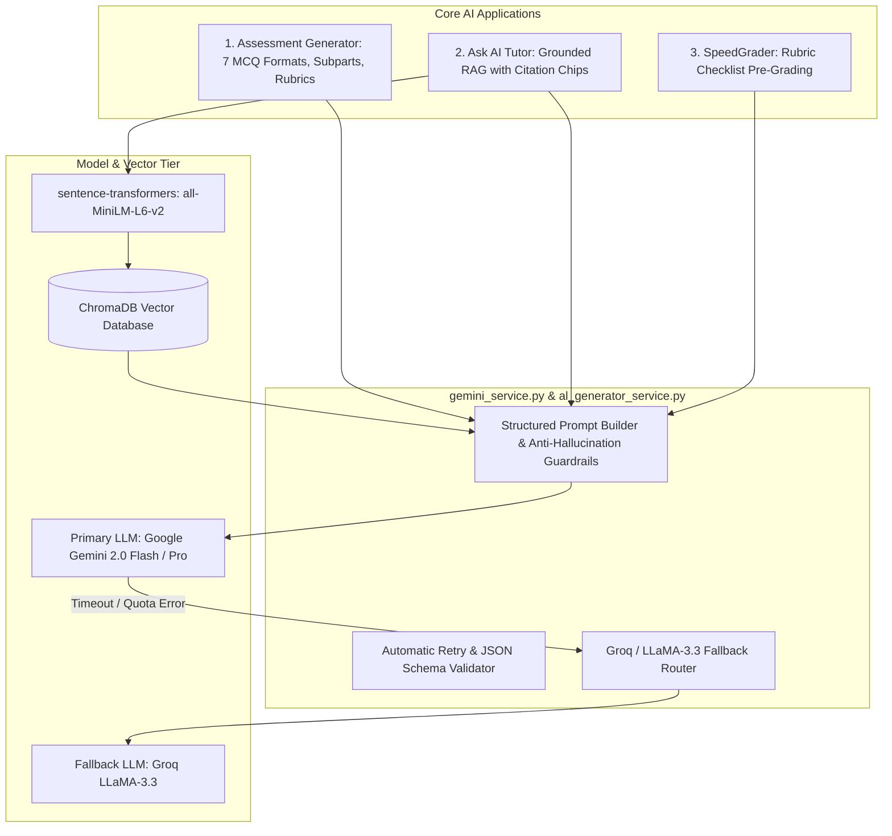

# 22. Artificial Intelligence Integration

## 1. AI Integration Architecture

Lumora embeds Artificial Intelligence across three core operational tiers: **Curriculum & Assessment Generation**, **Grounded Student Tutoring (RAG)**, and **SpeedGrader Pre-Evaluation**.

---

## 2. Comprehensive AI Capabilities Breakdown

| Domain | Backend Module | Primary Model | Input Parameters | Output Structure & Storage |
| :--- | :--- | :--- | :--- | :--- |
| **Paper I MCQ Generation** | `al_mcq_generator.py` | `gemini-2.0-flash` | Topic, count, template type, cognitive level, difficulty. | JSON list of 5-option MCQs with correct key, distractor rationales, and Bloom's classification $\rightarrow$ `al_questions`. |
| **Paper II-A Structured Gen**| `al_structured_generator.py`| `gemini-2.0-flash` | Topic, total marks, subpart depth constraint. | Hierarchical subpart tree with prompt labels (`(a)`, `(i)`), line limits, expected keywords $\rightarrow$ `al_questions`. |
| **Paper II-B Essay Gen** | `al_essay_generator.py` | `gemini-2.0-flash` | Essay topic, syllabus unit, criteria count. | Extended prompt + 10–15 item criteria marking rubric $\rightarrow$ `al_questions`. |
| **Ask AI RAG Tutor** | `al_rag_retriever.py` | `gemini-2.0-flash` + `all-MiniLM-L6-v2` | Student query + course ID. | Grounded response text, citation chips, and confidence score ($0.0-1.0$) $\rightarrow$ `ai_responses`. |
| **SpeedGrader Pre-Grading** | `al_marking_service.py`| `gemini-2.0-flash` | Candidate essay script + diagram description + rubric checklist. | Per-criterion attainment boolean, point suggestion, and holistic feedback summary $\rightarrow$ `al_student_answers`. |
| **Document Text Extraction** | `pdf_parser.py` / `ocr.py`| PyMuPDF / pytesseract | Uploaded past paper PDF or diagram image. | Extracted plain text and syllabus headings $\rightarrow$ `materials.extracted_text`. |

---

## 3. Global AI Hyperparameter Configuration

System administrators configure AI behavior dynamically via the `system_ai_configs` table and [`/api/admin/ai-config`](file:///d:/BSc%20SE/Final%20Project/lumora_LMS/backend/app/api/admin_ai.py):
- **`llm_provider`**: Provider identifier (default: `"gemini"`).
- **`llm_model`**: Active model identifier (e.g. `"gemini-2.0-flash"`, `"gemini-1.5-pro"`).
- **`temperature`**: Sampling temperature (default: `0.3` for deterministic curriculum compliance).
- **`max_tokens`**: Maximum output tokens per completion (default: `1500`).
- **`confidence_threshold`**: Minimum confidence threshold below which student inquiries are escalated to teacher moderation (default: `0.70`).
- **`embedding_model`**: Local transformer embedding model (default: `"all-MiniLM-L6-v2"`).
- **`chunk_size`**: Document splitting window size in characters (default: `500`).
- **`retrieval_top_k`**: Number of context chunks retrieved for RAG prompts (default: `5`).

---

## 4. Error Handling, Retries & Fallback Management

1. **Universal Error Classification** ([`frontend/src/lib/aiErrorClassifier.ts`](file:///d:/BSc%20SE/Final%20Project/lumora_LMS/frontend/src/lib/aiErrorClassifier.ts)):
   - Classifies API faults into `QUOTA_EXCEEDED`, `TIMEOUT`, `INVALID_JSON`, `CONTENT_FILTERED`, or `NETWORK_FAULT`.
   - Informs frontend alert components ([`AIGenerationErrorAlert.tsx`](file:///d:/BSc%20SE/Final%20Project/lumora_LMS/frontend/src/components/al-exams/AIGenerationErrorAlert.tsx)) with actionable recovery suggestions.
2. **Exponential Backoff**: Backend services retry failed LLM calls up to 3 times with exponential backoff before failing gracefully.
3. **Groq Fallback Engine**: If the primary Gemini endpoint encounters sustained rate limits, the system routes requests to secondary Groq LLaMA-3.3 endpoints.
4. **Credential Security**: All API keys are loaded via environment variables (`GEMINI_API_KEY`, `GROQ_API_KEY`) and are strictly redacted (`[REDACTED]`) from logs, database records, and client responses.
