# 23. Data Flow and Workflows

## 1. Master System Process Flows

This document details the 18 end-to-end data and operational workflows across the Lumora LMS platform, tracing the complete lifecycle from user initiation to database persistence, analytical computation, and UI rendering.

---

### Workflow 1: User Registration & Authentication
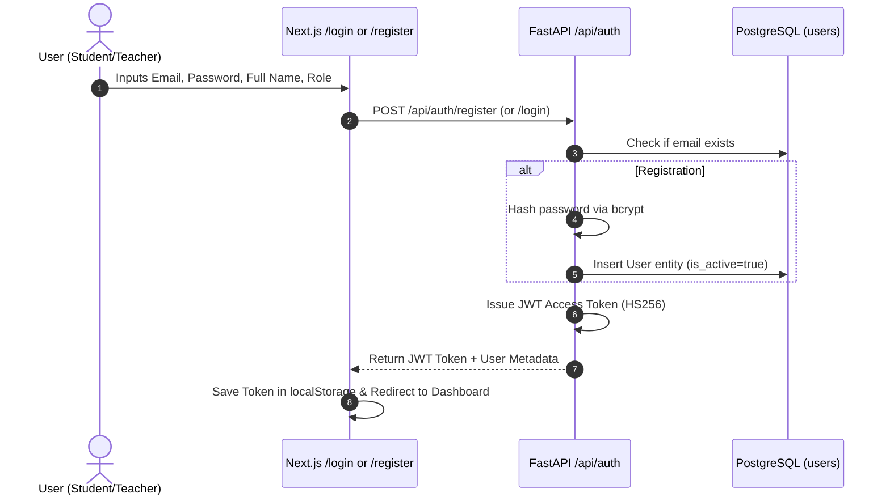

---

### Workflow 2: Course & Syllabus Unit Creation
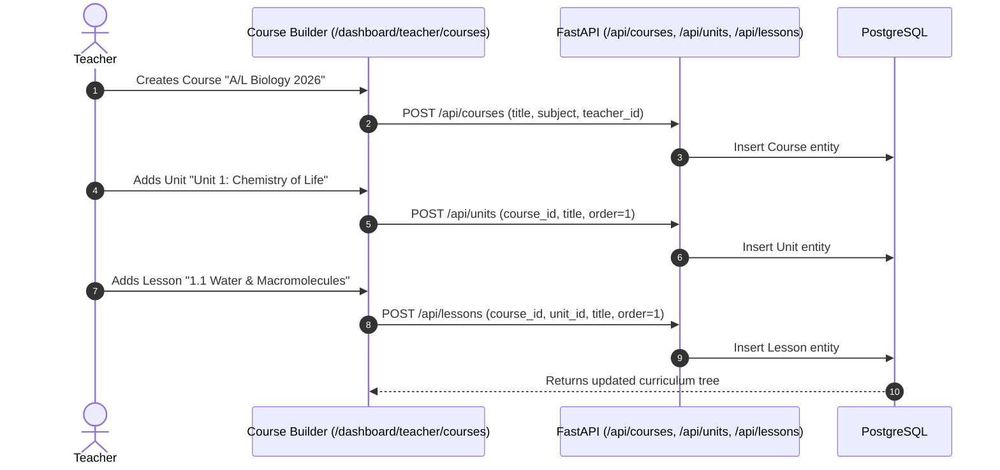

---

### Workflow 3: Material Upload & RAG Vector Ingestion
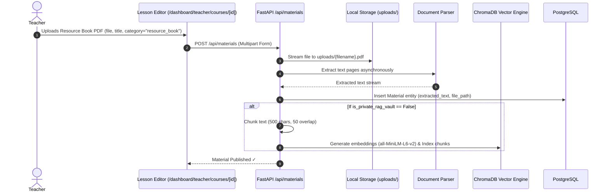

---

### Workflow 4: Material Viewing & Exact Position Resumption
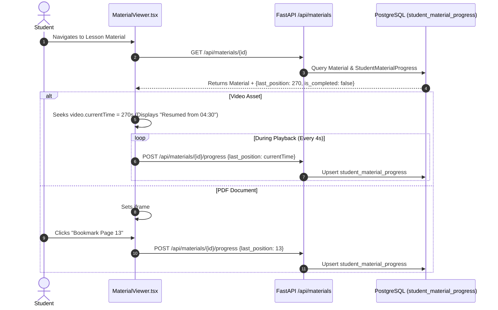

---

### Workflow 5: Material Difficulty Flagging & Resolution
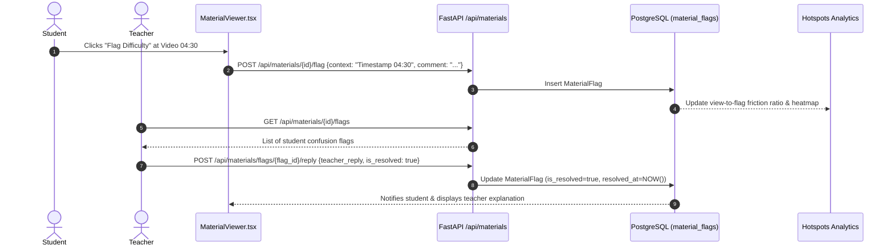

---

### Workflow 6: Ask AI RAG Inquiry & Citation Rendering
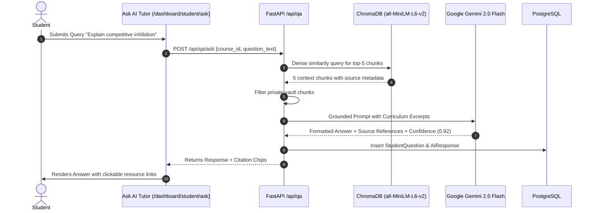

---

### Workflow 7: Q&A Moderation & Human-in-the-Loop Correction
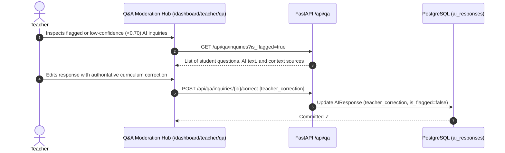

---

### Workflow 8: A/L Exam Creation & Question Bank Assembly
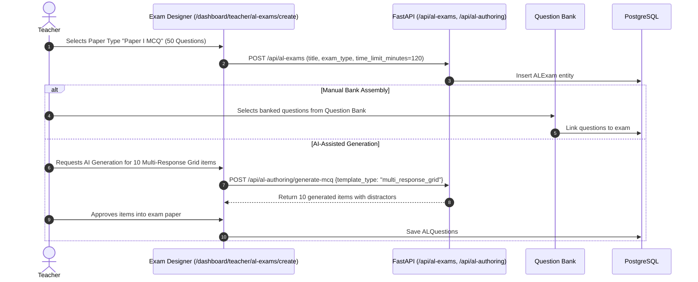

---

### Workflow 9: Student Examination Answering & Autosave
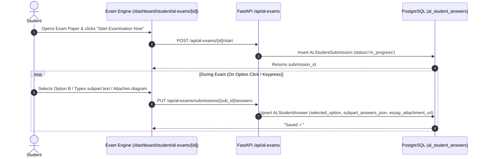

---

### Workflow 10: Exam Submission & Deterministic Machine Scoring
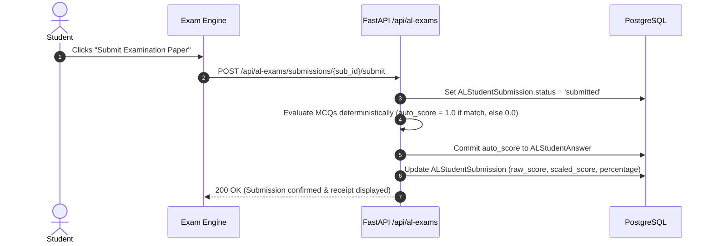

---

### Workflow 11: SpeedGrader AI Pre-Grading
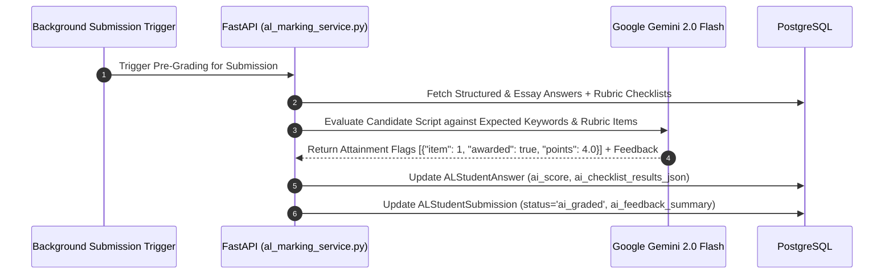

---

### Workflow 12: Teacher Marking Studio Verification & Overrides
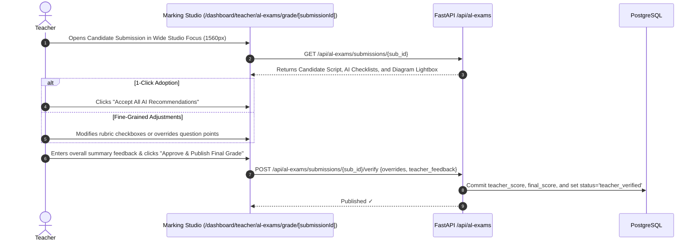

---

### Workflow 13: Student Result Review & Mastery Update
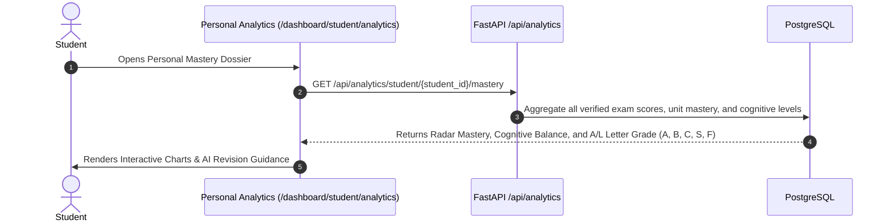

---

### Workflow 14: Teacher Analytics Workstation Computation
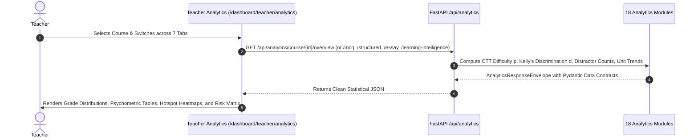

---

### Workflow 15: Psychometric Item Discrimination ($d$) Pipeline
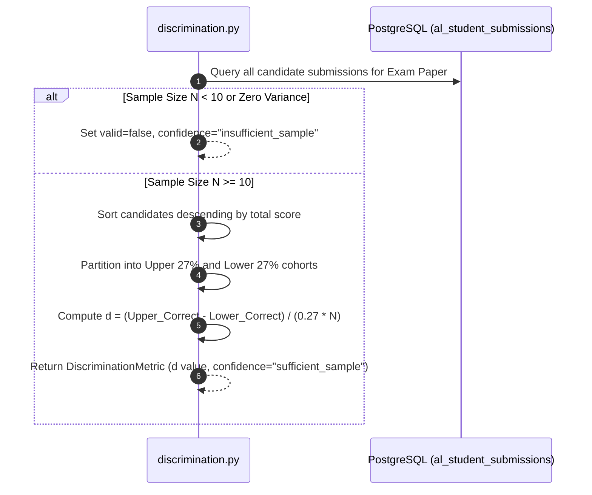

---

### Workflow 16: Learning Intelligence Cross-Domain Synthesis
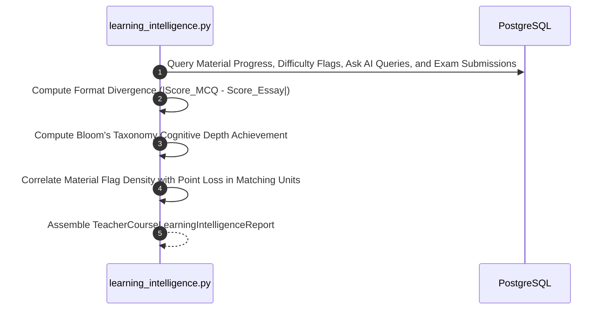

---

### Workflow 17: CSV & Printable PDF Dossier Export
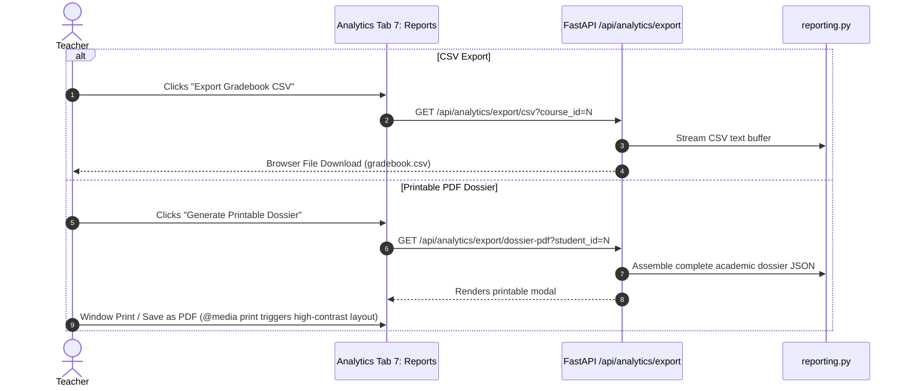

---

### Workflow 18: Safe Exam Deletion with Question Bank Cascade Control
```mermaid
sequenceDiagram
    autonumber
    actor Teacher as Teacher
    participant UI as Exam Management (/dashboard/teacher/al-exams)
    participant API as FastAPI /api/al-exams/{id}
    participant DB as PostgreSQL

    Teacher->>UI: Clicks Delete Exam
    UI->>UI: Opens Exam Deletion Modal
    
    alt Option A: Keep Questions in Bank (Recommended)
        Teacher->>UI: Selects "Keep in Question Bank" (delete_banked_questions=false)
        UI->>API: DELETE /api/al-exams/{id}?delete_banked_questions=false
        API->>DB: Delete ALExam container; unlink questions; retain ALQuestions with is_banked=true
    else Option B: Permanently Delete Questions
        Teacher->>UI: Selects "Permanently Delete" (delete_banked_questions=true)
        UI->>API: DELETE /api/al-exams/{id}?delete_banked_questions=true
        API->>DB: Cascade delete ALExam and all child ALQuestions
    end
    
    API-->>UI: 200 OK (Exam deleted successfully)
```
