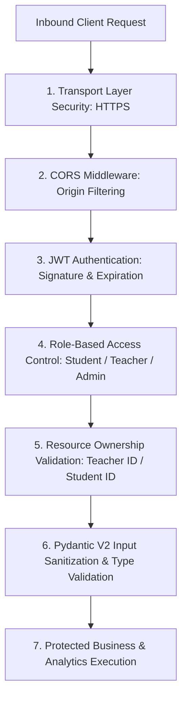

# 24. Security and Data Isolation

## 1. Security Architecture Review

Lumora implements defense-in-depth security principles across authentication, authorization, role separation, tenant isolation, input validation, and AI prompt protection.

---

## 2. Authentication & Credential Security

1. **Stateless JWT Tokens**:
   - Signed using `HS256` with a high-entropy secret key loaded via `SECRET_KEY`.
   - Fixed token expiration configured via `ACCESS_TOKEN_EXPIRE_MINUTES` (default: 60 minutes).
   - Invalidation enforced on signature mismatch, expiration, or deactivated user flag (`is_active == False`).
2. **Salted Bcrypt Password Hashing**:
   - Passwords hashed via `passlib.context.CryptContext` utilizing `bcrypt 4.3.0` with adaptive cost factors.
   - Raw plaintext passwords are never stored, logged, or serialized into database responses.
3. **Forced Password Rotation**:
   - Administrative password resets trigger `must_change_password = True`, forcing immediate credential update before application access is granted.

---

## 3. Role Separation & Tenant Data Isolation

| Security Boundary | Protection Mechanism | Enforcement Point |
| :--- | :--- | :--- |
| **Student Assessment Isolation** | Students can only query their own submissions (`submission.student_id == current_user.id`). Cross-candidate inspection is strictly blocked. | `al_exams.py` / `students.py` |
| **Teacher Course Isolation** | Teachers can only modify, grade, or delete courses they created (`course.teacher_id == current_user.id`). | `courses.py` / `materials.py` / `al_exams.py` |
| **Marking Scheme Confidentiality** | Unverified answer keys and rubric criteria are inaccessible to students during active exam taking. | `al_exams.py` |
| **RAG Privacy Vault Isolation** | Chunks flagged with `is_private_rag_vault = True` are filtered out of student similarity searches to prevent prompt injection leaks. | `al_rag_retriever.py` |
| **Administrative Governance** | Hyperparameter configuration endpoints (`/api/admin/*`) require explicit `require_admin` dependency checks. | `admin_ai.py` |

---

## 4. Input Validation & Injection Defenses

1. **SQL Injection Defense**: All database interactions use SQLAlchemy ORM parameterized queries, completely neutralizing SQL injection risks.
2. **Pydantic V2 Type Enforcement**: Strict type schemas prevent malformed JSON, prototype pollution, or unexpected field injections.
3. **File Upload Hardening**: Uploaded files (PDFs, videos, diagrams) are streamed via `aiofiles` into partitioned upload directories, validated against allowed MIME types, and served as static assets with explicit content headers.

---

## 5. Security Hardening Observations & Recommendations

- **Observation 1 (Rate Limiting)**: Authentication endpoints (`/api/auth/login`) would benefit from IP/account-based rate limiting (e.g. via `slowapi` or Redis token bucket) to prevent brute-force attacks.
- **Observation 2 (Token Storage)**: JWT access tokens currently reside in browser `localStorage`. For higher-security environments, migrating tokens to `HttpOnly`, `Secure`, `SameSite=Strict` cookies would mitigate XSS token exfiltration risks.
- **Observation 3 (Refresh Token Rotation)**: Introducing short-lived access tokens (15 mins) paired with rotating refresh tokens would enhance session revocation capabilities.
