# 25. Validation and Testing

## 1. Validation Architecture & Test Suite Inventory

Lumora maintains an extensive automated testing and validation infrastructure consisting of **41 backend pytest suites** in [`backend/tests/`](file:///d:/BSc%20SE/Final%20Project/lumora_LMS/backend/tests/), comprehensive TypeScript compile-time type-checking, and end-to-end integration scripts.

```mermaid
graph TD
    subgraph Test Suites [41 Pytest Test Suites: backend/tests/]
        CurriculumTests[Curriculum & Scope Slicer Tests]
        ExamTests[A/L 3-Paper Exam & Generator Tests]
        SpeedGraderTests[Grading, Marking & Verification Tests]
        AnalyticsTests[Psychometrics, Kelly's d & Learning Intelligence Tests]
        SecurityTests[Teacher Authorization & Tenant Isolation Tests]
    end

    subgraph Validation Phases [Phased Forensic Validation Pipeline]
        V1[Phase V1: Curriculum & Blueprint Architecture]
        V2[Phase V2: Assessment Execution & Reconciliation]
        V3[Phase V3: SpeedGrader AI Pre-Grading & Overrides]
        V4[Phase V4: Reality Check & Assessment Reliability]
        V5_1[Phase V5.1: Analytics Foundation & Data Contracts]
        V5_2[Phase V5.2: Psychometrics & Discrimination Index d]
        V5_3[Phase V5.3: Learning Activity Ingestion & Flags]
        V5_4[Phase V5.4: Cross-Analytics & Learning Intelligence]
        V5_5[Phase V5.5: Student Personal Mastery & Risk Models]
        V5_6[Phase V5.6: Acceptance QA & Workstation Verification]
    end

    subgraph Build & Type Verification
        TypeCheck[TypeScript 5 Strict Type Checking]
        NextBuild[Next.js 16 Production Build: 35/35 Routes]
    end

    CurriculumTests --> V1
    ExamTests --> V2
    SpeedGraderTests --> V3
    ExamTests --> V4
    AnalyticsTests --> V5_1
    AnalyticsTests --> V5_2
    AnalyticsTests --> V5_3
    AnalyticsTests --> V5_4
    AnalyticsTests --> V5_5
    AnalyticsTests --> V5_6
```



---

## 2. Phased Validation History (V1 – V5.6)

| Phase | Dedicated Script / Test File | Purpose & Verification Scope | Outcome & Evidence |
| :--- | :--- | :--- | :--- |
| **Phase V1** | `test_phase1_curriculum.py` | Validated A/L Biology curriculum mapping, topic trees, and scope slicing. | **VERIFIED PASS** |
| **Phase V2** | `run_phase_v2_assessment_execution.py` / `validate_phase_v2_reconciliation.py` | Executed 30 full assessment attempts across 10 synthetic candidates for 3 genuine A/L papers (MCQ, Structured, Essay). | **VERIFIED PASS** (559 answer records generated cleanly) |
| **Phase V3** | `run_phase_v3_grading_validation.py` | Validated automated deterministic MCQ scoring, Gemini essay rubric pre-grading, and teacher override persistence. | **VERIFIED PASS** (Audit scores tracked: auto, ai, teacher, final) |
| **Phase V4** | `run_phase_v4_reality_check.py` | Validated submission score bounds, percentage scaling, and A/L letter grade classifications (`A`, `B`, `C`, `S`, `F`). | **VERIFIED PASS** (Zero grade anomalies) |
| **Phase V5.1** | `run_phase_v5_1_validation.py` / `test_analytics_foundation.py` | Verified unified Pydantic data contracts (`AnalyticsResponseEnvelope`, `MCQItemMetric`) and baseline grade distributions. | **VERIFIED PASS** |
| **Phase V5.2** | `run_phase_v5_2_validation.py` / `test_teacher_assessment_analytics.py` | Validated Classical Test Theory difficulty ($p$) and Kelly's 27% discrimination index ($d$) with sample validation ($N \ge 10$). | **VERIFIED PASS** |
| **Phase V5.3** | `populate_phase_v5_3_learning_activity.py` / `run_phase_v5_3_validation.py` | Ingested 54 learning material progress records, video resume timestamps, and difficulty flag hotspots. | **VERIFIED PASS** |
| **Phase V5.4** | `run_phase_v5_4_validation.py` / `test_learning_intelligence_cross_analytics.py` | Verified cross-domain learning intelligence: format divergence ($\Delta_{\text{format}}$), Bloom's depth, and unit friction. | **VERIFIED PASS** |
| **Phase V5.5** | `run_phase_v5_5_validation.py` / `test_student_personal_mastery.py` | Validated individual student radar mastery vectors, cognitive depth tracking, and multi-factor academic risk classification. | **VERIFIED PASS** |
| **Phase V5.6** | `run_phase_v5_6_validation.py` / `test_analytics_phase_a8_acceptance.py` | Comprehensive acceptance testing of the 7-tab Teacher Analytics Workstation and CSV/PDF export streams. | **VERIFIED PASS** |

---

## 3. Automated Test Execution Evidence

### 3.1. Backend Pytest Execution Evidence
```powershell
$env:PYTHONPATH="."; pytest tests/ -p no:warnings
```
- **Execution Result**: **156 passed in 43.93s (100% PASS across all 27 test suites)**.
- **Suite Breakdown**:
  - `test_ai_generation_core.py` (11 tests): Schema validity, cognitive level matching, MCQ generation.
  - `test_ai_lesson_material_isolation.py` (10 tests): Strict lesson-level material isolation and RAG context scoping.
  - `test_al_assembly_and_symbols.py` (4 tests): Scientific symbol rendering and full exam assembly.
  - `test_al_essay_generator.py` & `test_al_essay_system.py` (13 tests): Essay rubrics, checklists, and scoring.
  - `test_al_structured_generator.py` & `test_al_structured_system.py` (16 tests): Subpart trees, dotted-line constraints.
  - `test_al_ordering_engine.py` (15 tests): Dynamic question reordering and palette navigation.
  - `test_al_mcq_quality.py` & `test_al_mcq_deduplication.py` (11 tests): Option key normalization and deduplication.
  - `test_teacher_assessment_analytics.py` & `test_teacher_learning_analytics.py` (17 tests): Psychometric item metrics, $p$-values, discrimination $d$.
  - `test_teacher_manual_grading_policy.py` (1 test): Teacher grading override precedence and draft filtering.
  - `test_universal_ai_error_handling.py` (4 tests): Graceful AI service degradation and fallback mechanisms.

### 3.2. Frontend Production Build & TypeScript Verification
```powershell
npm run build
```
- **Execution Result**: `✓ Compiled successfully in 21.6s`, Next.js 16 Turbopack completed with **0 errors across all 35 routes** (Static & Dynamic SSR).
