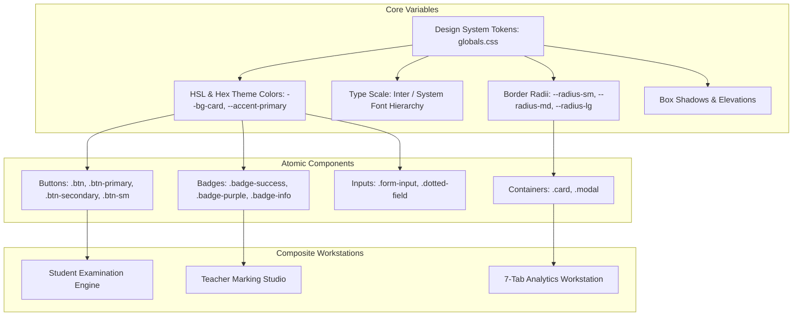

# 26. UI/UX Structure and Design System

## 1. Design System Foundations

The Lumora LMS user interface is built on a custom, modern **Vanilla CSS Token Architecture** in [`frontend/src/app/globals.css`](file:///d:/BSc%20SE/Final%20Project/lumora_LMS/frontend/src/app/globals.css) augmented with TailwindCSS utility layers.

---

## 2. Color Palette & Design Tokens

| CSS Variable Token | Light / Dark Semantic Value | Operational Role in UI |
| :--- | :--- | :--- |
| **`--bg-primary`** | `#0B0F17` (Dark) / `#F8FAFC` (Light) | Main application viewport background. |
| **`--bg-secondary`** | `#111827` / `#F1F5F9` | Secondary containers, sidebar backgrounds, student reading panels. |
| **`--bg-card`** | `#1A2234` / `#FFFFFF` | Elevated card surfaces, question cards, and summary KPI widgets. |
| **`--accent-primary`** | `#3B82F6` (Electric Indigo/Blue) | Primary action buttons, active navigation indicators, key metrics. |
| **`--accent-secondary`**| `#8B5CF6` (Vibrant Purple) | AI indicators, Structured question badges, recommendation pills. |
| **`--text-primary`** | `#F9FAFB` / `#0F172A` | Primary headings, candidate answer text, question stems. |
| **`--text-secondary`** | `#94A3B8` / `#475569` | Sub-labels, metadata hints, teacher feedback notes. |
| **`--border-subtle`** | `rgba(255, 255, 255, 0.08)` / `#E2E8F0` | Card borders, subpart dividers, table row separators. |
| **`--success`** | `#10B981` (Emerald Green) | Distinction grades (`A`), completed materials, verified marks. |
| **`--warning`** | `#F59E0B` (Amber) | Medium risk alerts, ordinary pass grades (`S`), pending grading items. |
| **`--danger`** | `#EF4444` (Rose Red) | High academic risk flags, failure grades (`F`), exam deletion dialogs. |

---

## 3. Core Component Catalog & State Handling

### 3.1. Cards & Containers
- Standardized `.card` utility applying subtle borders, rounded corners (`var(--radius-md)` = 8px), and hover elevation transitions (`transition: all 0.2s ease`).

### 3.2. Form Inputs & Typography
- **Inputs** (`.form-input`): Styled text fields, number pickers, and textareas with focused accent glow (`outline: 2px solid var(--accent-primary)`).
- **Typography Scale**: High-legibility sans-serif font stack (`Inter`, `system-ui`, `-apple-system`, `sans-serif`) with `1.7–1.8` line height for long-form student reading and marking.

### 3.3. Modals & Dialogs (`Modal.tsx`, `ConfirmDialog.tsx`)
- High-zIndex modal overlays (`z-index: 1000`) with backdrop blur (`backdrop-filter: blur(4px)`), Escape key listeners, and accessible `aria-modal="true"` dialog roles.

### 3.4. Loading, Error & Empty States
- **Loading**: Pulse animation skeletons ([`Skeleton.tsx`](file:///d:/BSc%20SE/Final%20Project/lumora_LMS/frontend/src/components/Skeleton.tsx)) rendered during API fetching.
- **Error**: Component-level error boundary ([`ErrorBoundary.tsx`](file:///d:/BSc%20SE/Final%20Project/lumora_LMS/frontend/src/components/ErrorBoundary.tsx)) catching unhandled rendering faults.
- **Empty States**: Informative empty cards with contextual icons and call-to-action buttons.
