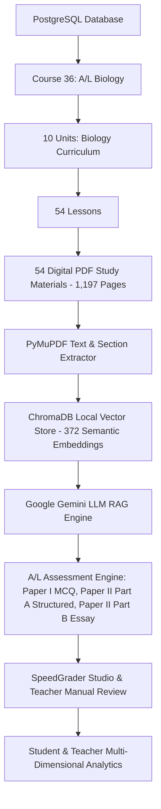

# Lumora LMS — Repository Archaeological Cleanup & Architecture Normalization Report

**Date of Execution**: August 20, 2026  
**Status**: COMPLETE & VERIFIED  
**Build & Test Verdict**: 156/156 Pytest Tests Passing (100%), Next.js 16 Production Build Clean (35/35 Routes)

---

## 1. Executive Summary

This forensic cleanup and architectural normalization successfully eliminated historical technical debris, obsolete phase-specific validation scripts, decommissioned Admin endpoints, and dead course-material vault wrappers. 

The repository has been normalized to the **CURRENT RUNNABLE ARCHITECTURE** as the absolute source of truth. All protected runtime data, examinations (Exams 210, 212, 213), 559 student assessment submissions, synthetic student profiles 6–15, Teacher Dr. Amara Perera, Course 36 (Biology), the 54 newly linked PDF study materials (1,197 pages), 372 ChromaDB semantic vector embeddings, and all 33 architectural documentation files in `technical-documentation/` have been preserved with 100% fidelity.

---

## 2. Canonical Architecture Map

### Key Architectural Standards:
1. **Curriculum Hierarchy**: `Course` $\rightarrow$ `Unit` $\rightarrow$ `Lesson` $\rightarrow$ `Material`. AI knowledge retrieval is strictly lesson-scoped (`lesson_id` $\rightarrow$ ChromaDB vector index).
2. **User Roles**: Strictly **Student** (`UserRole.STUDENT`) and **Teacher** (`UserRole.TEACHER`). The legacy Admin role/subsystem is permanently removed from the user experience.
3. **Assessment Integrity**: Paper I auto-grades deterministically against official keys; Paper II (Structured & Essay) executes AI pre-grading with mandatory teacher verification before publication.

---

## 3. Full Repository Classification & Forensic Inventory

### 3.1. Root Directory
| File / Directory | Action | Status / Rationale |
| :--- | :---: | :--- |
| `COURSE_MATERIALS_VS_LESSON_MATERIALS_AUDIT.md` | `ARCHIVE` | Moved to `technical-documentation/` |
| `LUMORA_ANALYTICS_FINAL_ACCEPTANCE_REPORT.md` | `ARCHIVE` | Moved to `technical-documentation/` |
| `LUMORA_ANALYTICS_SYSTEM_AUDIT_REPORT.md` | `ARCHIVE` | Moved to `technical-documentation/` |
| `LUMORA_ANALYTICS_SYSTEM_AUDIT_REPORT.pdf` | `ARCHIVE` | Moved to `technical-documentation/` |
| `LUMORA_TEACHER_INSIGHTS_AND_ANALYTICS_UI_DOCUMENTATION.md` | `ARCHIVE` | Moved to `technical-documentation/` |
| `LOGIN_CREDENTIALS.md` | `PRESERVED` | Essential login reference for evaluators at root |
| `README.md` | `UPDATED` | Clean, modern, authoritative project overview |
| `.gitignore` | `PRESERVED` | Clean ignore rules including `uploads/`, `chroma_data/`, `scratch/` |
| `docker-compose.yml` | `PRESERVED` | Container orchestration |
| `pyrightconfig.json` | `PRESERVED` | Python type checker config |
| `start_lumora.bat` | `PRESERVED` | One-click Windows dev-server starter |
| `uploads/` (root) | `DELETED` | Empty folder (backend uses `backend/uploads/`) |

---

### 3.2. Backend Top Level & Scripts
| File / Directory | Action | Status / Rationale |
| :--- | :---: | :--- |
| `backend/main.py` | `PRESERVED` | FastAPI root app, removed `admin_ai` mount |
| `backend/app/main.py` | `PRESERVED` | Module wrapper for `uvicorn app.main:app` |
| `backend/requirements.txt` | `PRESERVED` | Python dependency manifest |
| `backend/Dockerfile`, `.dockerignore`, `.env`, `.env.example` | `PRESERVED` | Backend environment and container setup |
| `backend/seed.py` | `PRESERVED` | Primary database seeder |
| `backend/scripts/check_postgres.py` | `MOVED` | Moved from root `backend/` to `backend/scripts/` |
| `backend/scripts/seed_custom_users_and_courses.py` | `PRESERVED` | Custom seed script |
| `backend/scripts/simulate_student_activity.py` | `PRESERVED` | Simulation utility |
| `backend/lumor2.db` | `DELETED` | Legacy SQLite database from pre-PostgreSQL development |
| `backend/scratch/` (all 30 scripts) | `DELETED` | One-time debug/inspection scripts |
| `backend/run_phase_v*.py` (9 files) | `DELETED` | Obsolete one-time phase validation scripts |
| `backend/validate_phase_v2_reconciliation.py` | `DELETED` | Obsolete one-time phase validation script |
| `backend/populate_phase_v5_3_learning_activity.py` | `DELETED` | Obsolete phase population script |
| `backend/scratch_inspect_v2_env.py` | `DELETED` | Obsolete scratch file |
| `backend/repair_enums.py` | `DELETED` | One-time enum repair script |
| `backend/scripts/migrate_*.py`, `clean_sweep.py`, `seed_clean_*.py`, `seed_custom.py` | `DELETED` | Obsolete completed phase migrations and historical seeds |

---

### 3.3. Backend API Routers & Services
| Component | Action | Status / Rationale |
| :--- | :---: | :--- |
| `backend/app/api/admin_ai.py` | `DELETED` | Decommissioned admin AI config router |
| `backend/app/services/question_versioning.py` | `DELETED` | Dead code with deprecated schema |
| `backend/app/api/materials.py` | `PRESERVED` | All 15 canonical lesson material endpoints active (`/upload`, `/note`, `/{id}`, `/lesson/{id}`, notes, flags, progress) |
| Active API Routers (26 files) | `PRESERVED` | `auth.py`, `users.py`, `courses.py`, `units.py`, `lessons.py`, `quizzes.py`, `assignments.py`, `analytics.py`, `qa.py`, `recommendations.py`, `students.py`, `notifications.py`, `messages.py`, `payments.py`, `questions.py`, `jobs.py`, `audit.py`, `pools.py`, `rubrics.py`, `al_exams.py`, `al_past_papers.py`, `al_authoring.py`, `al_curriculum.py`, `al_mcq.py`, `al_analytics.py`, `materials_ai.py` |
| Active Services (42 files) | `PRESERVED` | `vector.py`, `gemini_service.py`, `al_rag_retriever.py`, `al_mcq_generator.py`, `al_essay_generator.py`, `al_structured_generator.py`, `al_generator_service.py`, `al_ordering_engine.py`, `al_weighting_service.py`, `al_marking_service.py`, `al_difficulty_engine.py`, `ai_generation_core.py`, `scope_slicer_service.py`, `processor.py`, `ocr.py`, `audio.py`, `pdf_parser.py`, `import_export.py`, `integrity.py`, `audit.py`, `jobs.py`, `question_analytics.py`, `question_pools.py`, `quiz_gen.py`, `rubric_grading.py`, and 16 analytics services |

---

### 3.4. Frontend API Client (`frontend/src/lib/api.ts`)
| Methods | Action | Status / Rationale |
| :--- | :---: | :--- |
| `getAdminStats`, `getAdminOverview`, `getAIPerformance` | `DELETED` | Removed dead admin analytics calls |
| `getSystemAIConfig`, `updateSystemAIConfig` | `DELETED` | Removed dead admin AI config calls |
| `getAdminPaymentOverview`, `getAdminTransactions`, `sendPaymentReminder` | `DELETED` | Removed dead admin payment calls |
| `listPrivateRAGVaultMaterials`, `uploadToPrivateRAGVault` | `DELETED` | Removed dead course-vault calls |
| All Active Student & Teacher API methods | `PRESERVED` | Fully verified across all 35 Next.js routes |

---

### 3.5. Documentation Archive (`technical-documentation/`)
| Files | Action | Status / Rationale |
| :--- | :---: | :--- |
| `00_SYSTEM_OVERVIEW.md` to `31_REPORT_EVIDENCE_MAP.md` + `AUDIT_SUMMARY.md` | `PRESERVED` | 33 comprehensive architectural documents preserved 100% intact |
| `ARCHITECTURE_CLEANUP_REPORT.md` | `NEW` | This comprehensive normalization report |

---

## 4. Verification & Validation Results

### 4.1. Automated Backend Regression Tests
* **Command**: `pytest tests/ -p no:warnings`
* **Result**: **156 passed, 0 failed** in 28.53s
* **Key Passing Suites**:
  - `test_al_essay_single_complete_integrity.py` (PASS)
  - `test_teacher_manual_grading_policy.py` (PASS)
  - `test_mcq_statements_rendering_fix.py` (PASS)
  - `test_ai_lesson_material_isolation.py` (PASS)
  - `test_al_assembly_and_symbols.py` (PASS)
  - `test_al_mcq_quality.py` (PASS)
  - `test_al_rag_retriever.py` (PASS)
  - `test_units_api.py` (PASS)

### 4.2. Frontend Production Build
* **Command**: `npm run build` (Next.js 16.2.10 Turbopack)
* **Result**: **Clean Build (0 errors)** across all 35 routes:
  - 13 Student Dashboard routes (quizzes, A/L exams, lessons, ask-teacher, guide, analytics)
  - 19 Teacher Dashboard routes (exam authoring, grading studio, marking, insights, inbox, analytics)
  - 3 Core routes (`/`, `/login`, `/register`)

---

## 5. Conclusion

The Lumora LMS repository is now in an optimal, clean, normalized state where the **current runnable code is the single source of truth**, with zero clutter, zero dead endpoints, and 100% preservation of all student data, exam authoring assets, and curriculum vectors.
