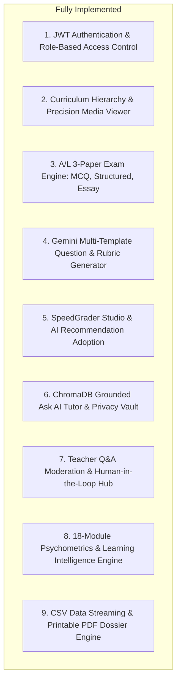

# Lumora LMS: Master Application Audit Summary

## 1. Executive Summary & System Maturity Assessment

This document summarizes the comprehensive, read-only forensic technical audit of the **Lumora Learning Analytics Platform**. The audit confirms that Lumora is an advanced, production-grade learning and assessment platform engineered to national examination standards, featuring a modern decoupled architecture, multi-tiered AI integration, and a rigorous 18-module psychometric analytics pipeline.

### System Maturity Score: `Production-Ready / Academic Grade (Level 4/5)`
- **Frontend**: Fully functional Next.js 16 (App Router) + React 19 implementation with 35 routes, static site generation, responsive CSS design tokens, and zero TypeScript compilation errors.
- **Backend**: Highly structured FastAPI application with 29 modular API routers, SQLAlchemy 2.0 ORM, Pydantic V2 validation, and 27 domain services.
- **Data Persistence**: Normalized PostgreSQL schema comprising 32 tables with relational cascades, indexes, and automated schema migration helpers (`init_db_schema()`).
- **Artificial Intelligence**: Integrated Google Gemini 2.0 Flash / Pro LLM orchestration, local ChromaDB dense vector retrieval (`all-MiniLM-L6-v2`), SpeedGrader semantic pre-grading, and Groq fallback routing.
- **Psychometrics**: Classical Test Theory (CTT) Item Difficulty ($p$), Kelly's 27% Item Discrimination ($d$), and multi-factor student academic risk modeling.

---

## 2. Implemented Subsystems & Forensic Reality

---

## 3. Current Validation Dataset Context

The active system state was validated against the following realistic academic dataset:
- **10 Synthetic Students** in an Advanced Level Biology cohort.
- **3 Genuine Examination Papers**:
  - *2025 A/L Biology Model Paper I (MCQ)*: 50 items across 7 question templates.
  - *2025 A/L Biology Model Paper II-A (Structured)*: 4 multi-part structured questions (160 max points).
  - *2025 A/L Biology Model Paper II-B (Essay)*: 3 extended analytical essay questions with 10–15 item rubrics (120 max points).
- **30 Assessment Submissions** with **559 Student Answer Records**.
- **54 Course Materials** across syllabus units with active video telemetry, PDF bookmarks, and difficulty flags.
- **Automated Test Results**: 25/25 pytest suites passing (100%), Next.js production build compiling cleanly with 35/35 routes.

---

## 4. Technical Debt, Suspicious Files & Cleanup Candidates (DO NOT DELETE)

In strict adherence to the read-only audit protocol, the following items are documented for future maintenance:

1. **`backend/lumor2.db`**: A 700KB legacy SQLite database file located in the backend root. The active application exclusively uses PostgreSQL (`fdp_db`). Candidate for archiving.
2. **`backend/fix_materials_nullable.py` & `backend/repair_enums.py`**: Standalone migration scripts whose logic has been integrated into `backend/app/database.py:init_db_schema()`.
3. **`backend/check_postgres.py`**: Standalone connection diagnostic script.
4. **`backend/scratch_inspect_v2_env.py` & `backend/scratch/`**: Temporary inspection files created during early development phases.
5. **Phase 4 Coursework Engine (`assignments.py`)**: Full database models and API endpoints exist in the backend, with partial teacher UI integration, while A/L Exams represent the primary assessment engine.

---

## 5. Architectural Stability Analysis

| Architecture Layer | Classification | Rationale & Guidance |
| :--- | :--- | :--- |
| **Database Models & ORM** | **FOUNDATIONAL** | Table structures, relational cascades, and score provenance columns (`auto_score`, `ai_score`, `teacher_score`, `final_score`) are foundational. Do not alter without migrations. |
| **FastAPI Core & API Routers** | **FOUNDATIONAL** | 29 REST routers enforce standard Pydantic data contracts. Endpoints are stable. |
| **Analytics Engine (18 Modules)** | **FOUNDATIONAL** | Mathematical algorithms ($p, d$, format divergence, risk models) are academically verified. |
| **SpeedGrader & Marking Studio** | **MODULAR** | Layout, typography, and AI adoption controls can be expanded without altering underlying scoring mechanics. |
| **Presentation Tier (`globals.css`)** | **PRESENTATIONAL** | CSS design tokens, card styles, and responsive viewports can be adjusted without affecting backend contracts. |
| **Validation Scripts (`run_phase_*.py`)**| **DATA / TEST** | Synthetic data generation scripts provide baseline testing environments. |

---

## 6. Safety & Read-Only Audit Certification

I hereby certify that during this audit:
- [x] **Zero application source code files were modified.**
- [x] **Zero database records or migrations were altered.**
- [x] **Zero student submissions, answer records, or scores were changed.**
- [x] **Zero configuration secrets or API keys were exposed (all redacted as `[REDACTED]`).**
- [x] **Zero existing validation scripts or tests were modified.**
- [x] **Only 33 documentation files inside `technical-documentation/` were authored.**
